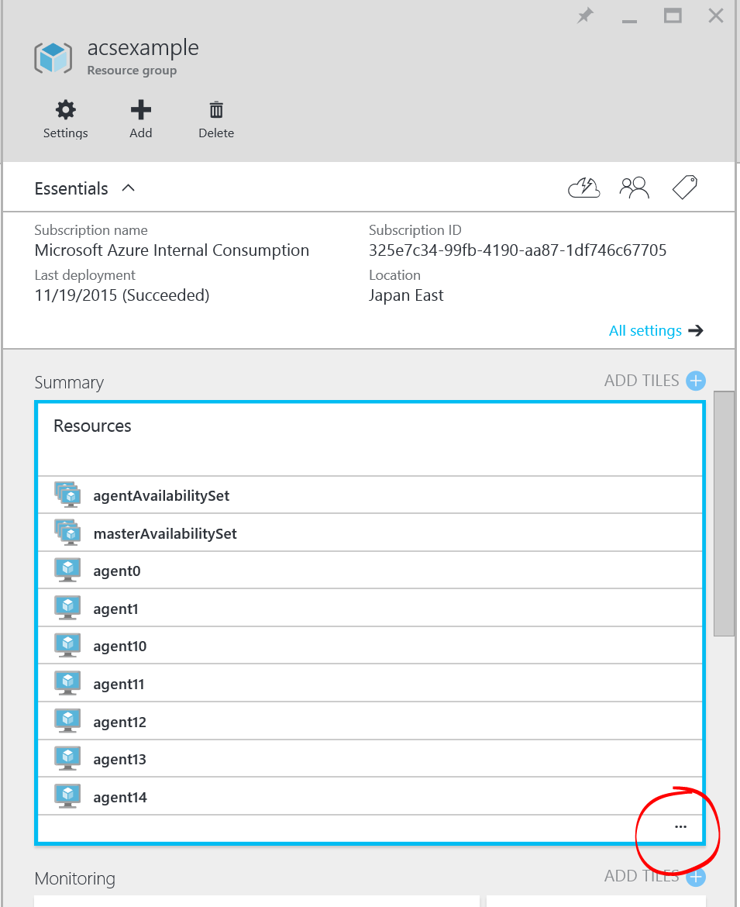
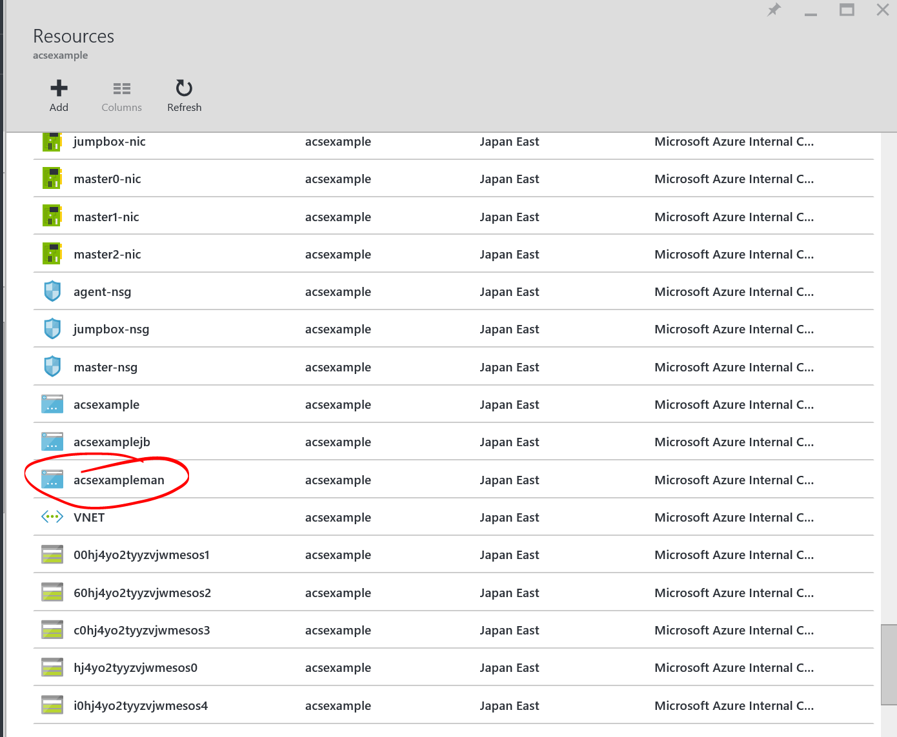
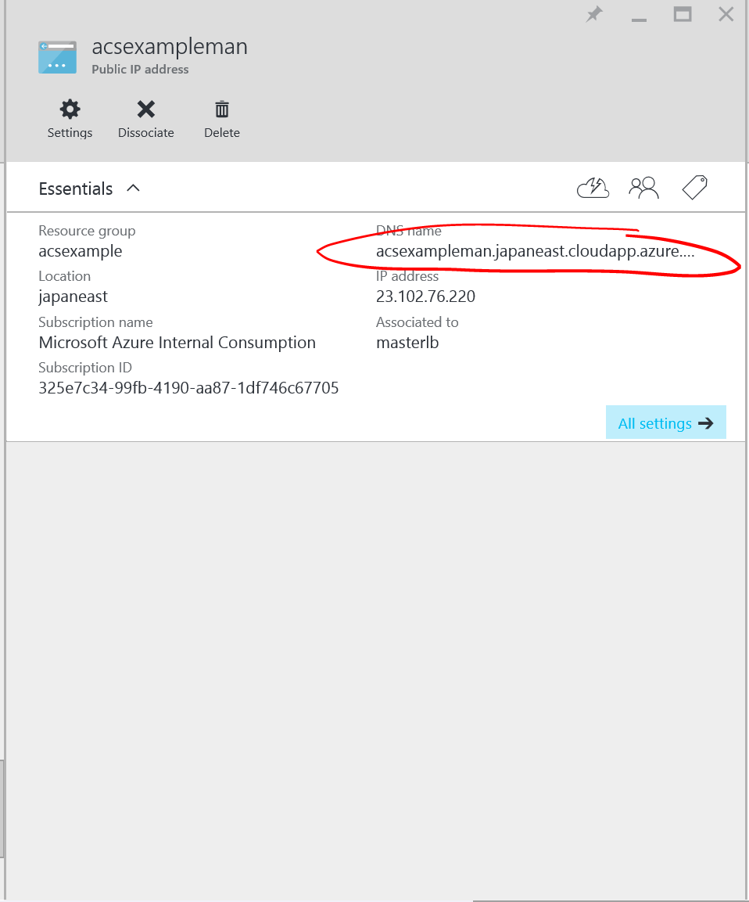
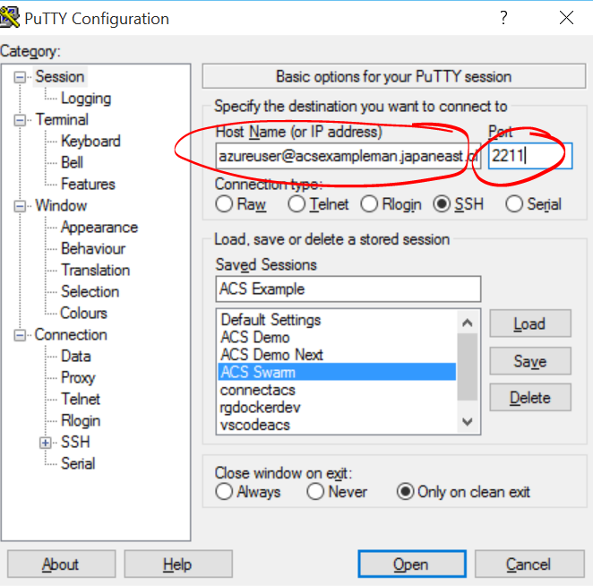
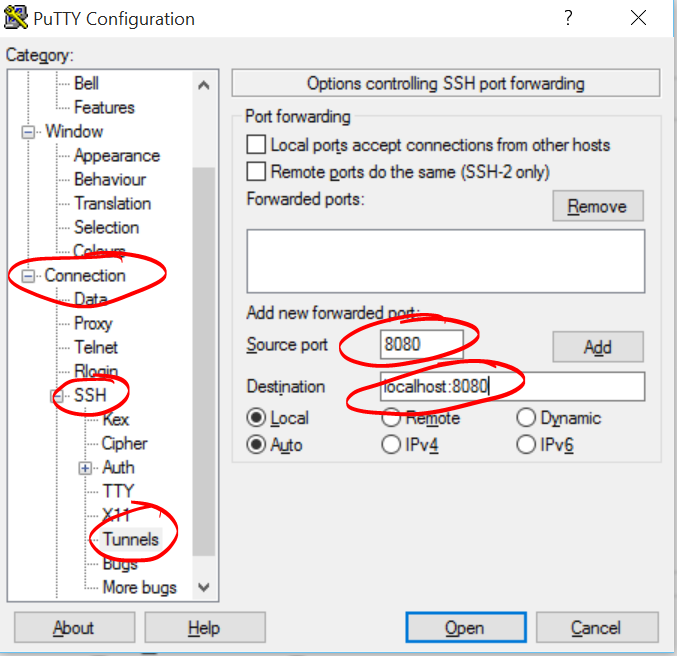

# 108: Connecting to Orchestration REST API

Depending on the configuration of your cluster you will have a number of management endpoints exposed. If you chose to create a jumpbox then you can use the web interfaces provided by the Orchestration tools in your cluster. You will also have a number of REST API endpoints to use. In order to connect to any of these endpoints you will need to create an SSH tunnel to the appropriate endpoint.

## REST API Endpoints

All REST API endpoints are located on the masters and so first you need to identify the domain name for the Master Load Balancer. If you are using the \`acs-base-template\` then this will be DNSPREFIXman.REGION.cloudapp.azure.com. To find the DNS name in the portal:







## Web Interfaces for Management tools

If you want to use the web interfaces for these tools then you will need to have deployed a jumpbox in your cluster. This will be using the DNS name \[DNSPREFIX\]man.\[REGION\].cloudapp.azure.com

## Setting up an SSH Tunnel

### Using SSH

```
ssh -L PORT:localhost:PORT -N [USERNAME]@[DNSPREFIX]man.[REGION].cloudapp.azure.com -p SSH_PORT
```

PORT is the port of the endpoint you want to expose.

USERNAME is the username provided when you deployed the cluster

DNSPREFIX is the DNS prefix you provided when you deployed the cluster

REGION is the region in which your resource group is located

SSH_PORT is either 22 (for the Jumpbox) or 2200, 2201 … 2204 for master0, master1 … master4 REST API's respectively

Now you can access the Marathon API on \[DNSPREFIX\]man.\[REGION\].cloudapp.azure.com using ```localhost:8080```

For example, to set up a tunnel to the Marathon API in our example cluster:

```
ssh -L 8080:localhost:8080 -n azureuser@acsexamplemgmt.japaneast.cloudapp.azure.com -p 2200
```


### Using Putty

[Download](http://www.putty.org/) and install Putty.

The snapshots below walk you through the steps needed to set up a SSH tunnel.




