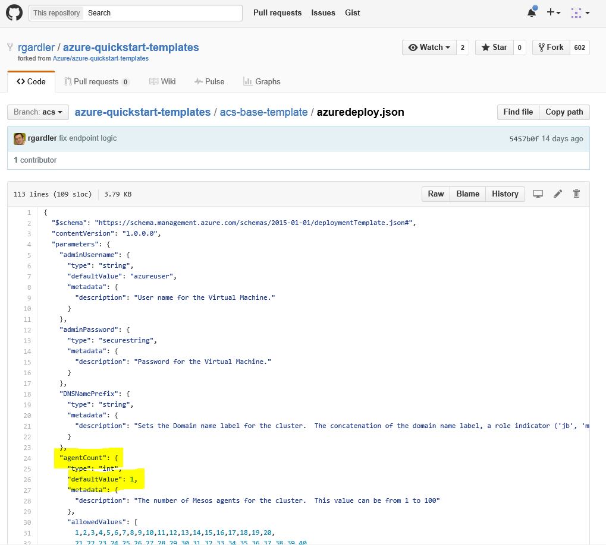
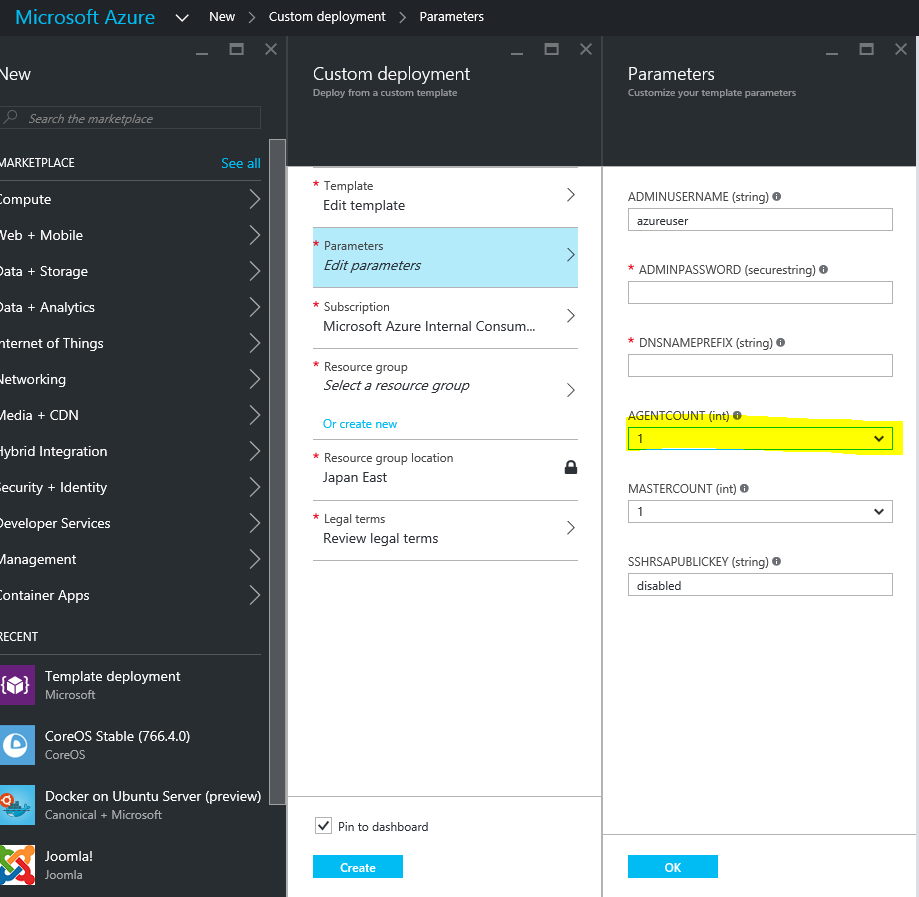
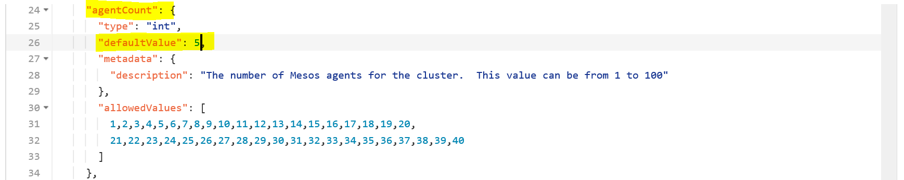

# 130: Increasing the Agent Count

We recommended to start with a simple deployment using the template for [Mesos](https://github.com/rgardler/azure-quickstart-templates/tree/acs/acs-mesos-full-template) or [Swarm](https://github.com/rgardler/azure-quickstart-templates/tree/acs/acs-swarm-full-template). If we look into the contents of the azuredeploy.json file of this template, specifically the lines highlighted in yellow, we see that the agent count has been set at 1 by default.

When you click on the DeployToAzure button, you will be taken to Azure portal to enter the parameters.

You can edit the AGENTCOUNT parameter to set it anywhere between 1 and 40.

Say you initially had set AGENTCOUNT to 1, you can increase the number of agents to 5 in the azuredeploy.json file as shown below. When you deploy, you have to ensure that all the parameters that you enter match the ones that you created the initial deployment.

