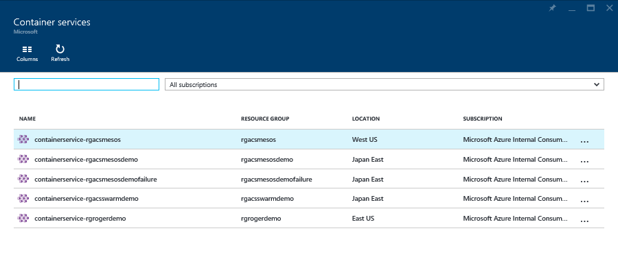
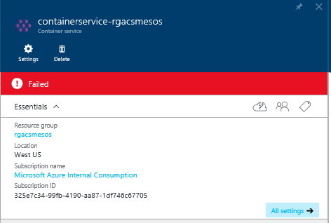
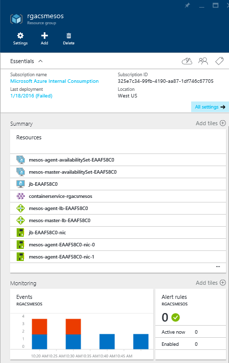
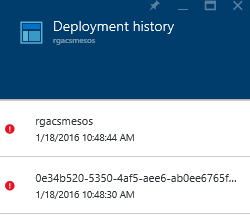
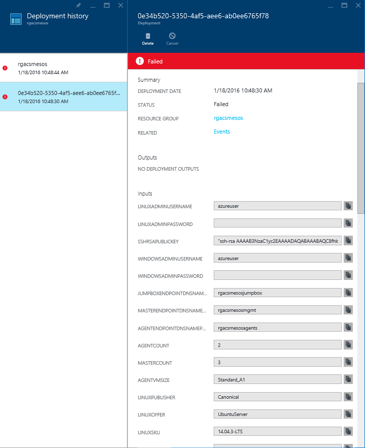
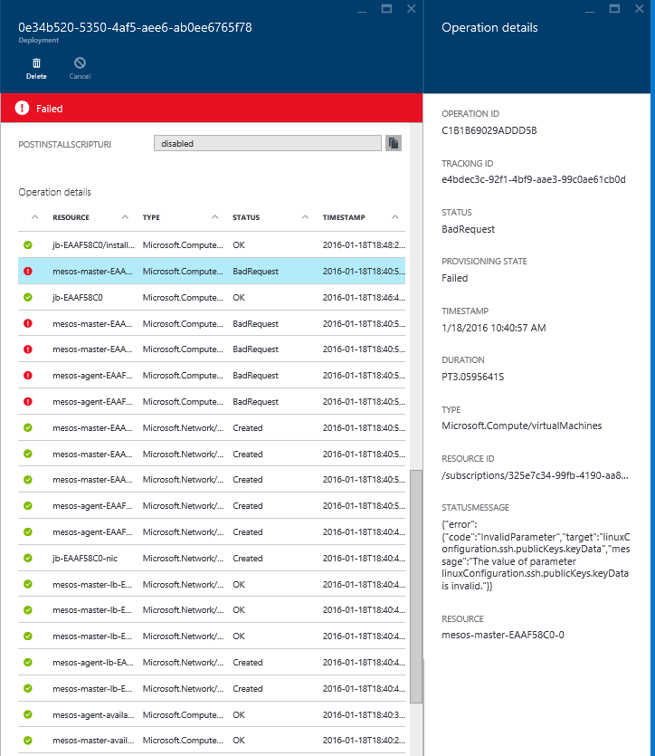

# 180: Debugging a Failed Deployment

Sometimes a deployment will fail. Here's some tips on how to debug
using both the [portal](#using-the-portal) and the [CLI](#using-the-cli).

## Using the CLI

First we need to know the name of the deployment. You can list all
deployments on a resource group using `azure group deployment list [options]
<resource-group> [state]`. In the below example we are limiting our
list to those in the "Failed" state:

```bash
azure group deployment list rgacsmesos Failed
```

This will provide an output that looks something liket this:

```bash
info:    Executing command group deployment list
                                                        + Listing deployments
data:    DeploymentName     : 0e34b520-5350-4af5-aee6-ab0ee6765f78
data:    ResourceGroupName  : rgacsmesos
data:    ProvisioningState  : Failed
data:    Timestamp          : 2016-01-18T18:48:30.6162837Z
data:    Mode               : Incremental
data:
data:    DeploymentName     : rgacsmesos
data:    ResourceGroupName  : rgacsmesos
data:    ProvisioningState  : Failed
data:    Timestamp          : 2016-01-18T18:48:44.4637497Z
data:    Mode               : Incremental
info:    group deployment list command OK
```

Ising the name of the failed deployment we can get details of the
failure using `azure group deployment operation list [options]
[resource-group] [name]`. Since this command will list all operations,
successful and unsuccesful, we will use grep to filter this list for
us:

```bash
azure group deployment operation list rgacsmesos 0e34b520-5350-4af5-aee6-ab0ee6765f78 | grep -B 3 -A 7 Failed
```

This will return useful information that should help you debug, such
as the following which indicates we have invalid data in our ssh key
field:

```
data:    ---------------------
data:
data:    Id:                   /subscriptions/325e7c34-99fb-4190-aa87-1df746c67705/resourceGroups/rgacsmesos/deployments/0e34b520-5350-4af5-aee6-ab0ee6765f78/operations/056DB6A5C6215FF3
data:    OperationId:          056DB6A5C6215FF3
data:    Provisioning State:   Failed
data:    Timestamp:            2016-01-18T18:40:55.2413575Z
data:    Status Code:          BadRequest
data:    Status Message:       code=InvalidParameter, target=linuxConfiguration.ssh.publicKeys.keyData, message=The value of parameter linuxConfiguration.ssh.publicKeys.keyData is invalid.
data:    Target Resource Id:   /subscriptions/325e7c34-99fb-4190-aa87-1df746c67705/resourceGroups/rgacsmesos/providers/Microsoft.Compute/virtualMachines/mesos-agent-EAAF58C0-0
data:    Target Resource Name: mesos-agent-EAAF58C0-0
data:    Target Resource Type: Microsoft.Compute/virtualMachines
```

## Using the Portal

Navigate to the [container service](http://aka.ms/acsportal) browse UI in the portal. 



Select the service that suffered the failed deployment in order to view the service details:



Click on the "Resource Group":



Click on "Last Deployment" to list deployments for this resource group:



Select the failed deployment (note there will be two deployments for
each ACS deployment, the earlier of the two will give more detailed
results.:



At the top of this blade you will see the parameters used for the
deployment, scroll down to view the the log, click on Failed entried
to get more details.


