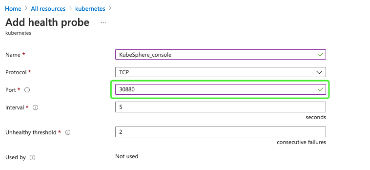

# Install KubeSphere on Azure Kubernetes Cluster

> English | [中文](README_zh.md)

Automatic deploy KubeSphere on Azure Kubernetes Cluster.
Supported Kubernetes versions include `1.15.x`,`1.16.x`,`1.17.x`,`1.18.x`,`1.19.x`

## Requirements
1. Install Azure CLI
[Install Azure CLI on Windows](https://docs.microsoft.com/en-us/cli/azure/install-azure-cli-windows?tabs=azure-cli)
[Install Azure CLI on macOS](https://docs.microsoft.com/en-us/cli/azure/install-azure-cli-macos)

2. Sign in
[Sign in with Azure CLI](https://docs.microsoft.com/en-us/cli/azure/authenticate-azure-cli)

3. Create a service principal
[Create an Azure service principal with the Azure CLI](https://docs.microsoft.com/en-us/cli/azure/create-an-azure-service-principal-azure-cli)

> Note: The output for a service principal with password authentication includes the password key. Make sure you copy this value - it can't be retrieved. If you forget the password, reset the service principal credentials.

> Warning: The limitation of script, please create the service principal by password-based authentication. Copy "name" "password" and "tenant" - it will be used.

4. Get subscriptionsID
```
az account list|grep "id"
```

> Copy "subscriptionsID" - it will be used.

## Deploy KubeSphere on AKS by azure-quickstart-templates
1. Download azure deploy file
Download "azuredeploy.json" from [deploy KubeSphere on AKS tampalte]()

2. Load deployment file
Sign in [Microsoft Template](https://portal.azure.com/?l=en.en-us#create/Microsoft.Template)
Click on "Build your own template in the editor"


Click on "Load file"


Then, click on "Save"

3. Choose Subscription, modify parameters of template


Please modify the parameters:

|  	parameters   	|		Description		|		default		|
| ----------------- | --------------------- | ----------------- |
|		vmSize		|			Kubernetes Cluster virtual machine resource size		|	Standard_F8s_v2	|
| kubernetesVersion |	The version of Kubernetes	|	1.18.14	|
|  MasterNodeCount  | 	The number of Master node	| 	3	|
|  WorkerNodeCount  | 	The number of Worker node	| 	3	|
|  ClientosDiskType |	Client os Disk type	|	StandardSSD_LRS	|
|	osDiskSizeGB	| 	Disk size (in GB) to provision for each of the agent pool nodes.	|	0	|
|	adminUsername	|	Client node admin user name	|	aksuser	|
|	adminPassword	|	Client node admin user password	|	ABCabc321	|
|	SPName			|	Service Principal User Name	|	null	|
|	SPPassword		| 	Service Principal User Password	|	null	|
|	SPTenant		|	Service Principal User Tenant	|	null	|
|	SubscriptionID  |	Subscription ID	|	null	|


More information: [Detailed parameters](parameters.md)

Then, Click on "Review + creat"

4. Check deployment status


5. Deployment complate


6. Check Kubernetes and KubeSphere status
Sign in Client node, Check Kubernetes and KubeSphere status.


> Check deployment log "/tmp/deploy.log"

7. Check KubeSphere installer logs
```
sudo kubectl logs -n kubesphere-system $(sudo kubectl get pod -n kubesphere-system -l app=ks-install -o jsonpath='{.items[0].metadata.name}') -f
```


8. Set AKS network security group
Set AKS network security group inbound security fules.


9. Set AKS load balancer
Set AKS load balancer rules.
- Set health probes




- Set load balancering rules


10. Sign in KubeSphere console
Sign in KubeSphere console by AKS load balancer public ip and port 30880


KubeSphere console defaule user and password are admin/P@88w0rd

More information about KubeSphere,please check [KubeSphere documentation](https://kubesphere.io/docs/)