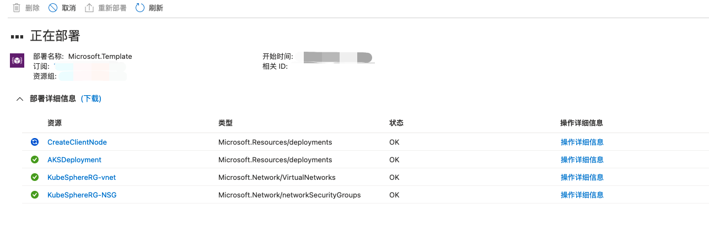
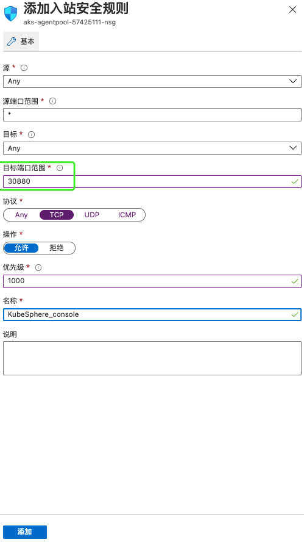

# 在 Azure Kubernetes 集群上部署 KubeSphere

> [English](README.md) | 中文

在 Azure Kubernetes 集群上自动部署 KubeSphere。
Kubernetes 支持版本`1.15.x`,`1.16.x`,`1.17.x`,`1.18.x`,`1.19.x`

## 准备工作
1. 本地安装 Azure CLI
Windows 用户请参考[在 Windows 上安装 Azure CLI](https://docs.azure.cn/zh-cn/cli/install-azure-cli-windows?view=azure-cli-latest&tabs=azure-cli)
macOS 用户请参考[在 macOS 上安装 Azure CLI](https://docs.azure.cn/zh-cn/cli/install-azure-cli-macos?view=azure-cli-latest)
2. 使用 Azure CLI 登录
请参考 [使用 Azure CLI 登录](https://docs.azure.cn/zh-cn/cli/authenticate-azure-cli?view=azure-cli-latest)
3. 创建服务主体
请参考 [使用 Azure CLI 创建 Azure 服务主体](https://docs.azure.cn/zh-cn/cli/create-an-azure-service-principal-azure-cli?view=azure-cli-latest)

> 注意：与密码身份验证配合使用的服务主体的输出包括 password 密钥。 __请确保__复制此值 - 它不可检索。 如果忘记了密码，请[重置服务主体凭据](https://docs.azure.cn/zh-cn/cli/create-an-azure-service-principal-azure-cli?view=azure-cli-latest#reset-credentials)。

> 注意：由于脚本限制，请创建基于密码身份验证的服务主体，并记录“服务主体用户名”、“服务主体密码”、“服务主体tenant”。
4. 查询订阅号
```
az account list|grep "id"
```


> 请记录好“订阅号”。

## 通过 azure-quickstart-templates 模板快速在Azure Kubernetes 集群上部署 KubeSphere
1. 下载部署文件
访问[AKS 上部署 KubeSphere 模板]()页面，将"azuredeploy.json"文件下载到本地备用。
2. 访问[自定义部署](https://portal.azure.cn/#create/Microsoft.Template)页面
点击“在编辑器中生成自己的模版”


点击“加载文件”，导入"azuredeploy.json"文件


导入后点击“保存”

3. 选择订阅，修改模版参数
选择或新建资源组


请修改参数以下参数：

|    	参数   		|			说明			|		默认值		|
| ----------------- | --------------------- | ----------------- |
|		vmSize		|			null		|	null	|
| kubernetesVersion |	null	|	null	|
|  MasterNodeCount  | 	null	| 	null	|
|  WorkerNodeCount  | 	null	| 	null	|
|  ClientosDiskType |	null	|	null	|
|	osDiskSizeGB	| 	null	|	null	|
|	adminUsername	|	null	|	null	|
|	adminPassword	|	null	|	null	|
|	CloudName		|	null	|	null	|
|	SPName			|	null	|	null	|
|	SPPassword		| 	null	|	null	|
|	SPTenant		|	null	|	null	|
|	SubscriptionID  |	null	|	null	|

参数详解请查阅：[参数详解](parameters_cn.md)

设置完成后点击“购买”

4. 查看部署进度
当“通知”中部署状态为“正在部署......”时，点击进入查看部署状态




5. 等待部署完成


6. 登录 Client 服务器查看 Kubernetes、KubeSphere状态


> 部署日志请查看"/tmp/deploy.log"
> 若 KubeSphere 安装失败，可使用执行以下命令重新安装：
> kubectl apply -f https://github.com/kubesphere/ks-installer/releases/download/v3.0.0/kubesphere-installer.yaml
> kubectl apply -f https://github.com/kubesphere/ks-installer/releases/download/v3.0.0/cluster-configuration.yaml

7. 查看 KubeSphere 安装日志
```
sudo kubectl logs -n kubesphere-system $(sudo kubectl get pod -n kubesphere-system -l app=ks-install -o jsonpath='{.items[0].metadata.name}') -f
```
出现以下页面说明 KubeSphere 安装完成

8. 设置 AKS 负载均衡器和网络安全组
AKS 部署时会自动创建负载均衡器和网络安全组，为了能访问当 KubeSphere Console 页面，想要修改负载均衡器和网络安全组规则

- 修改网络安全组规则，开放30880端口

打开网络安全组


添加入站规则


设置好后点击“添加”



- 添加负载均衡器规则

添加“运行状态探测”


设置好后点击“添加”


添加“负载均衡规则”


设置好后点击“添加”


9. 访问 KubeSphere Console

查看“负载均衡器的前端公网IP”


通过“负载均衡器的前端公网IP”的30880端口访问 KubeSphere Console

使用默认用户密码登陆并修改默认密码


关于 KubeSphere 的更多使用说明，请查阅[KubeSphere官方文档](https://kubesphere.io/docs/)
