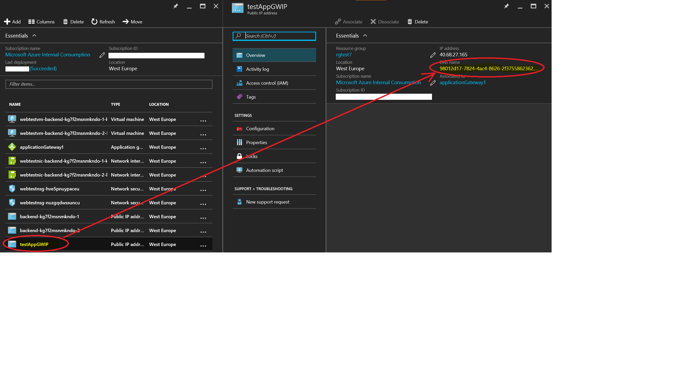
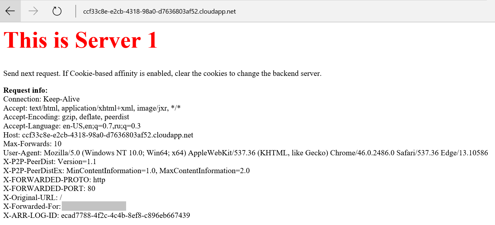

# Azure Application Gateway Demo Setup

&nbsp;
&nbsp;

&nbsp;
&nbsp;

&nbsp;
&nbsp;

This template allows you to quickly deploy Azure Application Gateway demo to test load-balancing with or without cookie-based affinity.

## To Deploy Demo Setup:

1. Push Deploy to Azure button.
2. Choose admin credentials for the backend Web servers.
3. If needed change size, capacity, cookie-based affinity mode (you can re-configure later).
4. Start template deployment.

## After Deployment

Once your demo setup is deployed use DNS name of your Azure Application Gateway that was generated for you automatically to test how it works.
To get your Azure Application Gateway DNS name you can open Azure Application Gateway's Public IP address properties in Azure Portal:

## Testing Your Setup

In order to try your test setup in action you can re-send your requests, bring down/up the VMs/Web servers created as a part of the deployment, change Azure Application Gateway settings.

When your HTTP request hits backend server, you should be able to see a page like the one below:

