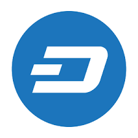

# Dash Core Blockchain Node on Ubuntu VM

This template delivers the Dash network to your VM in about 15 minutes. Everything you need to get started using the Dash blockchain from the command line is included. Once installed, 'dashd' will begin syncing the public blockchain. You may then connect via SSH to the VM and launch 'dashd' to interface with the blockchain.

# What is Dash?

Dash is an experimental digital currency that enables anonymous, instant
payments to anyone, anywhere in the world. Dash uses peer-to-peer technology
to operate with no central authority: managing transactions and issuing money
are carried out collectively by the network. Dash Core is the name of the open
source software which enables the use of this currency.

For more information, as well as an immediately useable, binary version of
the Dash Core software, see https://www.dash.org/get-dash/.

# Getting Started Tutorial

* Click the `Deploy to Azure` icon for this template
* Complete the template parameters, choose your resource group, accept the terms and click Create
* Wait about 15 minutes for the VM to spin up and install the software
* Connect to the VM via SSH using the DNS name assigned to your Public IP
* If you wish to relaunch dashd `sudo dashd`
* dashd will run automatically on restart

# Licensing

Dash Core is released under the terms of the MIT license. See `COPYING` for more information or see http://opensource.org/licenses/MIT.
