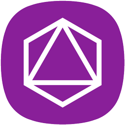

# Dynamic Blockchain Node on Ubuntu VM

This template delivers the Dynamic network to your VM in about 15 minutes. Everything you need to get started using the Dynamic blockchain from the command line is included. Once installed, 'dynamicd' will begin syncing the public blockchain. You may then connect via SSH to the VM and launch 'dynamicd' to interface with the blockchain.

# What is [Dynamic](https://duality.solutions/dynamic)?
----------------
* Coin Suffix: DYN
* PoW Mining Algorithm: Argon2d
* PoW Difficulty Algorithm: Digishield V3
* PoW Period: Unlimited
* PoW Target Spacing: 128 Seconds
* PoW Reward per Block: Controlled via Fluid Protocol
* PoW Reward Start Height: Block 5,137
* Maturity: 10 Blocks
* PoW Blocks: ~675 per day
* Dynode Collateral Amount: 1000 DYN
* Dynode Min Confirmation: 17 Blocks
* Dynode Reward: Controlled via Fluid Protocol
* Dynode Reward Start Height: Block 10,273
* Total Coins: 263 - 1
* Min TX Fee: 0.0001 DYN
* Max Block Size: 4MB

[Dynamic(DYN)](https://duality.solutions/dynamic) allows fast, secure, verifiable transfers of data using blockchain technology and enables third-party developers to build low-cost solutions across varied industry using the BDAP protocol. Dynamic can be used to run incentivized Dynodes; the second tier of nodes on the network processing, verifying, validating and storing data.

**MainNet Parameters**
P2P Port = 33300
RPC Port = 33350
Dynodes = 33300
Magic Bytes: 0x5e 0x61 0x74 0x80

# Getting Started Tutorial

* Click the `Deploy to Azure` icon for this template
* Complete the template parameters, choose your resource group, accept the terms and click Create
* Wait about 15 minutes for the VM to spin up and install the software
* Connect to the VM via SSH using the DNS name assigned to your Public IP
* If you wish to relaunch dynamicd `sudo dynamicd`
* dynamicd will run automatically on restart

# Licensing

Dynamic is released under the terms of the MIT license. See `COPYING` for more information or see http://opensource.org/licenses/MIT.
