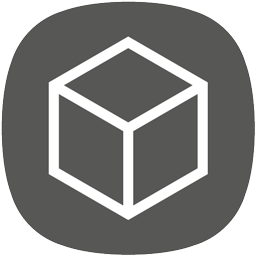

# Sequence Blockchain Node on Ubuntu VM

This template delivers the Sequence network to your VM in about 15 minutes. Everything you need to get started using the Sequence blockchain from the command line is included. Once installed, 'sequenced' will begin syncing the public blockchain. You may then connect via SSH to the VM and launch 'sequenced' to interface with the blockchain.

# What is [Sequence](https://duality.solutions/sequence)?
----------------
* Coin Suffix: SEQ
* PoW Algorithm: Scrypt
* PoW Period: 10,000 Blocks
* PoW Target Spacing: 60 Seconds 
* PoW Difficulty Retarget: 10 Blocks 
* PoW Reward per Block: 0 SEQ
* Full Confirmation: 10 Blocks
* PoS Algorithm: Blake2b
* PoS Target Spacing: 64 Seconds 
* PoS Difficulty Retarget: 10 Blocks 
* PoS Reward: 2 SEQ
* PoS Min: 1 Hour
* PoS Max: Unlimited
* Total Coins: 263 - 1
* Block Size: 4MB
* Min TX Fee: 0.001 SEQ

[Sequence(SEQ)](https://duality.solutions/sequence) was developed to provide data redundancy for the BDAP protocol and support the applications created by Duality & third-party developers. Sequence nodes implement static Proof-of-Stake (PoS) rewards in exchange for supporting  the BDAP protocol, applications, blockchain and network.

[Sequence(SEQ)](https://duality.solutions/sequence) is a digital currency that enables instant payments to anyone, anywhere in the world. [Sequence(SEQ)](https://duality.solutions/sequence) uses peer-to-peer technology to operate with no central authority (decentralisation): managing transactions and issuing currency [(SEQ)](https://duality.solutions/sequence) are carried out collectively by the [Sequence](https://duality.solutions/sequence) network. [Sequence](https://duality.solutions/sequence) is the name of open source software which enables the use of the currency [SEQ](https://duality.solutions/sequence).

**MainNet Parameters**
P2P Port = 16662
RPC Port = 16663

**TestNet Parameters**
P2P Port = 16664
RPC Port = 16665

# Getting Started Tutorial

* Click the `Deploy to Azure` icon for this template
* Complete the template parameters, choose your resource group, accept the terms and click Create
* Wait about 15 minutes for the VM to spin up and install the software
* Connect to the VM via SSH using the DNS name assigned to your Public IP
* If you wish to relaunch sequenced `sudo sequenced`
* sequenced will run automatically on restart

# Licensing

Sequence is released under the terms of the MIT license. See `COPYING` for more information or see http://opensource.org/licenses/MIT.
