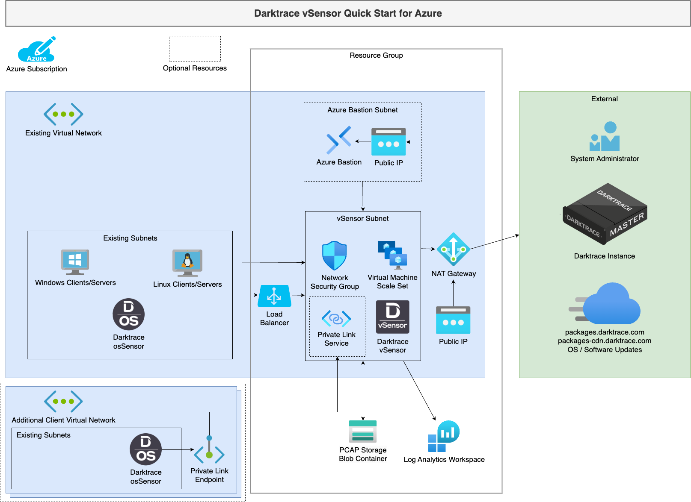

# Deploy Darktrace Autoscaling vSensors


[](https://portal.azure.com/#create/Microsoft.Template/uri/https%3A%2F%2Fraw.githubusercontent.com%2FAzure%2Fazure-quickstart-templates%2Fmaster%2Fapplication-workloads%2Fdarktrace%2Fdarktrace-vsensor-autoscaling%2Fazuredeploy.json)
[](http://armviz.io/#/?load=https%3A%2F%2Fraw.githubusercontent.com%2FAzure%2Fazure-quickstart-templates%2Fmaster%2Fapplication-workloads%2Fdarktrace%2Fdarktrace-vsensor-autoscaling%2Fazuredeploy.json)


## Introduction


This document intends to describe how to use the provided ARM template to deploy automatically scaling Darktrace vSensors in Microsoft Azure.

**Note**: A simpler, non-autoscaling version of this template is also available [here](https://github.com/Azure/azure-quickstart-templates/tree/master/application-workloads/darktrace/darktrace-vsensor-standalone)

The Darktrace vSensor is a lightweight virtual probe intended for deployment in cloud-based networks or environments where it is not feasible to deploy a physical probe, such as virtualized networks. In an Azure public cloud environment, vSensors can be deployed as an automatic virtual machine scale set that collects packets from osSensor agents deployed on the VMs that are to be monitored. 

In addition to processing and transmitting network traffic, vSensors can ingest and forward syslog-format logs to the Darktrace master instance. VPN and DHCP logs can provide valuable device-tracking enrichment and custom event types derived from ingested log data. This can be used to integrate with a number of third-party tools.

## Architecture



In brief, the template will perform the following:
* Create a Subnet for the vSensors in the existing VNet.
* Create a subnet and deploy Azure Bastion to allow access to manage the vSensors (optional).
* Create an Azure Storage Account and Blob Container to hold PCAP data for a configurable retention period (optional).
* Spin up the requested number of compatible base OS VMs in the existing VNet as part of a Virtual Machine Scale Set.
* Automatically download and install the Darktrace vSensor.  
**Note**: a valid Darktrace Update Key is required for this. Please contact your Darktrace representative if you do not possess this.
* The vSensors will self-configure. As part of the configuration the vSensor will automatically:
    * Configure automatic OS and Darktrace software updates.
    * Connect and register to the Darktrace master instance (virtual/physical) using the Push Token that has already been generated (on the same master instance).
    * Add the osSensor HMAC Token to allow osSensors to authenticate.
    * Configure the PCAP storage to the shared Blob Container.
* A load balancer is configured to distribute osSensor registrations between available vSensors.
* A Log Analytics workspace is created to house vSensor logs for Azure.
* Deploy an Azure Private Link Service for connecting osSensors outside of the vSensor VNet (optional).

### osSensors

In Microsoft Azure, the configuration and maintenance of the virtual switches is automated and removed from the user’s control. As a result of this lack of access, a direct SPAN cannot be setup from the virtual switch to the vSensor. 

In this environment, the Darktrace osSensor - a lightweight host-based server agent - is used to send a feed from all monitored VMs directly to the vSensor.

These osSensors can be manually installed quickly and simply. However, for large environments there are a number of tools that can be used to facilitate the deployment of osSensors in bulk, such as Ansible, Terraform, and Run Commands. For an in-depth guide on each of these, please see the relevant documentation.

### VNets

In Microsoft Azure, all VMs are separated into virtual networks (VNets) which are logically separated from each other. A vSensor must be placed in each VNet to ensure total coverage of your Azure environment.

It is possible for VNets to be ‘peered’ and for data to be sent across VNets, thus reducing the number of vSensors needing to be deployed. However, this should be carefully considered before implementing as cross regional data transfer can incur a significant financial cost, as well as potential legal and compliance issues surrounding data residency.

## Considerations

### Pre-deployment Requirements
#### Virtual Network

The template should be used to deploy vSensor(s) in an existing Virtual Network (VNet). This VNet must have space for up to 2 Subnets to be created:
* A larger subnet for the number of expected vSensors deployed (`/24` recommended).
* A small subnet for the Azure Bastion: `/26` or larger, see [Azure Docs](https://learn.microsoft.com/en-us/azure/bastion/configuration-settings#subnet) (optional).

#### Resource Group
The Resource Group (RG) is where the new resources’ metadata will be stored. The resources will be placed in the new/existing RG of the deployment, which may be separate from the VNet for easier management. The subnets created will still be created within the existing VNet's RG.

#### Network Security Group
The template will create a new Network Security Group (NSG) that permits outbound access to the Darktrace Update Packages CDN and the configured master instance on HTTP/HTTPS. It also allows osSensor inbound connectivity on HTTP/HTTPS.

Lastly, it will enable access for SSH management from (private) IP addresses and/or IP Ranges specified in 'MgmtSourceAddressOrRange'.

#### VM Sizes
The VM size should be decided based on the vSensor Requirements as described in the ‘Example Sizings’ in the below link:
https://customerportal.darktrace.com/product-guides/main/vsensor-requirements

Various recommended sizes have been provided below, from small burstable CPU sizes for small levels of traffic to large 32 core sizes for high levels of traffic:

* Standard_B2ms
* Standard_D2_v3
* Standard_D4_v3
* Standard_D8_v3
* Standard_D8s_v5
* Standard_D16s_v5
* Standard_D32s_v5

Note that, vSensor performance will vary by CPU speed and the nature of the traffic - estimated sizings are provided for guidance only.

We recommend you choose instance sizes:
* Large enough that traffic spikes don't require large numbers of machines to be scaled up.
* Small enough that low traffic (i.e. outside business hours) doesn't waste too many compute resources.

The disk size in this template is fixed, since PCAPs are stored via a configurable PCAP retention policy (in days). Note that changing the retention policy will affect deployment costs based on the ongoing amount of traffic ingested.

#### Admin User SSH Authentication
The Azure deployment manager will allow a new or existing SSH keypair to be used.

vSensors will be configured with the admin username and SSH public key provided only, no password login will be accepted. Ensure you possess and keep the correct private key for later use.

#### Darktrace Master Communication
To connect and register the vSensor to the Darktrace master instance (or Cloud Master) the following is required:
* The Darktrace master instance’s FQDN or IP and HTTPS port (typically `443/TCP`).
* The push token (generated on the Darktrace Master System Config page).
* Access to the master instance’s FQDN or IP and port.

#### osSensor Connectivity
The template will expect the osSensor HMAC Token to be provided so it can configure it as part of the automated configuration.

When an osSensor is in the same VNet, use the IP address of the load balancer frontend provided in the deployment outputs under `osSensorVsensorIP`.

#### Azure Private Link

Azure Private Link is now also supported to allow osSensors to be connected from across your Azure environment, including on-premise, other regions and other subscriptions. This means you can deploy fewer instances of Darktrace vSensor in large environments for easier management and lower compute costs.

Enabling the `privateLinkEnable` parameter will do the following:
* Create a Azure Private Link Service in the vSensor subnet with TCP Proxy v2 support enabled.
* Create a secondary load balancer frontend such that both local VNet (non-proxy) and Private Link (proxy) osSensors are supported simultaneously.
* Configure vSensors to accept TCP Proxy v2 protocol from the created Private Link service and load balancer health probes (`168.63.129.16/32`, see [Microsoft documentation](https://learn.microsoft.com/en-us/azure/virtual-network/what-is-ip-address-168-63-129-16)) via IP address firewalling.
* Configures all osSensor traffic to travel through the load balancer, rather than taking a direct route after vSensor discovery and registration. PLEASE NOTE: This will also incur extra bandwidth costs for local osSensors.

When using Azure Private Link, osSensors must be configured with the IP address or DNS of the Private Link Endpoint you manually create and connect to the provided Private Link Service, named under deployment output `osSensorPrivateLinkService`.

NOTE: The use of TCP Proxy v2 is required with Private Link Services so that osSensors can be separately identified. Overlapping osSensor IPs are not supported.

#### Access to the vSensor
The vSensors created will not have public IPs associated. Exposing a vSensor via a public IP carries additional security burden and is not a requirement of push token authentication with the master instance.

It is expected that there is already a solution in place to access the VMs in the VNet via their private IP. If one is not present, the template can install a Azure Bastion Host and subnet to the existing VNet using the 'Bastion Enable' parameter. Don't select this option if you already have a Azure Bastion in your VNet.

If there is a virtual firewall on your network, please ensure access is granted to the vSensor to the Darktrace instance FQDN/port or IP/port, as well as to *ubuntu.com, packages.darktrace.com and packages-cdn.darktrace.com on port `80/TCP` and `443/TCP`. The deployed NSG will attempt to configure this access.

### Deployment Parameters

The template should appear as a form that expects values for input parameters (with some pre-populated):


**Note**: all parameters are necessary. The Bastion Subnet CIDR will not be used if Bastion Enable is false.

| Parameter name | Description |
| ------ | ------ |
| Subscription | Choose the Subscription to use for this deployment. |
| Resource Group | Choose a pre-existing RG or create a new RG; resources created as part of this deployment will be stored in this RG (excluding VNet/Subnets). |
| shortID | A short (upto 20 character alphanumeric) string to prefix resource names by (where available). Defaults to resource group name. |
| zones | List of availability zone numbers for vSensors to be deployed into. Leave default for all Zones. |
| existingVirtualNetworkName | Name of the existing Virtual Network to be monitored, should be in the same **location** as this deployment/resource group. |
| existingVirtualNetworkResourceGroup | The Resource Group the VNet is deployed in. |
| natGatewayEnable | Deploy a NAT Gateway in the Virtual Network. If using an existing VNet and are using other firewall configurations, False may be required. |
| existingRouteTable | If not deploying a NAT Gateway, you may need to provide an existing route table to attach to the new deployed vSensor subnet to allow internet routing. |
| existingRouteTableResourceGroup | The Resource Group the existing Route Table (if provided) is deployed in. Default is same RG. |
| bastionEnable | Whether to deploy a Azure Bastion and associated Subnet in. See above. |
| bastionSubnetCIDR | CIDR IP range of the private subnet the Azure Bastion will be deployed in (if deployed). This must be an unused range within the supplied VNet. E.g. 10.0.1.0/24. If Bastion Enable is false, this value will be ignored. |
| VMSSSubnetCIDR | CIDR IP range of the private subnet the vSensors will be deployed in. This must be an unused range within the supplied VNet. E.g. 10.0.2.0/24. |
| MgmtSourceAddressOrRange | Provide a private address range using CIDR notation (e.g. 10.1.0.0/24), or an IP address (e.g. 192.168.99.21) for Management access via ssh (port 22/TCP). Set to 'VMSS Subnet CIDR' to not use this access. You can also provide a comma-separated list of IP addresses and/or address ranges (a valid comma-separated list is 10.1.0.4,10.2.1.0/24). |
| VMSSInstanceSize | vSensor VM Size. For more information regarding the Virtual Hardware Requirements please visit https://customerportal.darktrace.com/product-guides/main/vsensor-requirements <br><br> _Default value_: **Standard_D2s_v3** |
| VMSSMinSize | The minimum number of vSensors to auto-scale down to. |
| VMSSMaxSize | The maximum number of vSensors to be deployed by auto-scaling during high traffic. |
| adminUsername | Username to be created when the vSensor is spun up. |
| adminPublicKey | Public key for the admin username to ssh to the vSensors. Note that password authentication over ssh for newly created VMs is disabled. |
| VSensorUpdateKey | Darktrace Update Key needed to install the vSensor package. Contact your Darktrace representative for more information. |
| applianceHostName | The FQDN or the IP of the Darktrace master instance (virtual/physical). |
| appliancePort | Darktrace master instance connection port. <br><br> _Default value_: **443** |
| appliancePushToken | Push token to authenticate with the appliance. Should be generated on the Darktrace master instance. |
| OSSensorHMACToken | Hash-based message authentication code (HMAC) token to authenticate osSensors with vSensor. |
| PCAPLifetimeDays | Captured packets storage retention (days), longer retention will increase storage costs. |
| privateLinkEnable | If you wish to connect osSensors from outside the deployed Virtual Network via Azure Private endpoints, enable this option. This will deploy a PrivateLink service and direct all traffic via the load balancer instead of direct from osSensor to vSensor after registration. Note: this will incur extra Azure charges for the private link endpoint and associated bandwidth. |
| resourceTags | Specify tags as JSON key-pairs to apply to all compatible resources deployed by this template. |

There is an example in **[Appendix A](#appendix-a-examples)**.

In the case of deploying this template outside of the Portal (ie CLI), fill `adminPublicKey` with the contents of the **public** key file.

### Post deployment checks

If any configuration settings provided are invalid, the deployment will fail to deploy the Virtual Machine Scale Set. Azure may provide a short error log for this stage. You may find more complete logging in `/var/log/user-data.log` on the vSensor.

As stated under the Considerations section – it is recommended to perform a health check on successful template deployment.
Once the deployment has completed successfully, connect to a vSensor and verify the vSensor configuration and health check by running:

```
$ sudo confconsole
```

Once complete, follow the menu. More details on available options can be found on the Darktrace Customer Portal.

# Appendix A - Examples

## Create vSensors in a pre-existing RG

In this example the VNet (which is pre-existing) is in a different Resource Group than the RG for this deployment.

* Template input parameters


* Deployment validation


* Deployment completed - overview


* Deployment completed - outputs


`Tags: Microsoft.Network/networkSecurityGroups, Microsoft.Network/networkInterfaces, Microsoft.Compute/virtualMachines`
