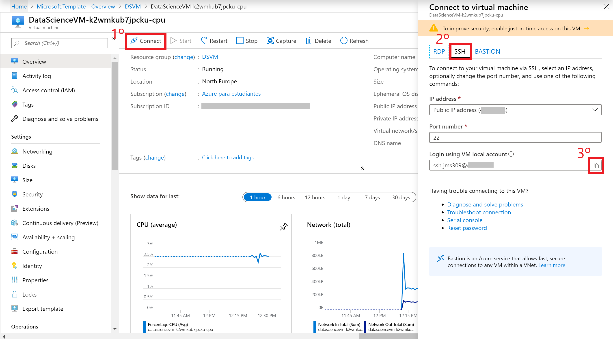
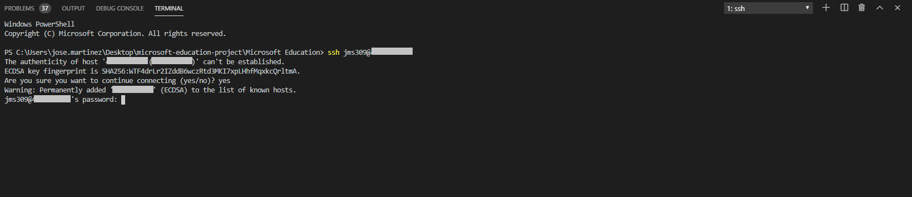
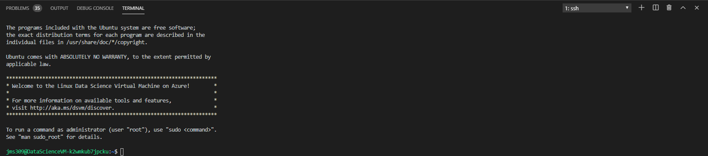
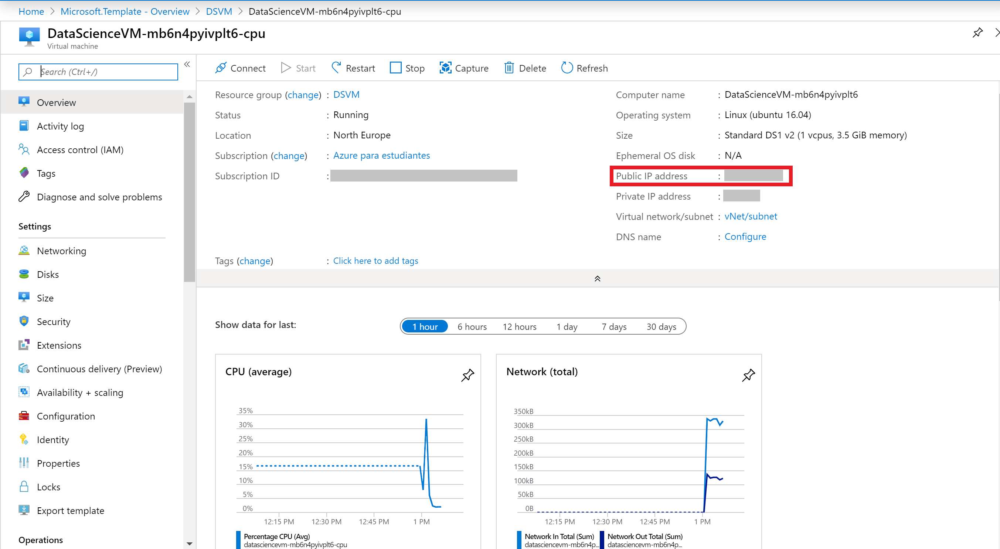
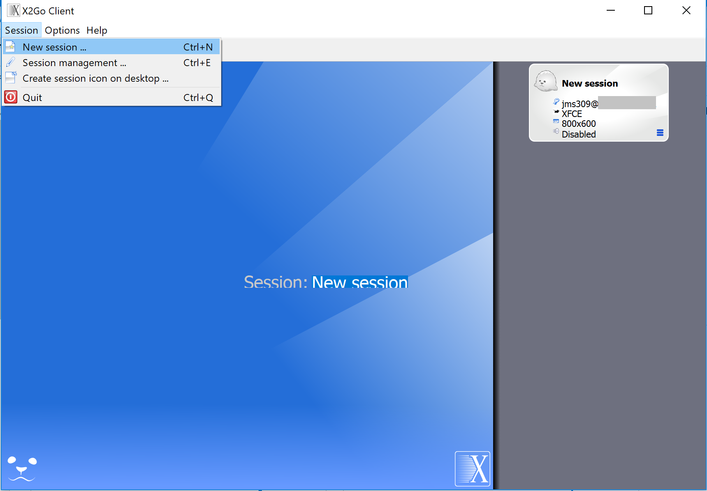
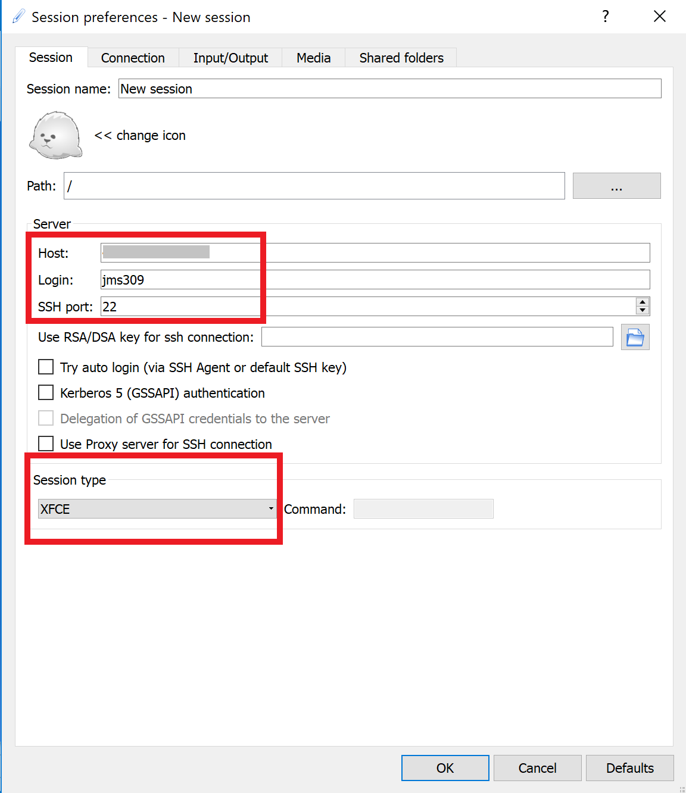
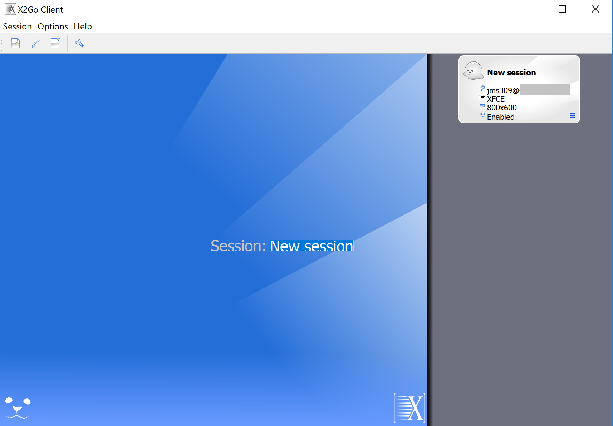
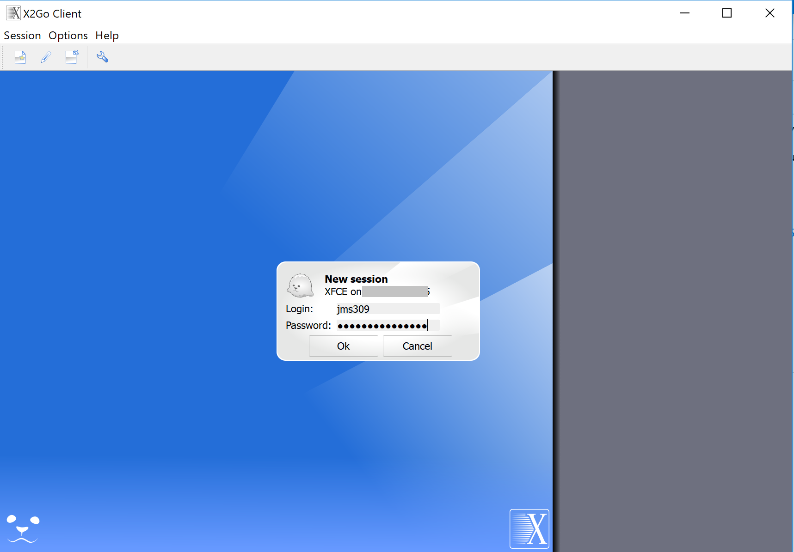
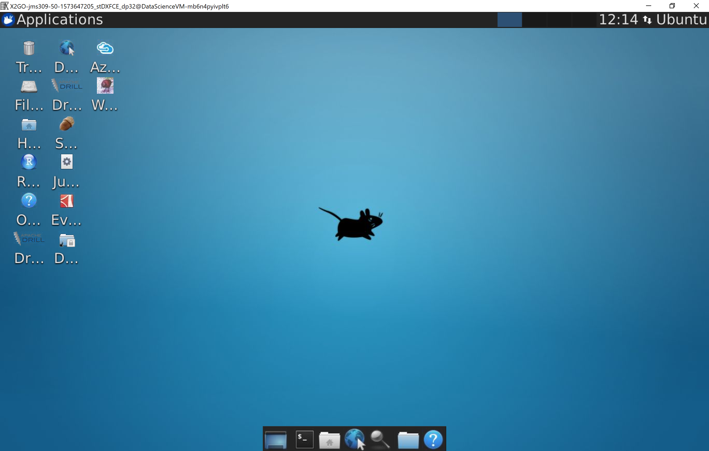

# Data Science Linux Ubuntu 18.04

This template deploys a **Linux VM Ubuntu with data science tools**. This will deploy a CPU or GPU based VM in the resource group location and will return the admin user name, Virtual Network Name, Network Security Group Name and FQDN.

If you are new to Azure virtual machines, see:

- [Azure Virtual Machines](https://azure.microsoft.com/services/virtual-machines/).
- [Azure Linux Virtual Machines documentation](https://docs.microsoft.com/azure/virtual-machines/linux/)
- [Azure Windows Virtual Machines documentation](https://docs.microsoft.com/azure/virtual-machines/windows/)
- [Template reference](https://docs.microsoft.com/azure/templates/microsoft.compute/allversions)
- [Quickstart templates](https://azure.microsoft.com/resources/templates/?resourceType=Microsoft.Compute&pageNumber=1&sort=Popular)
- [Microsoft learn](https://docs.microsoft.com/learn/browse/?term=Data%20Science%20Virtual%20Machine)

If you are new to template deployment, see:

- [Azure Resource Manager documentation](https://docs.microsoft.com/azure/azure-resource-manager/)
- [Data Science VM quickstart article](https://docs.microsoft.com/azure/machine-learning/data-science-virtual-machine/dsvm-tutorial-resource-manager)

## Usage

### Connect

You have two different ways to connect to the DSVM. You can connect to the solution via SSH or using the X2Go Client.

#### Connecting via SSH

You can connect to your virtual machine using SSH.

First, go to your resource (the VM) and click on connect. After that, go to the SSH tab. Finally, copy the command to connect to the VM.

Now, open any **bash terminal** and paste the command.

It will ask you to type your password. After that, you will be connected to the VM:

#### Connecting via X2Go Client

You can connect to your virtual machine using the X2Go Client. If you don't have the program, you can download it from [here](https://wiki.x2go.org/doku.php/doc:installation:x2goclient).

Then, go to your resource, and copy the virtual machine's public IP address.

Now, it's time to open the X2Go client. If the "New Session" window does not pop up automatically, go to Session -> New Session.

On the resulting configuration window, enter the following configuration parameters on the session tab:

- Host: Enter the IP address of your VM.
- Login: Enter the username of the Linux VM.
- SSH port: Leave it at 22, the default value.
- Session Type: Change the value to XFCE.

Then, click [Ok]. You will see your VM added to the right of the X2Go window. Click on the box of your VM to bring up the log-in screen.

Then enter the password and select [Ok]. You may have to give X2Go permission to bypass your firewall to finish connecting.

Now, you should see the graphical interface for your Ubuntu DSVM.

`Tags: Azure4Student, virtual machine, Linux, Ubuntu Server, Beginner, Data Science`
