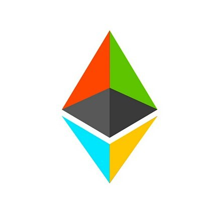

# Ethereum C++ Public Node

This Microsoft Azure template deploys a single C++ Ethereum client which will connect to the public Ethereum network.

 

Once your deployment is complete you will be able to connect to the Ethereum public network.

# Template Parameters
When you launch the installation of the VM, you need to specify the following parameters:
* `newStorageAccountNamePrefix`: make sure this is a unique identifier. Azure Storage's accounts are global so make sure you use a prefix that is unique to your account otherwise there is a good change it will clash with names already in use.
* `vmDnsName`: this is the public DNS name for the VM that you will use interact with your geth console. You just need to specify an unique name.
* `adminUsername`: self-explanatory. This is the account you will use for connecting to the node
* `adminPassword`: self-explanatory. Be aware that Azure requires passwords to have One upper case, one lower case, a special character, and a number
* `vmSize`: The type of VM that you want to use for the node. The default size is D1 (1 core 3.5GB RAM) but you can change that if you expect to run workloads that require more RAM or CPU resources.
* `location`: The region where the VM should be deployed to

# Ethereum C++ Deployment Walkthrough
1. Get your node's IP
 1. browse to https://portal.azure.com

 2. then click browse all, followed by "resource groups", and choose your resource group

 3. then expand your resources, and public ip address of your node.

2. Connect to your geth node
 1. SSH to the public ip of your node as the user you specified for `adminUsername`
 2. Enter your `adminPassword`

3. Invoke the following command to connect to the Ethereum public network:

`eth`

