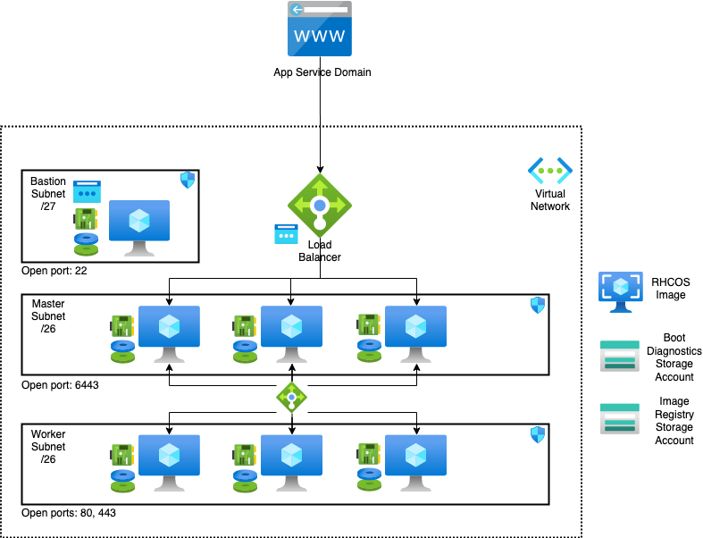

# Cloud Pak for Data 4.0.2 on Azure


[](https://portal.azure.com/#create/Microsoft.Template/uri/https%3A%2F%2Fraw.githubusercontent.com%2FAzure%2Fazure-quickstart-templates%2Fmaster%2Fapplication-workloads%2Fibm-cloud-pak%2Fibm-cloud-pak-for-data%2Fazuredeploy.json)
[](http://armviz.io/#/?load=https%3A%2F%2Fraw.githubusercontent.com%2FAzure%2Fazure-quickstart-templates%2Fmaster%2Fapplication-workloads%2Fibm-cloud-pak%2Fibm-cloud-pak-for-data%2Fazuredeploy.json)

Cloud Pak for Data is an end to end platform that helps organizations in their journey to AI. It enables data engineers, data stewards, data scientists, and business analysts to collaborate using an integrated multiple-cloud platform.
Cloud Pak for Data uses IBM’s deep analytics portfolio to help organizations meet data and analytics challenges. The required building blocks (collect, organize, analyze, infuse) for information architecture are available using Cloud Pak for Data on Azure.

Cloud Pak for Data uses Azure services and features, including VNets, Availability Zones, Availability Sets, security groups, Managed Disks, and Azure Load Balancers to build a reliable and scalable cloud platform.

This deployment guide provides step-by-step instructions for deploying IBM Cloud Pak for Data on a Red Hat OpenShift Container Platform 4.8 cluster on Azure. With this Template, you can automatically deploy a multi-master, production instance of Cloud Pak for Data. See [Services](#cloud-pak-for-data-services) for the services that are enabled in this deployment.

## Cost and licenses
Cloud Pak for Data offers a try and buy experience.
The automated template deploys the Cloud Pak for Data environment by using Azure Resource Manager templates.
The deployment template includes configuration parameters that you can customize. Some of these settings, such as instance count, will affect the cost of the deployment. For cost estimates, see the pricing page for each Azure service you will be using. Prices are subject to change.

**TRIAL:**<br/>
To request a 60 day trial license of Cloud Pak for Data please use the following link - [IBM Cloud Pak for Data Trial](https://www.ibm.com/account/reg/us-en/signup?formid=urx-42212).
Instructions to use your trial license/key are provided in the section - [IBM Cloud Pak for Data Trial key](#IBM-Cloud-Pak-for-Data-Trial-key).
Beyond the 60 day period, you will need to purchase the Cloud Pak for Data by following the instructions in the 'Purchase' section below.

**PURCHASE:**<br/>
To get pricing information, or to use your existing Cloud Pak for Data entitlements, contact your IBM sales representative at 1-877-426-3774. 
Note: Cloud Pak for Data license will include entitlements to RHEL and Openshift.

## Deployment Topology

Deploying this template builds the following Cloud Pak for Data cluster in a multi zone.



The template sets up the following:
- A highly available architecture that spans up to three Availability Zones.
- A Virtual network configured with public and private subnets.
-  In a public subnet, a bastion host to allow inbound Secure Shell (SSH) access to compute instances in private subnets.
-	In the private subnets:
    * OpenShift Container Platform master instances.
    * OpenShift compute nodes with machine auto scaling features.
- An Azure Load Balancer spanning the public subnets for accessing Cloud Pak for Data from a web browser.
- Storage disks with Azure Managed Disk mounted on compute nodes for Portworx or on an exclusive node for NFS.
- An Azure domain as your public Domain Name System (DNS) zone for resolving domain names of the IBM Cloud Pak for Data management console and applications deployed on the cluster.

## Deployment on Azure

### Prerequisites

1. You would need to create the following resources on your Azure account to use this deployment template:
  - An empty Resource Group. This resource group will be entered for the variable `clusterResourceGroupName`. If no values is passed for this variable, Openshift installer will create a resource group for the cluster. 
  - Service Principal, with Contributor and User Access Administrator on the scope of the new resource group just created.
  - App Service Domain OR a Private DNS Zone for Private clusters.

These can be done by running the azure CLI commands from any host where azure CLI is installed.
  * Create resource group
  ```bash
  az group create --name ClusterRG --location westus2
  ```
  * Create [App Service Domain](https://portal.azure.com/#create/Microsoft.Domain)
    * This will also create a DNS Zone needed for this deployment.
    * Note the DNS Zone name.
  * Create Azure Service Principal with `Contributor` and `User Access Administrator` roles.
    * **Option 1:** using the script provided in the `scripts` folder:
      ```bash
      az login
      scripts/createServicePrincipal.sh -r "Contributor,User Access Administrator"
      ```
    * **Option 2:** running the commands manually:
      * Create Service Principal, using your Azure Subscription ID, and save the returned json:
        ```bash
        az login
        az ad sp create-for-rbac --role="Contributor" --scopes="/subscriptions/<subscription_id>/resourceGroups/<cluster_rg>"
        ```
      * Get `Object ID`, using the AppId from the Service Principal just created:
        ```bash
        az ad sp list --filter "appId eq '<app_id>'"
        ```
      * Assign `User Access Administrator` roles, using the `Object Id`.
        ```bash
        az role assignment create --role "User Access Administrator" --assignee-object-id "<object_id>" --scopes="/subscriptions/<subscription_id>/resourceGroups/<cluster_rg>"
        ```
    * Save the `ClientID` and `ClientSecret` from either option.

2. [Download](https://cloud.redhat.com/openshift/install/pull-secret) a pull secret. Create a Red Hat account if you do not have one.

3. [Sign up](https://www.ibm.com/account/reg/us-en/signup?formid=urx-42212) for Cloud Pak for Data Trial Key if you don't have the entitlement api key

4. (Optional) If you choose Portworx as your storage class, see [Portworx documentation](PORTWORX.md) for generating `portworx spec url`. 

5. Read and agree to the [license terms](https://ibm.biz/BdqyB2)

### Steps to deploy

* Click on <a href="https://portal.azure.com/#create/Microsoft.Template/uri/https%3A%2F%2Fraw.githubusercontent.com%2FAzure%2Fazure-quickstart-templates%2Fmaster%2Fapplication-workloads%2Fibm-cloud-pak%2Fibm-cloud-pak-for-data%2Fazuredeploy.json" target="_blank">

</a>

* Log in to your Azure account if not already logged in.

* Now the parameters required for deployment are visible. Configure these parameters according to your requirements.
<br/><br/>


* Specify the resource group or create new using the given option

* Select the location

* Use the default values for artifacts location, SAS token and Location.

* Specify the Aad Client ID and Aad Client Secret. (See [Pre-requisites](#prerequisites))

* Specify the VM admin username

* Specify the VM sizes for Bastion, Master and Worker nodes

* Specify the number of instances (VMs) for Master and Worker in the cluster

* Specify ssh public key

<br/><br/>

<br/>

* Select 'new' network if you wish to deploy on a new network or you may deploy on an 'existing' network. In case of 'existing' network, make sure the new resources are also in the same region. For 'new' deployment, the network configuration parameters should be ignored

* If deployment is on an 'existing' network, specify the following:

    * Resource group where existing network is present

    * Virtual Network Name and Network CIDR
     
    * Master Subnet Name and Subnet Prefix
     
    * Worker Subnet Name and Subnet Prefix

    * Bastion Subnet Name and Subnet Prefix

* Specify the availability zone - single or multiple.

* Specify the DNS Zone and DNS Zone Resource Group

* Specify the OCP pull secret. (See [Pre-requisites](#prerequisites))

* Specify the cluster name

* Specify Openshift cluster admin username and password

* Specify Fips (true to enable)

* Specify the Storage - Portworx or NFS

* For Portworx, specify the Px spec Url (See [Pre-requisites](#prerequisites))

* Specify Enable Backup to enable backup for the NFS storage disk.

<br/><br/>

<br/><br/>

* Specify disk size

* Specify if the cluster should Private or Public endpoints

* Specify Project Name 

* Specify the add-ons needed- Watson Studio Library, Watson Machine Learning, Watson Knowledge Catalog, Data Virtualization, Cognos Dashboard,Watson Openscale, Apache Spark (select 'yes' to install)

* Specify Api Key (See [Pre-requisites](#prerequisites))

* Cloud Pak License Agreement (select 'yes' to agree)

* Finally, go through the [Cloud Pak for Data terms and conditions](https://ibm.biz/BdqyB2) and click on Purchase to deploy

<br/>

* The webconsole URL can be found in the `ResourceGroup`>`Deployments`>`azuredeploy`>`Outputs`.

* Access the respective console on a web browser.
* example:


<br/>

Use the default credentials for Cloud Pak for Data admin / password to log in to CPD console. Ensure to change the password after your first login.

## Cloud Pak for Data Services
You can browse the various services that are available for use by navigating to the services catalog page in Cloud Pak for Data


As part of the deployment, the following services can be enabled:
•	Watson Studio
•	Watson Knowledge Catalog
•	Watson Machine Learning
•	Data Virtualization
•	Watson Openscale
•	Cognos Dashboard
•	Analytics Engine


To get information on various other services that are available, you can visit [Cloud Pak for Data Service Catalog](https://www.ibm.com/support/producthub/icpdata/docs/content/SSQNUZ_current/cpd/svc/services.html)
