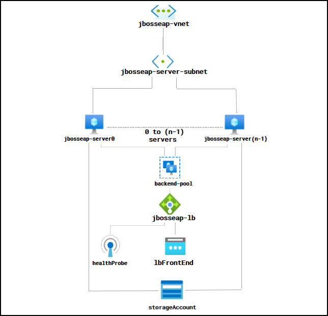
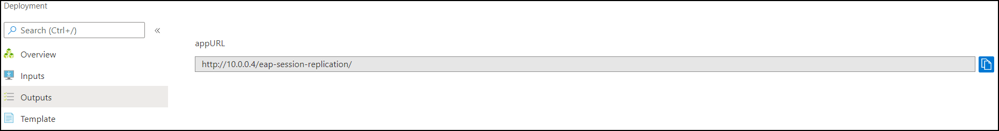
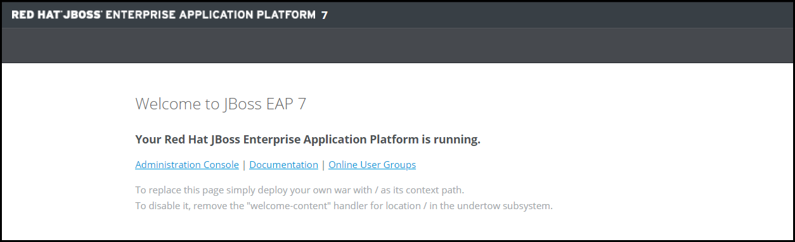
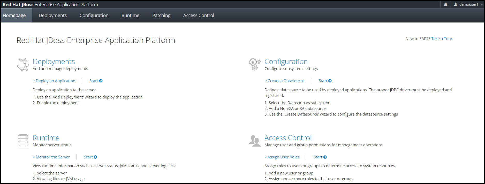
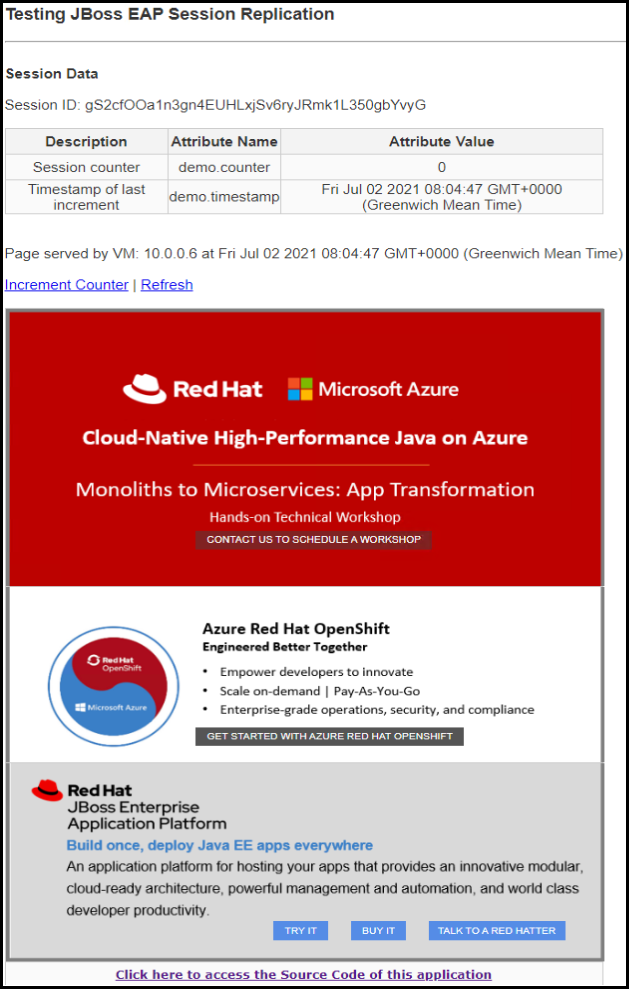
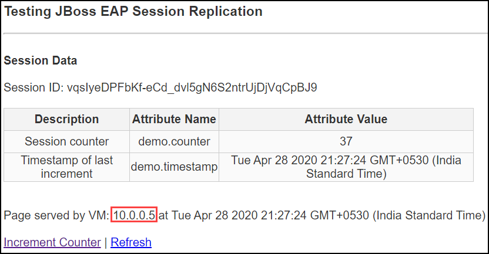
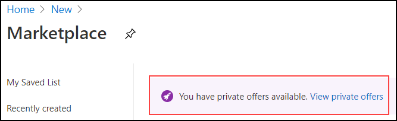
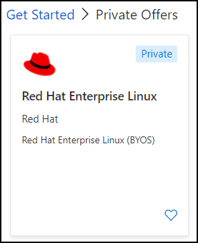

# JBoss EAP on RHEL (clustered, multi-VM)

<!-- TOC -->

1. [Solution Overview](#solution-overview)
2. [Template Solution Architecture](#template-solution-architecture)
3. [Subscriptions and Costs](#subscriptions-and-costs)
4. [Prerequisites](#prerequisites)
5. [Deployment Steps](#deployment-steps)
6. [Deployment Time](#deployment-time)
7. [Validation Steps](#validation-steps)
8. [Troubleshooting](#troubleshooting)
9. [Support](#support)

<!-- /TOC -->

## Solution Overview

JBoss Enterprise Application Platform (EAP) is an open source platform for highly transactional, web-scale Java applications. EAP combines the familiar and popular Jakarta EE specifications with the latest technologies, like MicroProfile, to modernize your applications from traditional Java EE into the new world of DevOps, cloud, containers, and microservices. EAP includes everything needed to build, run, deploy, and manage enterprise Java applications in a variety of environments, including on-premises, virtual environments, and in private, public, and hybrid clouds.

Red Hat Subscription Management (RHSM) is a customer-driven, end-to-end solution that provides tools for subscription status and management and integrates with Red Hat's system management tools. To obtain an RHSM account for JBoss EAP, go to: www.redhat.com.

## Template Solution Architecture

This Azure Resource Manager (ARM) template creates all the Azure compute resources to run JBoss EAP 7.3/ EAP 7.4 cluster running 'n' number of Red Hat Enterprise Linux (RHEL) 8.4 VM, where 'n' is decided by the user and all the VMs are added to the backend pool of a Load Balancer. The following resources are created by this template:

- RHEL 8.4 Virtual Machines
- 1 Load Balancer
- Virtual Network with a single subnet
- JBoss EAP 7.3/ EAP 7.4 cluster setup on the RHEL VMs
- Sample Java application called **eap-session-replication** deployed on JBoss EAP
- Storage Account

Note that the users also have the option to choose between the Red Hat Enterprise Linux version 8.4 and JBoss EAP versions 7.3 and 7.4. Users can select one of the following combinations for deployment

- JBoss EAP 7.3 on RHEL 8.4
- JBoss EAP 7.4 on RHEL 8.4

Following is the Architecture:

To learn more about the JBoss Enterprise Application Platform, visit: [Documentation for JBoss EAP 7.3](https://access.redhat.com/documentation/red_hat_jboss_enterprise_application_platform/7.3/) and [Documentation for JBoss EAP 7.4](https://access.redhat.com/documentation/red_hat_jboss_enterprise_application_platform/7.4/).

## Subscriptions and Costs

This ARM template is designed with flexible operating system (OS) options:

- Red Hat Enterprise Linux OS as Pay-As-You-Go (PAYG) or Bring-Your-Own-Subscription (BYOS) via Red Hat Gold Image model.
- Red Hat JBoss EAP is available through BYOS only.

#### Using RHEL OS with PAYG Model

By default this template uses the on-demand Red Hat Enterprise Linux PAYG image from the Azure Gallery. When using this on-demand image, there is an additional hourly RHEL subscription charge for using this image on top of the normal compute, network and storage costs. At the same time, the instance will be registered to your Red Hat subscription, therefore consuming one of your entitlements. This will lead to "double billing". To avoid this, you would need to build your own RHEL image, which is defined in this Red Hat KB article for [uploading RHEL image to Azure](https://access.redhat.com/articles/uploading-rhel-image-to-azure) or use RHEL Gold Image from the Azure Private Gallery offering.

Read [Red Hat Enterprise Linux pricing](https://azure.microsoft.com/pricing/details/virtual-machines/red-hat/) for details on the RHEL VMs pricing with PAYG model. In order to use RHEL in PAYG model, you will need an Azure Subscription with the specified payment method (RHEL 8.4 is an Azure Marketplace product and requires a payment method to be specified in the Azure Subscription).

#### Using RHEL OS with BYOS Model

In order to use BYOS for RHEL OS Licensing, you need to have a valid Red Hat subscription with entitlements to use RHEL OS in Azure. Please complete the following prerequisites in order to use RHEL OS through BYOS model before you deploy this quickstart template.

1. Ensure you have RHEL OS and JBoss EAP entitlements attached to your Red Hat Subscription.
2. Authorize your Azure Subscription ID to use RHEL BYOS images. Please follow [Red Hat Cloud Access program overview](https://access.redhat.com/documentation/en/red_hat_subscription_management/1/html/red_hat_cloud_access_reference_guide/getting-started-with-ca_cloud-access#proc_new-ca-experience-option2_cloud-access) to complete this process. This includes multiple steps including:

    2.1 Enable Microsoft Azure as provider in your Red Hat Cloud Access Dashboard.

    2.2 Add your Azure Subscription IDs.

    2.3 Enable new products for Cloud Access on Microsoft Azure.
    
    2.4 Activate Red Hat Gold Images for your Azure Subscription. Refer to [Getting access to Gold Images](https://access.redhat.com/documentation/en/red_hat_subscription_management/1/html/red_hat_cloud_access_reference_guide/understanding-gold-images_cloud-access#getting-access-to-gold-images_cloud-access) for more details.

    2.5 Wait for Red Hat Gold Images to be available in your Azure subscription. These are typically available within 3 hours.
    
3. Accept the Marketplace Terms and Conditions in Azure for the RHEL BYOS Images. You can complete this by running Azure CLI commands, as instructed below. Refer to [RHEL BYOS Gold Images in Azure documentation](https://docs.microsoft.com/azure/virtual-machines/workloads/redhat/byos) for more details.

    3.1 Launch an Azure CLI session and make sure your CLI version is updated to version 2.8 or newer before running these commands. Check the CLI version by running the following command and if your [CLI version](https://docs.microsoft.com/cli/azure/install-azure-cli-windows?view=azure-cli-latest&tabs=azure-cli) requires updating.

    `az version`
    
    3.2 Once your CLI session is ready, authenticate with your Azure account. Refer to [Signing in with Azure CLI](https://docs.microsoft.com/cli/azure/authenticate-azure-cli?view=azure-cli-latest) for assistance.

    3.3 Verify the RHEL BYOS images are available in your subscription by running the following CLI command. If your RHEL BYOS is not listed, please refer to #2 and ensure that your Azure subscription is activated for RHEL BYOS image.

    `az vm image list --offer rhel-byos --all`

    3.4 Run the following command to accept the Marketplace Terms for RHEL BYOS.

    `az vm image terms accept --publisher redhat --offer rhel-byos --plan rhel-lvm84` - *For RHEL 8.4 BYOS VM*

4. Your subscription is now ready to deploy RHEL 8.4 BYOS virtual machines.

#### Using JBoss EAP with BYOS Model

JBoss EAP is available on Azure through BYOS model only; you need to supply your RHSM credentials along with RHSM Pool ID showing valid EAP entitlements when deploying this template. If you do not have EAP entitlement, you must contact Red Hat for a subscription before you get started.

## Prerequisites

1. Ensure you have an Azure subscription compliant with licensing requirements specified in 'Subscriptions and Costs' section.

2. To deploy the template, you will need:

   - **Admin Username** and password or SSH key data which is an SSH RSA public key for the VM

   - **JBoss EAP Username** and password

   - **RHSM Username** and password

   - **RHSM Pool ID for JBoss EAP and/or RHEL OS**
    
## Deployment Steps

Build your environment with JBoss EAP 7.3/ EAP 7.4 cluster setup on 'n' number of RHEL 8.4 VMs where 'n' is decided by the user and all the VMs are added to the backend pool of a Load Balancer on Azure in a few simple steps:
1. Launch the template by clicking the **Deploy to Azure** button.
2. Complete the following parameter values and accept the Terms and Conditions before clicking on the **Purchase** button.

    - **Subscription** - Choose the appropriate subscription for deployment.

    - **Resource Group** - Create a new Resource Group or select an existing one.

    - **Location** - Choose the appropriate location for deployment.

    - **Admin Username** - User account name for logging into the RHEL VM.
    
    - **Authentication Type** - Type of authentication to use on the VM (password or SSH key).

    - **Admin Password or SSH key** - User account password or SSH key data which is an SSH RSA public key for logging into the RHEL VM.

    - **EAP on RHEL Version** - Select the EAP on RHEL version combination from the dropdown options, the default option selected here is JBoss EAP 7.3 on RHEL 8.4.

    - **JBoss EAP Username** - Username for JBoss EAP Admin Console.

    - **JBoss EAP Password** - User account password for JBoss EAP Admin Console.

    - **RHEL OS Subscription Type** - Select the type of RHEL OS license from the dropdown options for deploying the VM. You will have either the option of PAYG (by default) or BYOS.

    - **RHSM Username** - Username for the Red Hat Subscription Manager account.

    - **RHSM Password** - User account password for your RHSM account.
   
    - **RHSM Pool ID for JBoss EAP** - RHSM Pool ID (ensure you have EAP entitlement)

    - **RHSM Pool ID for RHEL** - RHSM Pool ID (ensure you have RHEL entitlement). This is **mandatory when selecting BYOS RHEL OS** as Subscription Type. This should be left blank when selecting RHEL OS PAYG Subscription Type.

    - **Storage Replication** - Select the [Replication Strategy](https://docs.microsoft.com/azure/storage/common/storage-redundancy) for the Storage account.

    - **VM Size** - Select the appropriate VM size option from the dropdown menu.

    - **Number of Instances** - Enter the number of VMs to be deployed.

    - Leave the rest of the parameter values (Artifacts and Location) as is, accept the Terms and Conditions, and proceed to purchase.
    
## Deployment Time

The deployment takes approximately 10 minutes to complete.

## Validation Steps

Once the deployment is successful, go to the outputs section of the deployment to obtain the **app URL**. You can access the RHEL VM and the application by following one of the 3 options:

1. Create a Jump VM in a different Virtual Network and access the Load Balancer and RHEL VM using Virtual Network Peering. (recommended method).
2. Create a Jump VM in a different subnet (new subnet) in the same Virtual Network and access the Load Balancer and RHEL VM via Jump VM.
3. Using an Application Gateway.

  

**Option 1 of 3**. Create a Jump VM in a different Virtual Network and access the Load Balancer and RHEL VM using Virtual Network Peering.

   - [Create a Windows Virtual Machine](https://docs.microsoft.com/azure/virtual-machines/windows/quick-create-portal#create-virtual-machine) - in a new Azure Resource Group, create a Windows VM. This should be in the same location as the Resource Group you deployed the template. Provide the required details and leave other configurations as default. This will create the Jump VM in a new Virtual Network.

   - [Peer the Virtual Networks](https://docs.microsoft.com/azure/virtual-network/tutorial-connect-virtual-networks-portal#peer-virtual-networks) - this is how you associate the Load Balancer with the Jump VM. Once the Virtual Network peering is successful, they can communicate with each other.

   - Go to the Jump VM details page and copy the Public IP. Log into the Jump VM using this Public IP.

   - To obtain the Private IP of a RHEL VM, go to the VM details page. Under Settings section go to *Networking* and copy the NIC Private IP. Open a web browser inside the Jump VM, go to **http://<PRIVATE_IP_Address>:8080** and you should see the web page as follows. Use the same Private IP to log into the RHEL VM.

     

   - To access the administration console, click on the **Administration Console** shown in the above image and enter JBoss EAP username and password to access the console of the respective VM.

     

   - To access the App UI console - copy the app URL from the output page of the deployment and paste it in a browser inside the Jump VM. The web application displays the *Session ID*, *Session counter* and *Timestamp* (these are variables stored in the session that are replicated) and the VM Private IP address that the web page and session is being hosted from. Clicking on the *Increment Counter* updates the session counter and clicking on *Refresh* will refresh the page.

     
  
     
     
   - Note that in the EAP Session Replication page of Load Balancer, the Private IP displayed is that of one of the VMs. If you click on *Increment Counter* or *Refresh* button when the service of the VM corresponding to the Private IP displayed is down (can be due to various reasons like VM in stopped state or VM restarting), the Private IP displayed will change to that of another VM Private IP but the Session ID remains the same. This validates that the Session was replicated.

     

**Option 2 of 3**. Create a Jump VM in a different subnet (new subnet) in the same Virtual Network and access the Load Balancer and RHEL VM via Jump VM.

   - [Add a new subnet](https://docs.microsoft.com/azure/virtual-network/virtual-network-manage-subnet#add-a-subnet) in the existing Virtual Network which contains the RHEL VMs.

   - [Create a Windows Virtual Machine](https://docs.microsoft.com/azure/virtual-machines/windows/quick-create-portal#create-virtual-machine) in Azure in the same Resource Group you deployed the template. Provide the required details and leave other configurations as default except for the Virtual Network and subnet. Make sure you select the existing Virtual Network in the Resource Group and select the subnet you just created in the step above. This will be your Jump VM.

   - Access Jump VM Public IP - once the Jump VM is successfully deployed, go to the VM details page and copy the Public IP. Log into the Jump VM using this Public IP.

   - To obtain the Private IP of a RHEL VM, go to the VM details page. Under Settings section go to *Networking* and copy the NIC Private IP. Open a web browser inside the Jump VM, go to **http://<PRIVATE_IP_Address>:8080** and you should see the web page as follows. Use the same Private IP to log into the RHEL VM.

     

   - To access the administration console, click on the **Administration Console** shown in the above image and enter JBoss EAP username and password to access the console of the respective VM.

     

   - To access the App UI console - copy the app URL from the output page of the deployment and paste it in a browser inside the Jump VM. The web application displays the *Session ID*, *Session counter* and *Timestamp* (these are variables stored in the session that are replicated) and the VM Private IP address that the web page and session is being hosted from. Clicking on the *Increment Counter* updates the session counter and clicking on *Refresh* will refresh the page.

     
  
     
     
   - Note that in the EAP Session Replication page of Load Balancer, the Private IP displayed is that of one of the VMs. If you click on *Increment Counter* or *Refresh* button when the service of the VM corresponding to the Private IP displayed is down (can be due to various reasons like VM in stopped state or VM restarting), the Private IP displayed will change to that of another VM Private IP but the Session ID remains the same. This validates that the Session was replicated.

     

**Option 3 of 3**. Using an Application Gateway

   - [Create an Application Gateway](https://docs.microsoft.com/azure/application-gateway/quick-create-portal#create-an-application-gateway) - to access the ports of the Load Balancer and the RHEL VMs, create an Application Gateway in a different subnet. This subnet must only contain Application Gateway.

   - Set *Frontends* parameters - make sure you select Public IP or both and provide the required details. Under *Backends* section, select **Add a backend pool** option and add your Load Balancer and RHEL VMs to the backend pool (ideally in different pools) of the Application Gateway.

   - Set access ports - under *Configuration* section add routing rules to access the ports 80 and 9990 of your Load Balancer and different rules to access port 9990 (admin console) of each RHEL VM.

   - Copy Public IP of Application Gateway - once the Application Gateway is created with the required configurations, go to the overview page and copy the Public IP of the Application Gateway.

   - To view the EAP Session Replication web page - open a web browser and go to *http://<PUBLIC_IP_AppGateway>/eap-session-replication/* and you should see the application running. The web application displays the *Session ID*, *Session counter* and *Timestamp* (these are variables stored in the session that are replicated) and the VM Private IP address that the web page and session is being hosted from. Clicking on the *Increment Counter* updates the session counter and clicking on *Refresh* will refresh the page.

     
  
     

   - Note that in the EAP Session Replication page of Load Balancer, the Private IP displayed is that of one of the VMs. If you click on *Increment Counter* or *Refresh* button when the service of the VM corresponding to the Private IP displayed is down (can be due to various reasons like VM in stopped state or VM restarting), the Private IP displayed will change to that of another VM Private IP but the Session ID remains the same. This validates that the Session was replicated.

     

   - To log into the JBoss EAP Admin Console of a VM - open a web browser and go to *http://<PUBLIC_IP_AppGateway>:listener_port*. Enter the JBoss EAP username and password to log in. The listener port should be the port of the listener which you have configured in routing rule associated with the particular RHEL VM.

     

## Troubleshooting

This section includes common errors faced during deployments and details on how you can troubleshoot these errors. 

#### Azure Platform 

- If the parameter criteria are not fulfilled (ex - the admin password criteria was not met) or if any mandatory parameters are not provided in the parameters section then the deployment will not start. The *Terms & Conditions* must be accepted before clicking on *Purchase*.

- Once the deployment starts the resources being deployed will be visible on the deployment page. In the case of any deployment failure, after parameter validation process, a more detailed failure message is available. 

- If your deployment fails at the **VM Custom Script Extension** resource, a more detailed failure message is available in the VM log file. Please refer to the next section for further troubleshooting.

#### Troubleshooting EAP deployment extension

This quickstart template uses VM Custom Script Extension to deploy and configure JBoss EAP with a sample application. Your deployment can fail at this stage due to several reasons such as:

- Invalid RHSM credentials or EAP entitlement
- Invalid JBoss EAP or RHEL OS entitlement Pool ID

Follow the steps below to troubleshoot this further:

1. Log into the provisioned VM through SSH as mentioned in the 'Validation section'.

2. Switch to root user

    `sudo su -`

3. Enter the VM admin password if prompted.

4. Change directory to logging directory

    `cd /var/lib/waagent/custom-script/download/0`

5. Review the logs in jbosseap.install.log log file.

    `more jbosseap.install.log`

This log file will have details that include deployment failure reason and possible solutions. If your deployment failed due to RHSM account or entitlements, please refer to 'Subscriptions and Costs' section to complete the prerequisites and try again. Note that after your Azure subscription receives access to Red Hat Gold Images, you can locate them in the Azure portal. Go to **Create a Resource** > **See all**. At the top of the page, you'll see that **You have private offers available** bar, click on *View private offers* link to view your private offers.

Your Private Offer will be tagged with *Private* as seen below.

Please refer to [Using the Azure Custom Script Extension Version 2 with Linux VMs](https://docs.microsoft.com/azure/virtual-machines/extensions/custom-script-linux) for more details on troubleshooting VM custom script extensions.

#### Cleanup

If your deployment fails due to any reason (like the ones mentioned above), make sure you delete the whole resource group so that you are not charged for any of the resources deployed so far before failure occurred. In case of successful deployment, follow the same process of deleting the resource group created by the template and related resources (if created in other resource groups) to optimize Azure cost. Note that if you want to keep any resources in the resource group, you can delete other resources manually which does not have dependencies on the resources that you do not want to delete. Once your resources are deleted make sure you log into your RHSM account and remove the system you registered for the deployment of the template, so that you do not hit the "Maximum Enabled Entitlement Quantity" (if you have set any). You can remove the registered system under the *Systems* section in the Red Hat portal.

`Tags: JBoss, Red Hat, EAP 7.3, EAP 7.4, Cluster, Load Balancer, RHEL 8.4, Azure, Azure VM, Java EE`

## Support

For any support related questions, issues or customization requirements with the GitHub template please contact [Spektra Systems](mailto:info@spektrasystems.com).

If you are experiencing production deployment issues please contact [Red Hat Support](https://www.redhat.com/en/services/support).
