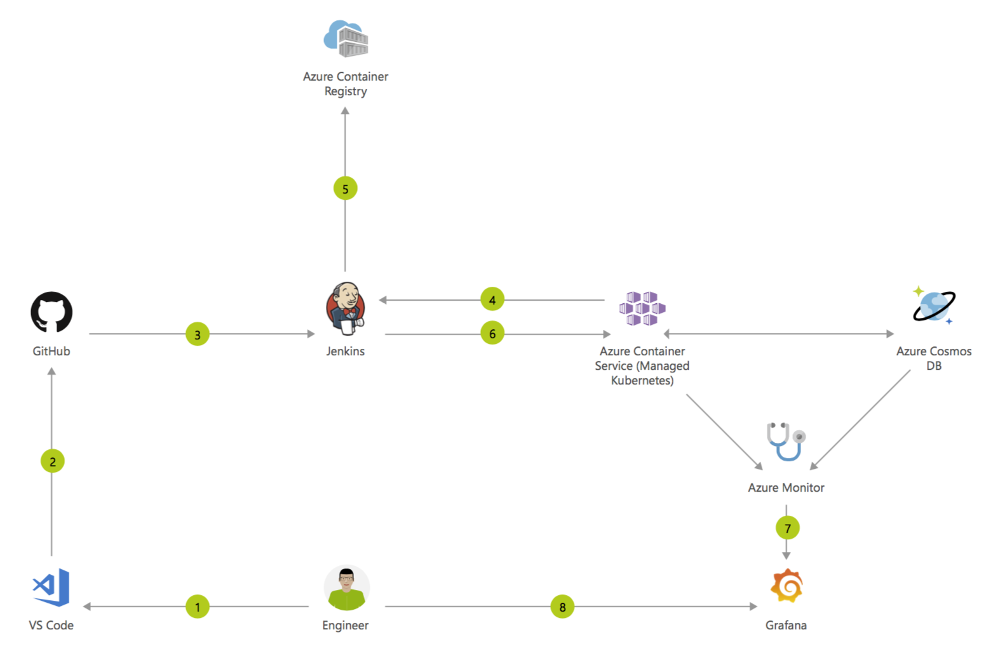
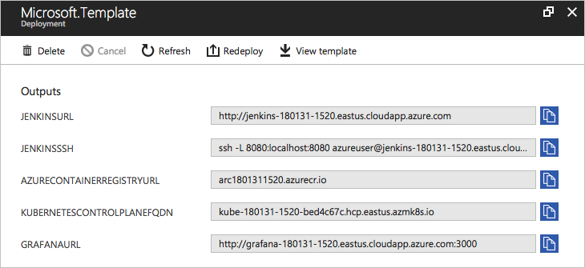
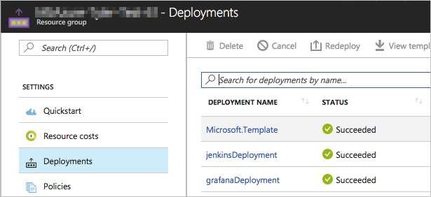
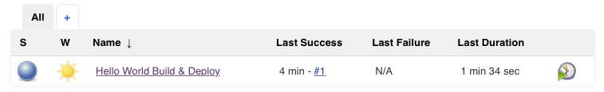
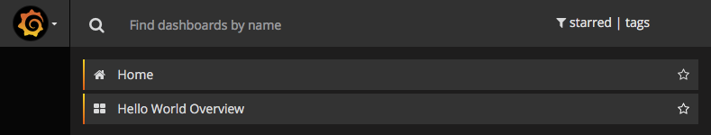
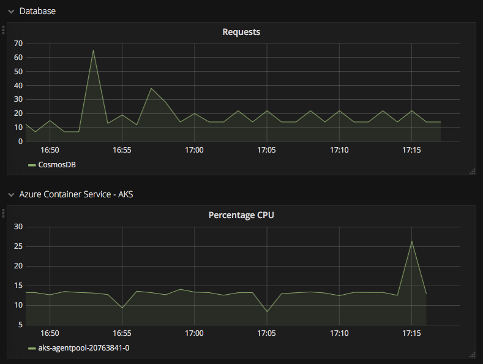

# Container CI/CD using Jenkins and Kubernetes on Azure Container Service (AKS)


## Architecture overview

Containers make it very easy for you to continuously build and deploy your applications. By orchestrating deployment of those containers using Kubernetes in Azure Container Service, you can achieve replicable, manageable clusters of containers.

By setting up a continuous build to produce your container images and orchestration, you can increase the speed and reliability of your deployment.



1. Change application source code.
2. Commit code to GitHub.
3. Continuous Integration Trigger to Jenkins.
4. Jenkins triggers a build job using Azure Container Service (AKS) for a dynamic build agent.
5. Jenkins builds and pushes Docker container Azure Container Registry.
6. Jenkins deploys new containerized app to Kubernetes on Azure Container Service (AKS) backed by Azure Cosmos DB.
7. Grafana displays visualization of infrastructure and application metrics via Azure Monitor.
8. Monitor application and make improvements.

## Deploy to Azure

### Create an Azure service principal

1. Install [Azure CLI](https://docs.microsoft.com/en-us/cli/azure/install-azure-cli?view=azure-cli-latest) if you have not.

2. Open terminal, then execute:

   ```sh
   az login
   ```

   Follow the guide to sign in.

3. Execute the command below to create service principal, with the role ``Contributor`` and under the current subscription by default.

   ```sh
   az ad sp create-for-rbac --name <AppName>
   ```

   > Note: please replate the \<AppName> placeholder.

4. You will get a response like below.

   ```json
   {
     "appId": "8e897eb4-069d-40c2-9563-b20fb0ac3c14",
     "displayName": "<AppName>",
     "name": "http://<AppName>",
     "password": "4309f67d-1719-44e3-bd47-12ab0409b13a",
     "tenant": "cc8ae42e-e3ba-44c6-97ba-2d7645d0a885"
   }
   ```

   Copy the values **appId** and **password**, they will be used later.

   > Note: for more details about creating an Azure service principal, please refer to [Create an Azure service principal with Azure CLI 2.0](https://docs.microsoft.com/en-us/cli/azure/create-an-azure-service-principal-azure-cli?view=azure-cli-latest)

### Deploy

1. Click **Deploy to Azure** to start the deployment.

[](https://portal.azure.com/#create/Microsoft.Template/uri/https%3A%2F%2Fraw.githubusercontent.com%2FAzure%2Fazure-quickstart-templates%2Fmaster%2Fapplication-workloads%2Fjenkins%2Fjenkins-cicd-container%2Fazuredeploy.json)  
[](https://portal.azure.us/#create/Microsoft.Template/uri/https%3A%2F%2Fraw.githubusercontent.com%2FAzure%2Fazure-quickstart-templates%2Fmaster%2Fapplication-workloads%2Fjenkins%2Fjenkins-cicd-container%2Fazuredeploy.json)
[](http://armviz.io/#/?load=https%3A%2F%2Fraw.githubusercontent.com%2FAzure%2Fazure-quickstart-templates%2Fmaster%2Fapplication-workloads%2Fjenkins%2Fjenkins-cicd-container%2Fazuredeploy.json)

   
   

   
   
   

2. Fill the form:

   * Choose a subscription.

   * Use a new resource group and choose a location.

   * Input the settings.

     > Note: 
     >
     > - The names and DNS prefixes should be unique. To avoid naming conflicting, we strongly recommend you to add some suffix. For example, the Cosmos Db name could be **cosmos-180130-1512**.
     > - ACR (Azure Container Registry) names may contain alpha numeric characters only. A valid name is **acr1801301512**.

   * Check **I agree to the terms and conditions stated above**.

3. Click **Purchase**.

   > Note: It will take about 13 minutes to finish the deployment. 

### Deployment output

After the deployment finishes, you will get some important information from the outputs section.



>Note: the deployment window above could be re-open in the **Deployments** tab of the resource group.
>
>
>
>Click the first one **Microsoft.Template**.

## Access Deployed Resources

### Access Jenkins

This Jenkins instance does not support https, so logging in through a public IP address has been disabled (it would expose your password and other information to eavesdropping). To securely login, you need to connect to the Jenkins instance using SSH port forwarding.

#### Connect to the Jenkins instance using SSH port forwarding

1. Copy the JENKINSSSH value from the Outputs section of the deployment.

2. Open terminal, then paste and execute it.

   ```Sh
   $ ssh -L 8080:localhost:8080 azureuser@jenkins-180131-1520.eastus.cloudapp.azure.com
   The authenticity of host 'jenkins-180131-1520.eastus.cloudapp.azure.com (40.71.20.174)' can't be established.
   ECDSA key fingerprint is SHA256:DCjXdLBLpeugm3eWG/xywT4xKYR/0QpVQaTnLwxB4Hk.
   Are you sure you want to continue connecting (yes/no)?
   ```

3. Input **yes** and press **Enter** key to accept and add the ECDSA to the list of known hosts.

   ```sh
   Warning: Permanently added 'jenkins-180131-1520.eastus.cloudapp.azure.com,40.71.20.174' (ECDSA) to the list of known hosts.
   azureuser@jenkins-180131-1520.eastus.cloudapp.azure.com's password: 
   ```

4. Input the **Linux Admin Password**

   If your pass work is correct, you will get the welcome message:

   ```Sh
   Welcome to Ubuntu 16.04.3 LTS (GNU/Linux 4.13.0-1007-azure x86_64) 
   ...
   ```

   Keep the terminal open.

#### Get the Jenkins admin password

1. Execute the command in the terminal:

   ```Sh
   sudo cat /var/lib/jenkins/secrets/initialAdminPassword
   ```

2. You will get the Jenkins admin password which looks like below:

   ```Sh
   77a6d3183ad24f9ca7df6181c81400d0
   ```

#### Log into Jenkins

1. Open http://localhost:8080 in a browser.

2. Click **log in** at the top-right.

3. Input the user and password:

   * User: admin
   * Password: *use the password you get in previous step*

   Click **log in**.

#### Check the sample pipeline job

After logged in, you will see the **Hello World Build & Deploy** pipline job. Please click to explore it.

 

### Access the hello world web app

#### Sign into Azure and get AKS credentials

1. Open terminal, execute:

   ```sh
   az login
   ```

   Follow the guide to sign in.

2. Execute the command below to get Kubenetes cluster credentials.

   ```sh
   aks get-credentials --resource-group <ResourceGroup> --name <KubenetesClusterName>
   ```

   > Note: please replace \<ResourceGroup> and \<KubenetesClusterName> before executing it.

   When done, you will get a prompt:

   ```Sh
   Merged "kube-180131-1520" as current context in /Users/<User>/.kube/config
   ```

#### Get Kubenetes service

1. Install [kubectl](https://kubernetes.io/docs/tasks/tools/install-kubectl/) if you have not.

2. Execute the command below:

   ```Sh
   kubectl get service
   ```

3. You will get the response like below:

   ```Sh
   NAME                  TYPE           CLUSTER-IP   EXTERNAL-IP      PORT(S)        AGE
   hello-world-service   LoadBalancer   10.0.98.99   52.168.126.156   80:32611/TCP   1h
   kubernetes            ClusterIP      10.0.0.1     <none>           443/TCP        1h
   ```

4. Copy the **external ip** of the **hello-world-service**.

#### Access the hello world web app

1. Open the **external ip** in a browser. You will see the response:

   ```html
   Hello World!
   There are 0 request records.
   ```

2. Refresh the page, the number of request records will increase.

### Access the Grafana instance

1. Copy the GRAFANAURL value from the Outputs section of the deployment.

2. Open it in a browser, then log in:

   * User: admin
   * Password: *use the Linux Admin Password*

3. Click **Home**.

   

   Then click **Hello World Overview**:

   

4. You will see the graphs:

   

