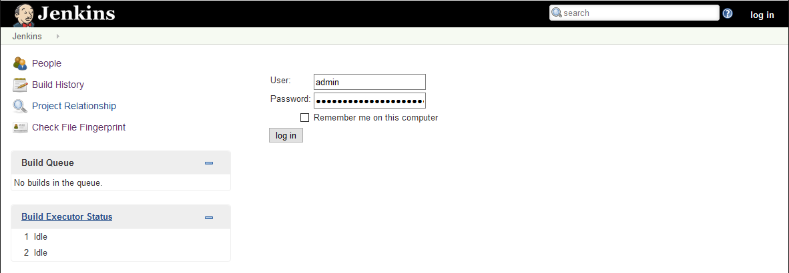

# Java CI/CD using Jenkins and Azure Web Apps


[](https://portal.azure.com/#create/Microsoft.Template/uri/https%3A%2F%2Fraw.githubusercontent.com%2FAzure%2Fazure-quickstart-templates%2Fmaster%2Fapplication-workloads%2Fjenkins%2Fjenkins-cicd-webapp%2Fazuredeploy.json)
[](https://portal.azure.us/#create/Microsoft.Template/uri/https%3A%2F%2Fraw.githubusercontent.com%2FAzure%2Fazure-quickstart-templates%2Fmaster%2Fapplication-workloads%2Fjenkins%2Fjenkins-cicd-webapp%2Fazuredeploy.json)
[](http://armviz.io/#/?load=https%3A%2F%2Fraw.githubusercontent.com%2FAzure%2Fazure-quickstart-templates%2Fmaster%2Fapplication-workloads%2Fjenkins%2Fjenkins-cicd-webapp%2Fazuredeploy.json)


Azure App Service is a fast and simple way to create web apps using Java, Node, PHP or ASP.NET, as well as support for custom language runtimes using Docker. A continuous integration and continuous deployment (CI/CD) pipeline that pushes each of your changes automatically to Azure app services allows you to deliver value faster to your customers.

## Deployment steps

1. Create service principal with the `Contributor` role with [Azure CLI](https://docs.microsoft.com/en-us/cli/azure/get-started-with-azure-cli?view=azure-cli-latest) if you don't have one in your subscription.
   ```shell
   az ad sp create-for-rbac --role="Contributor" --scopes="/subscriptions/${SUBSCRIPTION_ID}"
   ```

2. Your appId, password, sp_name, and tenant are returned. Make a note of the **appId** and **password**.

3. Click the **Deploy to Azure** button at the beginning of this document, and fill in the settings.
   - **Jenkins VM Admin Username** - Provide the user name for the Jenkins Virtual Machine.
   - **Jenkins VM Admin Password** - Provide the password for the Jenkins Virtual Machine, it must meet the complexity requirements, e.g. `30Jan2@18`
   - **Jenkins Dns Prefix** - Provide the unique DNS name for the Public IP used to access the Jenkins Virtual Machine.
   - **Jenkins Release Type** - Provide the Jenkins release type.
   - **Repository Url** - Provide the GitHub repository URL for the source code.
   - **Client Id** - Provide the client id for Azure service principal, use **appId** noted above.
   - **Client Secret** - Provide the client secret for Azure service principal, use **password** noted above.
   - **App Dns Prefix** - Provide the prefix name for web app components, accepts numbers and letters only.
   - **My Sql Admin Login** - Provide the user name for MySQL admin login.
   - **My Sql Admin Password** - Provide the password for MySQL admin login, it must meet the complexity requirements, e.g. `30Jan2@18`
   - **_artifacts Location** - Leave it with the default value.
   - **_artifacts Location Sas Token** - Leave it with the default value.

## Usage

### Check Jenkins Build Job Status

1. Find out the Jenkins URL in either **Outputs** section of the ARM template deployment blade, or in the `JenkinsPublicIP` component in the new resource group.

   
   

2. Open Jenkins URL in browser.

3. The `BuildWebApp` job will be queued automatically once the deployment complete, it will take several minutes to create and run the new build agent on Azure.

   

   You could also check the build agent status in the same resource group as Jenkins.

   

   Jenkins build will start once the build agent is running and available.

   

3. Click the build number (e.g. `#1`).

4. Click the **Console Output** in the left sidebar.

   

5. The build console output will be shown and keep refreshed until the build completes, you will also notice that a copy of the build is uploaded to the blob storage.
   

### Manage Jenkins

If you want to manage Jenkins, e.g. trigger a build manually, just follow the steps below.

1. Click the **log in** button on the top right of the Jenkins page.

   The Jenkins console is inaccessible through unsecured HTTP so instructions are provided on the page to access the Jenkins console securely from your computer using an SSH tunnel.

   

2. Set up the tunnel using the `ssh` command on the page from the command line, replacing `username` with the name of the virtual machine admin user chosen earlier.

   ```shell
   ssh -L 127.0.0.1:8080:localhost:8080 username@mswatest001.eastus.cloudapp.azure.com
   ```

   Or use [PuTTY](https://www.chiark.greenend.org.uk/~sgtatham/putty/) for Windows client alternatively.

   ```shell
   putty -ssh -L 127.0.0.1:8080:localhost:8080 username@mswatest001.eastus.cloudapp.azure.com
   ```

3. Get the initial password by running the following command in the command line while connected through SSH to the Jenkins VM.

   ```shell
   sudo cat /var/lib/jenkins/secrets/initialAdminPassword
   ```

4. Navigate to http://localhost:8080/ on your local machine.

5. Sign in with the user name `admin` and the initial password above.
   
   

6. Proceed management operations as need.

### Connect to Java Web App

1. The Java web app URL could be found in either the **Outputs** section of the ARM template deployment blade, or in the App Service component.

   
   

2. Navigate to the web app, it will query MySQL database and return the data.

   


