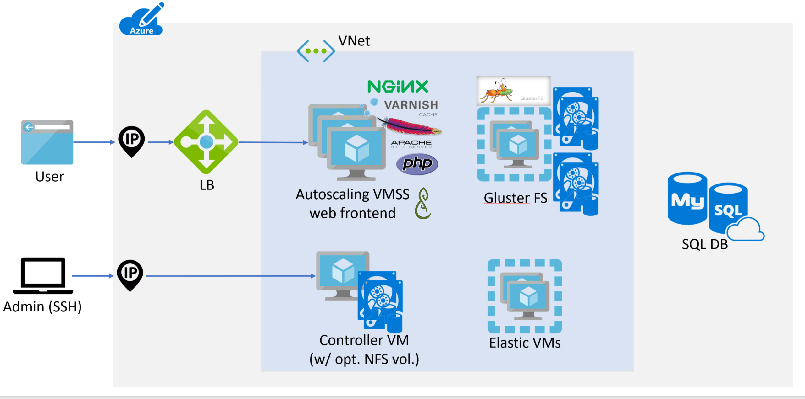

# *Deploy and manage a Scalable Mahara Cluster on Azure*


After deploying, these templates will provide you with a new Mahara site with caching for speed and scaling frontends to handle PHP load. The filesystem behind it is mirrored for high availability. Filesystem permissions and options have been tuned to make Mahara more secure than the default install.

[](https://portal.azure.com/#create/Microsoft.Template/uri/https%3A%2F%2Fraw.githubusercontent.com%2FAzure%2Fazure-quickstart-templates%2Fmaster%2Fapplication-workloads%2Fmahara%2Fmahara-autoscale-cache%2Fazuredeploy.json)
[](https://portal.azure.us/#create/Microsoft.Template/uri/https%3A%2F%2Fraw.githubusercontent.com%2FAzure%2Fazure-quickstart-templates%2Fmaster%2Fapplication-workloads%2Fmahara%2Fmahara-autoscale-cache%2Fazuredeploy.json)
[](http://armviz.io/#/?load=https%3A%2F%2Fraw.githubusercontent.com%2FAzure%2Fazure-quickstart-templates%2Fmaster%2Fapplication-workloads%2Fmahara%2Fmahara-autoscale-cache%2Fazuredeploy.json)

`Tags: cluster, ha, mahara, autoscale, linux, ubuntu`

## *What this stack will give you*

This template set deploys the following infrastructure:
- Autoscaling web frontend layer (Nginx for https termination, Varnish for caching, Apache/php or nginx/php-fpm)
- Private virtual network for frontend instances
- Controller instance running cron and handling syslog for the autoscaled site
- Load balancer to balance across the autoscaled instances
- [Azure Database for MySQL](https://azure.microsoft.com/en-us/services/mysql/) or [Azure Database for PostgreSQL](https://azure.microsoft.com/en-us/services/postgresql/) 
- Three Elasticsearch VMs for search indexing in Mahara (optional)*
- Dual Gluster nodes for high availability access to Mahara files

* Note: You will need to login into Mahara as 'admin' and configure the artifacts you want indexed after the installation has completed.



## *Deployment steps*

You can click the "deploy to Azure" button at the beginning of this document.

## *Using the created stack*

In testing, stacks typically took between 1 and 1 and a half hours to finish, depending on spec. Once this is done, you will receive JSON data with outputs needed to continue setup. You can also retrieve these from the portal or the CLI, more information below. The available parameters are:

- siteURL: If you provided a `siteURL` parameter when deploying this will be set to the supplied value. Otherwise it will be the same as the loadBalancerDNS, see below.
- loadBalancerDNS: This is the address of your load balancer. If you provided a `siteURL` parameter when deploying you'll need to add a DNS entry CNAMEs to this.
- maharaAdminPassword: The password for the "admin" user in your Mahara install.
- controllerinstanceIP: This is the address of the controller. You will need to SSH into this to make changes to your Mahara code or view logs.
- databaseDNS: This is the public DNS of your database instance. If you wish to set up local backups or access the db directly, you'll need to use this.
- databaseAdminUsername: The master account (not Mahara) username for your database.
- databaseAdminPassword: The master account password for your database.

Once Mahara has been created, and (if necessary) with your custom `siteURL` DNS pointing to the load balancer, you should be able to load the `siteURL` and login with "admin" and the password suppliedin the maharaAdminPassword.

#### Retrieving Deployment Configuration

The outputs provided by your deployment should include everything you need to manage your Mahara deployment. These are available in the portal by clicking on the deployment for your resource group. They are also available via the Azure CLI. For example:

Retrieve all the outputs in JSON format:

```
az group deployment show --resource-group $MAHARA_RG_NAME --name $MAHARA_DEPLOYMENT_NAME --out json --query *.outputs
```

Retrieve just the database password:

```
az group deployment show --resource-group $MAHARA_RG_NAME --name $MAHARA_DEPLOYMENT_NAME --out tsv --query *.outputs.databaseAdminPassword.value
```

Retrieve the public URL (if you did not provide your own URL):

```
az group deployment show --resource-group $MAHARA_RG_NAME --name $MAHARA_DEPLOYMENT_NAME --out tsv --query *.outputs.siteURL.value
```

### *Updating Mahara code/settings*

Your controller VM has Mahara code and data stored on /mahara. The code is stored in /mahara/html/mahara/. This is also mounted to your autoscaled frontends so all changes are instance. Depending on how large your Gluster disks are sized, it may be helpful to keep multiple older versions (/mahara/html1,/mahara/html2, etc) to roll back if needed.

### *Getting an SQL dump*

A daily SQL dump of your database is taken at 02:22 and saved to /mahara/db-backup.sql(.gz). If your database is small enough to fit, you may be able to get a more current SQL dump of your Mahara db by dumping it to /mahara/. Otherwise, you'll want to do this remotely by connecting to the hostname shown in the database-dns output using the database-admin-username and database-admin-password.

While Azure does not currently backup up Postgres/MySQL database, by dumping it to /mahara it is included in the Gluster VM backups should you enable Recovery Services in your parameters.

### *Azure Recovery Services*

If you have set azureBackupSwitch to 1 then Azure will provide VM backups of your Gluster node. This is recommended as it contains both your Mahara code and your sitedata. Restoring a backed up VM is outside the scope of this dos, but Azure's documentation on Recovery Services can be found here: https://docs.microsoft.com/en-us/azure/backup/backup-azure-vms-first-look-arm

### *Resizing your database*

Note: This involves a lengthy site downtime.

As mentioned above, Azure does not currently support resizing database. You can, however, create a new database instance and change your config to point to that. To get a different size database you'll need to:

1. Place your Mahara site into maintenance mode. You can do this either via the web interface or the command line on the controller VM.
2. Perform an SQL dump of your database, either to /mahara or remotely to your machine.
3. Create a new Azure database of the size you want inside your existing resource group.
4. Using the details in your /mahara/html/mahara/htdocs/config.php create a new user and database matching the details in config.php. Make sure to grant all rights on the db to the user.
5. On the controller instance, change the db setting in /mahara/html/mahara/htdocs/config.php to point to the new database.
6. Take Mahara out of maintenance mode.
7. Once confirmed working, delete the previous database instance.

How long this takes depends entirely on the size your database and the speed of your VM tier. It will always be a large enough window to make a noticeable outage.

### *Change the SSL cert*

The self-signed certificate generated by the template is suitable for very basic testing, but a public website will require a real certificate. After purchasing a trusted certificate, it can be copied to the following files to be ready immediately:

- /mahara/certs/nginx.key: Your certificate's private key
- /mahara/certs/nginx.crt: Your combined signed certificate and trust chain certificate(s).

Once replace these changes become effective immediately.

### *Sizing Considerations and Limitations*

Depending on what you're doing with Mahara, there are several considerations to make when configuring. The defaults included produce a cluster that is inexpensive but probably too low spec to use beyond single-user Mahara testing.

It should be noted that as of the time of writing both Postgres and MySQL databases are in preview at Azure. In the future larger DB sizes for different VM sizes will be available. The templates will allow you to select whatever sizeyou want, but there are restrictions in place (VMs with certain storage types, disk size for database tiers, etc) that may prevent certain selections from working together.

### *Database sizing*

As of the time of writing, Azure supports "Basic" and "Standard" tiers for database instances. In addition the skuCapacityDTU defines Compute Units, and the number of those you can use is limited by databas tier:

- Basic: 50, 100
- Standard: 100, 200, 400

This value also limits the maximum number of connections, as defined here: https://docs.microsoft.com/en-us/azure/mysql/concepts-limits

As the Mahara database will handle cron processes as well as the website, any public facing websites with than 10 users will likely require upgrading to 100. Once the site reaches 30+ users it will require upgrading to Standard for more compute units. This depends entirely on the individual site. As MySQL databases cannot change (or be restored to a different tier) once deployed it is a good idea to slightly overspec your database.

Standard instances have a minimum storage requirement of 128GB. All database storage, regardless of tier, has a hard upper limit of 1 terrabyte. After 128GB you gain additional iops for each GB, so if you're expecting a heavy amount of traffic you will want to oversize your storage. The current maximum iops with a 1TB disk is 3000.

### *Controller instance sizing*

The controller handles both syslog and cron duties. Depending on how big you Mahara cron runs are this may not be sufficient. If cron jobs are delayed and cron processess are building up on the controller then an upgrade in tier is needed.

### *Frontend instances*

In general the frontend instances will not be the source of any bottlenecs unless they are severely undersized versus the rest of the cluster. More powerful instances will be needed should fpm processess spawn and exhaust memory during periods of heavy site load. This can also be mitigated against by increasing the number of VMs but spawning new VMs is slower (and potentially more expensive) than having that capacity already available.

It is worth noting that the memory allowances on these instances allow for more memory than they may be able to provide with lower instance tiers. This is intentional as you can opt to run larger VMs with more memory and not require manual configuration. FPM also allows for a very large number of threads with prevents the systerm from failing during many small jobs.


