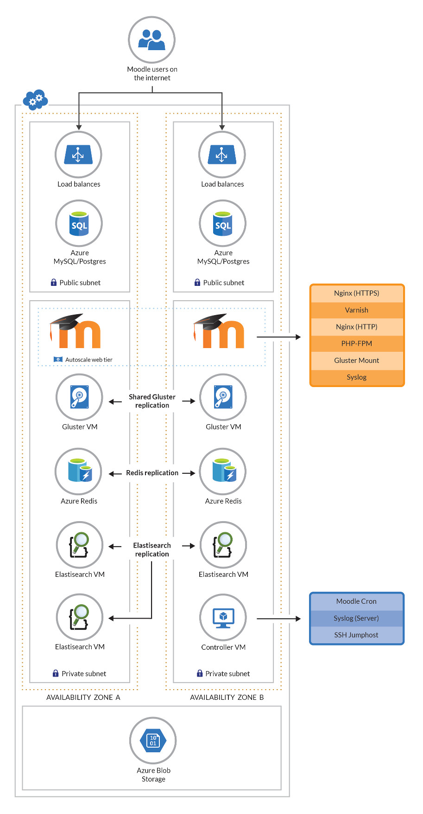

# *Autoscaling Moodle stack for Postgres or MySQL databases*


[](https://portal.azure.com/#create/Microsoft.Template/uri/https%3A%2F%2Fraw.githubusercontent.com%2FAzure%2Fazure-quickstart-templates%2Fmaster%2Fapplication-workloads%2Fmoodle%2Fmoodle-scalable-cluster-ubuntu%2Fazuredeploy.json)
[](https://portal.azure.us/#create/Microsoft.Template/uri/https%3A%2F%2Fraw.githubusercontent.com%2FAzure%2Fazure-quickstart-templates%2Fmaster%2Fapplication-workloads%2Fmoodle%2Fmoodle-scalable-cluster-ubuntu%2Fazuredeploy.json)
[](http://armviz.io/#/?load=https%3A%2F%2Fraw.githubusercontent.com%2FAzure%2Fazure-quickstart-templates%2Fmaster%2Fapplication-workloads%2Fmoodle%2Fmoodle-scalable-cluster-ubuntu%2Fazuredeploy.json)

After deploying, these templates will provide you with a new Moodle site with caching for speed and scaling frontends to handle PHP load. The filesystem behind it is mirrored for high availability and optionally backed up through Azure. Filesystem permissions and options have also been tuned to make Moodle more secure than a default install.

`Tags: cluster, ha, moodle, autoscale, linux, ubuntu`

## Reporting issues and Making Contributions

If you found these templates in the Azure Quickstarts Gallery then you are using the latest released version of the templates. Dependending on your goals you may prefer to work with the [development versions](http://github.com/Azure/Moodle) at http://github.com/Azure/Moodle.

If you wish to report any problems, make feature requests or issue a pull request against these templates please use the [issue tracker in our development repository](https://github.com/Azure/Moodle/issues) - they tend to get lost in the noise here on Azure Quickstarts.

## *What this stack will give you*

This template set deploys the following infrastructure:
- Autoscaling web frontend layer (Nginx, php-fpm, Varnish)
- Private virtual network for frontend instances
- Controller instance running cron and handling syslog for the autoscaled site
- Load balancer to balance across the autoscaled instances
- Postgres or MySQL database
- Azure Redis instance for Moodle caching
- ObjectFS in Azure blobs (Moodle sitedata)
- Three Elasticsearch VMs for search indexing in Moodle
- Dual gluster nodes for high availability access to Moodle files



## *Deployment steps*

You can click the "deploy to Azure" button at the beginning of this document or alternatively perform a deploy from the command line:

### *Command line deploys*
Once you've checked out the templates from git, you'll want to use the [Azure CLI tool](https://docs.microsoft.com/en-us/cli/azure/overview?view=azure-cli-latest) to deploy them. First off you'll want to create a group with these:

`az group create --name <stackname> --location <location>`

Note that some locations in Azure might not support features or certain VM tiers.

Next you'll want to either deploy and enter in all parameters manually:

`az group deployment create --name moodle-autoscale --resource-group <stackname> --template-file azuredeploy.json`

Alternatively, you can configure all your variables in the "azuredeploy.parameters.json" file and run:

`az group deployment create --name moodle-autoscale --resource-group <stackname> --template-file azuredeploy.json --parameters azuredeploy.parameters.json`

Note that `siteURL` is a special case in the `azuredeploy.parameters.json` files. If you do not define a value for `siteURL` or if you leave it as the default "www.example.org" this value will be overwritten by the template to be a calculated value for the public load balancers of your deployment. This allows you to experiment with this Moodle template without configuring a new domain name whilst still enabling Moodle to be configured with a production URL when appropriate. See the next section for instructions on retrieving the generated DNS name if necessary.

Depending on what tiers you selected for VMs and the database you will be looking at roughly 1-2 hours for a full deploy. See below for selectable parameters.

## *Using the created stack*

In testing, stacks typically took between 1 and 2 hours to finish,
depending on spec. Once this is done you will receive a JSON with
outputs needed to continue setup. You can also retrieve these from the
portal or the CLI, more information below. The available parameters
are:

- siteURL: If you provided a `siteURL` parameter when deploying this
  will be set to the supplied value. Otherwise it will be the same as
  the loadBalancerDNS, see below.
- loadBalancerDNS: This is the address of your load balancer. If you
  provided a `siteURL` parameter when deploying you'll need to add a
  DNS entry CNAMEs to this.
- moodleAdminPassword: The password for the "admin" user in your
  Moodle install.
- controllerInstanceIP: This is the address of the controller. You
  will need to SSH into this to make changes to your moodle code or
  view logs.
- databaseDNS: This is the public DNS of your database instance. If
  you wish to set up local backups or access the db directly, you'll
  need to use this.
- databaseAdminUsername: The master account (not Moodle) username for
  your database.
- databaseAdminPassword: The master account password for your
  database.

Once Moodle has been created, and (if necessary) with your custom
`siteURL` DNS pointing to the load balancer, you should be able to
load the `siteURL` and login with "admin" and the password supplied in
the moodleAdminPassword.

#### Retrieving Deployment Configuration

The outputs provided by your deployment should include everytyrhing
you need to manage your Moodle deployment. These are available in the
portal by clicking on the deployment for your resource group. They are
also available in via the Azure CLI. For example:

Retrieve all the outputs in JSON format:

```
az group deployment show --resource-group $MOODLE_RG_NAME --name $MOODLE_DEPLOYMENT_NAME --out json --query *.outputs
```

Retrieve just the database password

```
az group deployment show --resource-group $MOODLE_RG_NAME --name $MOODLE_DEPLOYMENT_NAME --out tsv --query *.outputs.databaseAdminPassword.value
```

Assign the database password to a variable (BASH):

```
MOODLE_DATABASE_DNS="$(az group deployment show --resource-group $MOODLE_RG_NAME --name $MOODLE_DEPLOYMENT_NAME --out tsv --query *.outputs.databaseDNS.value)"
```

### *Updating Moodle code/settings*

Your controller VM has Moodle code and data stored on /moodle. The code is stored in /moodle/html/moodle/. This is also mounted to your autoscaled frontends so all changes are instant. Depending on how large your Gluster disks are sized, it may be helpful to keep multiple older versions (/moodle/html1, /moodle/html2, etc) to roll back if needed.

### *Getting an SQL dump*

A daily sql dump of your database is taken at 02:22 and saved to /moodle/db-backup.sql(.gz). If your database is small enough to fit, you may be able to get a more current SQL dump of your Moodle db by dumping it to /moodle/. Otherwise, you'll want to do this remotely by connecting to the hostname shown in the database-dns output using the database-admin-username and database-admin-password.

While Azure does not currently back up Postgres/MySQL databases, by dumping it to /moodle it is included in the Gluster VM backups should you enable Recovery Services in your parameters.

### *Azure Recovery Services*

If you have set azureBackupSwitch to 1 then Azure will provide VM backups of your Gluster node. This is recommended as it contains both your Moodle code and your sitedata. Restoring a backed up VM is outside the scope of this doc, but Azure's documentation on Recovery Services can be found here: https://docs.microsoft.com/en-us/azure/backup/backup-azure-vms-first-look-arm

### *Resizing your Database*

Note: This involves a lengthy site downtime.

As mentioned above, Azure does not currently support resizing databases. You can, however, create a new database instance and change your config to point to that. To get a different size database you'll need to:

1. Place your Moodle site into maintenance mode. You can do this either via the web interface or the command line on the controller VM.
2. Perform an SQL dump of your database, either to /moodle or remotely to your machine.
3. Create a new Azure database of the size you want inside your existing resource group.
4. Using the details in your /moodle/html/moodle/config.php create a new user and database matching the details in config.php. Make sure to grant all rights on the db to the user.
5. On the controller instance, change the db setting in /moodle/html/moodle/config.php to point to the new database.
6. Take Moodle site out of maintenance mode.
7. Once confirmed working, delete the previous database instance.

How long this takes depends entirely on the size of your database and the speed of your VM tier. It will always be a large enough window to make a noticeable outage.

### *Changing the SSL cert*

The self-signed cert generated by the template is suitable for very basic testing, but a public website will want a real cert. After purchasing a trusted certificate, it can be copied to the following files to be ready immediately:

- /moodle/certs/nginx.key: Your certificate's private key
- /moodle/certs/nginx.crt: Your combined signed certificate and trust chain certificate(s).

Once replaced these changes become effective immediately.

## *Sizing Considerations and Limitations*

Depending on what you're doing with Moodle, there are several considerations to make when configuring. The defaults included produce a cluster that is inexpensive but probably too low spec to use beyond single-user Moodle testing.

It should be noted that as of the time of this writing both Postgres and MySQL databases are in preview at Azure. In the future larger DB sizes or different VM sizes will be available. The templates will allow you to select whatever size you want, but there are restrictions in place (VMs with certain storage types, disk size for database tiers, etc) that may prevent certains selections from working together.

### *Database Sizing*

As of the time of this writing, Azure supports "Basic" and "Standard" tiers for database instances. In addition the skuCapacityDTU defines Compute Units, and the number of those you can use is limited by database tier:

- Basic: 50, 100
- Standard: 100, 200, 400, 800

This value also limits the maximum number of connections, as defined here: https://docs.microsoft.com/en-us/azure/mysql/concepts-limits

As the Moodle database will handle cron processes as well as the website, any public facing website with more than 10 users will likely require upgrading to 100. Once the site reaches 30+ users it will require upgrading to Standard for more compute units. This depends entirely on the individual site. As MySQL databases cannot change (or be restored to a different tier) once deployed it is a good idea to slightly overspec your database.

Standard instances have a minimum storage requirement of 128000MB. All database storage, regardless of tier, has a hard upper limit of 1 terrabyte. After 128GB you gain additional iops for each GB, so if you're expecting a heavy amount of traffic you will want to oversize your storage. The current maximum iops with a 1TB disk is 3000.

### *Controller instance sizing*

The controller handles both syslog and cron duties. Depending on how big your Moodle cron runs are this may not be sufficient. If cron jobs are very delayed and cron processes are building up on the controller then an upgrade in tier is needed.

### *Frontend instances*

In general the frontend instances will not be the source of any bottlenecks unless they are severely undersized versus the rest of the cluster. More powerful instances will be needed should fpm processes spawn and exhaust memory during periods of heavy site load. This can also be mitigated against by increasing the number of VMs but spawning new VMs is slower (and potentially more expensive) than having that capacity already available.

It is worth noting that the memory allowances on these instances allow for more memory than they may be able to provide with lower instance tiers. This is intentional as you can opt to run larger VMs with more memory and not require manual configuration. FPM also allows for a very large number of threads which prevents the system from failing during many small jobs.


