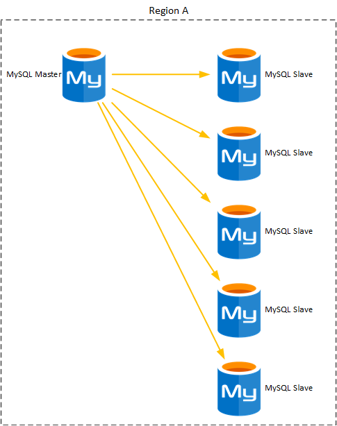

# MySQL PaaS Replication


[](https://portal.azure.com/#create/Microsoft.Template/uri/https%3A%2F%2Fraw.githubusercontent.com%2FAzure%2Fazure-quickstart-templates%2Fmaster%2Fapplication-workloads%2Fmysql%2Fmysql-paas-replication%2Fazuredeploy.json)
[](https://portal.azure.us/#create/Microsoft.Template/uri/https%3A%2F%2Fraw.githubusercontent.com%2FAzure%2Fazure-quickstart-templates%2Fmaster%2Fapplication-workloads%2Fmysql%2Fmysql-paas-replication%2Fazuredeploy.json)
[](http://armviz.io/#/?load=https%3A%2F%2Fraw.githubusercontent.com%2FAzure%2Fazure-quickstart-templates%2Fmaster%2Fapplication-workloads%2Fmysql%2Fmysql-paas-replication%2Fazuredeploy.json)

`Tags: MySQL, Replication, PaaS, Replicas, Read-Only`

# Introduction

This ARM template provides a solution to replicate a Azure DB for MySQL instance.

# Template description

This ARM template will deploy only MySQL PaaS instances. Depending on the information provided it might deploy from 1 to 6 instances. In the case of deploying only 1 (a master and 0 copies) and SQL Instance will be created and no read only copies will be deployed. Any other combination will deploy a master MySQL PaaS instance and between 1 to 5 read only replicas. All of them will be deployed within the same region and resource group.



This implementation is based on what is described in [Read replicas in Azure Database for MySQL](https://docs.microsoft.com/en-us/azure/mysql/concepts-read-replicas)

## How to connect to the services deployed

Use this command line to connect to the MySQL PaaS instances, if using the CloudShell no additional steps will be required. But if connecting from somewhere else you might need to add your IP to the MySQL firewall ([Configure Firewall Rules](https://docs.microsoft.com/en-us/azure/mysql/howto-manage-firewall-using-portal)):

```bash
mysql -h <fqdnOfTheMySQLInstance> -u <userCreatedForTheMySQLInstance>@<fqdnOfTheMySQLInstance> -p
```
