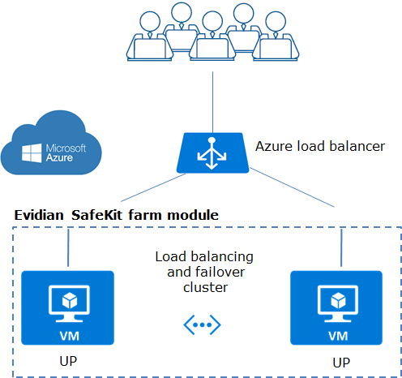

# Evidian SafeKit - Load Balancing Cluster with Failover in Azure - Farm Module

  [!
  [!
[Visualize](https://raw.githubusercontent.com/Azure/azure-quickstart-templates/master/1-CONTRIBUTION-GUIDE/images/visualizebutton.svg?sanitize=true)](http://armviz.io/#/?load=https%3A%2F%2Fraw.githubusercontent.com%2FAzure%2Fazure-quickstart-templates%2Fmaster%2Fapplication-workloads%2Fsafekit%2Fsafekit-cluster-farm%2Fazuredeploy.json)

*   [Description](#description)
*   [Deployed resources](#resources)
*   [How to use](#use)
*   [More information](#more)

## <a name="description">Description

On the previous figure,

*   the critical application is running in all servers of the farm,
*   users are connected to a virtual IP address which is configured in the Azure load balancer.
SafeKit brings a generic health probe for the load balancer. When the farm module is stopped in a server, the health probe returns NOK to the load balancer which stops the load balancing of requests to the server. The same behavior happens when there is a **hardware failure**.
*   in each server, SafeKit monitors the critical application with process checkers and custom checkers;
*   SafeKit restarts automatically the critical application in a server when there is a **software failure** thanks to the restart scripts;
*   a connector for the SafeKit web console is installed in each server. Thus, the load balancing cluster can be managed in a very simple way to avoid **human errors**.

## <a name="resources">Deployed resources

In term of VMs, this template deploys:

*   from 2 to 4 VMs (Windows or Linux) spanning 2 or 3 availability zone(s)
*   each VM has a public IP address (Standard SKU)
*   the SafeKit free trial is installed in all VMs
*   a SafeKit farm module is configured in all VMs

In term of load balancer, this template deploys:

*   a public load balancer (standard SKU)
*   a public IP (Standard SKU) is associated with the public load balancer and plays the role of the virtual IP
*   alls VMs are in the backend pool of the load balancer
*   a health probe checks the farm module state on all VMs
*   a load balancing rule for external port 9453 / internal port 9453 is set to test the load balanced virtual IP

## <a name="use">How to use

Click the "Deploy to Azure" button at the beginning of this document to deploy the load balancing cluster. Please create a new resource group.

After deployment, go to the resource group's 'Microsoft.Template' deployment output panel (Home > Resource Groups > YourResourceGroup - Deployments) and:

*   visit the credential url to install the client and CA certificates in your web browser
*   after certificates installation, start the web console of the cluster
*   test the load balanced virtual IP address with the test URL in the output

## <a name="more">More information on **Evidian SafeKit** in Azure

*   [Azure: The Simplest Load Balancing Cluster with Failover](https://www.evidian.com/products/high-availability-software-for-application-clustering/azure-load-balancing-cluster-failover/)
*   [Azure: The Simplest High Availability Cluster with Synchronous Replication and Failover](https://www.evidian.com/products/high-availability-software-for-application-clustering/azure-high-availability-cluster-synchronous-replication-failover/)

`Tags: load balancing, cluster, failover, high availability, business continuity, disaster recovery, evidian, safekit, farm`

