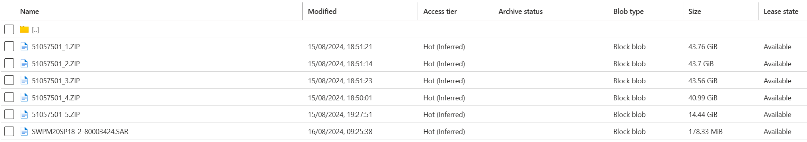

# SAP 2-tier S/4HANA Fully Activated Appliance


[](https://portal.azure.com/#create/Microsoft.Template/uri/https%3A%2F%2Fraw.githubusercontent.com%2FAzure%2Fazure-quickstart-templates%2Fmaster%2Fapplication-workloads%2Fsap%2Fsap-2-tier-s4hana-fully-activated-appliance%2Fazuredeploy.json)
[](https://portal.azure.us/#create/Microsoft.Template/uri/https%3A%2F%2Fraw.githubusercontent.com%2FAzure%2Fazure-quickstart-templates%2Fmaster%2Fapplication-workloads%2Fsap%2Fsap-2-tier-s4hana-fully-activated-appliance%2Fazuredeploy.json)
[](http://armviz.io/#/?load=https%3A%2F%2Fraw.githubusercontent.com%2FAzure%2Fazure-quickstart-templates%2Fmaster%2Fapplication-workloads%2Fsap%2Fsap-2-tier-s4hana-fully-activated-appliance%2Fazuredeploy.json)

## SAP 2-tier S/4HANA Fully Activated Appliance Overview 

Explore the latest and greatest features of SAP S/4HANA with this fully activated appliance on Azure! This template deploy the ABAP stack of a **Fully activated SAP S/4HANA system**. You can find more information about this type of deployment method in this excellent [SAP blog post by Mahesh Sardesai](https://community.sap.com/t5/enterprise-resource-planning-blogs-by-sap/s-4hana-2022-fps1-fully-activated-appliance-standard-installation/ba-p/13547947). 

## Deployment steps

1. **SAP Software**: You must have the SAP S/4HANA Fully Activated Appliance software. Download the software media from the [SAP Software Centre](https://me.sap.com/softwarecenter). This deployment was build on the SAP software for the S/4HANA 2023 version, which are 51057501_1.ZIP, 51057501_2.ZIP, 51057501_3.ZIP, 51057501_4.ZIP and SWPM20SP1880003424.SAR. You might need to adjust the scripts if you are using a different version. 

2. **Storage Account**: A storage account is required to store the SAP software media. Create one using the Azure portal or follow [Create an Azure Storage Account and Blob Container](https://docs.microsoft.com/azure/storage/blobs/storage-quickstart-blobs-portal). Upload the SAP software media to a blob container in the storage account. An example of the uploaded files is shown below:



3. You can click the "deploy to Azure" button at the beginning of this document or follow the instructions for command line deployment using the scripts in the root of this repo.

4. Run the SAP S/4HANA Fully Activated Appliance installation 

Log in to the VM and run the following commands. Run this command in a jump server to ensure that the installation process is not interrupted. As a prerequisite, you must have set up a [Managed Identity](https://learn.microsoft.com/en-us/entra/identity/managed-identities-azure-resources/overview) or use a temporary storage account SAS token to retrieve the SAP software from the storage account. Note that for optimal security, Microsoft recommends using managed identities to authorize requests.  

```bash
sudo su -
/sapmedia/s4install.sh 'https://<storage account name>.blob.core.windows.net/<container name>/'
```

or

```bash
sudo su -
/sapmedia/s4install.sh 'https://<storage account name>.blob.core.windows.net/<container name>/' 'SAS Token' 
```

5. Wait for Installation to Complete 
Go for a long coffee or tea break. Or better yet, read the latest [SAP on Azure blog posts](https://techcommunity.microsoft.com/t5/sap-on-microsoft/ct-p/SAPonMicrosoft). Installation typically takes 2-3 hours and you can follow the installation progress in the log file located at `/var/log/azure-quickstart-install-s4.log`.

## Usage

### Connect

You will need a SAPGUI to connect to the SAP S/4HANA system. You can download the SAPGUI from the [SAP Software Centre](https://me.sap.com/softwarecenter).

### Stop and Start
As s4hadm user, you can stop and start the SAP system using the following commands:

```bash
sapcontrol -nr 00 -function StopSystem
sapcontrol -nr 01 -function StopSystem

sapcontrol -nr 00 -function StartSystem
sapcontrol -nr 01 -function StartSystem
```

As hdbadm, you can stop and start the HANA database using the following commands:

```bash
HDB stop
HDB start
```

## Notes
This template is design for a proof of concept or training environment. For production deployments of your SAP S/4HANA system, it is recommended to use [Azure Centre for SAP Solutions](https://learn.microsoft.com/en-us/azure/sap/center-sap-solutions/overview) or the [SAP on Azure Deployment Automation Framework](https://learn.microsoft.com/en-us/azure/sap/center-sap-solutions/overview).

When you no longer need the resources, you can delete the delete VM. The template is configured to delete the VM and the associated disks and nic when the VM is deleted, but will not delete the storage account or the resource group. 

Solution notes

`Tags: SAP, S/4HANA, S/4HANA Fully Activated Appliance, SAP on Azure`

