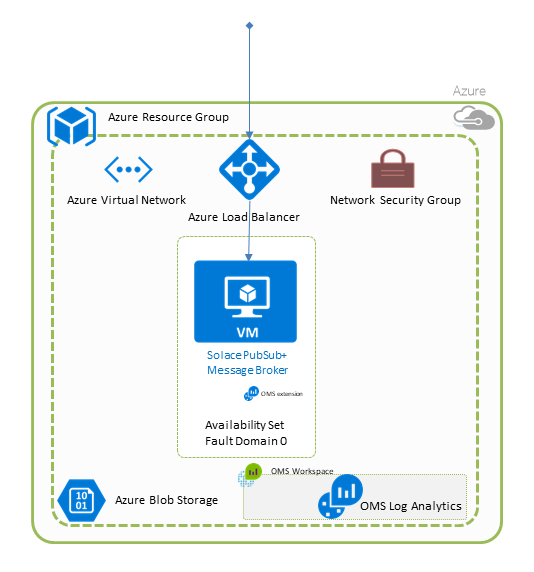
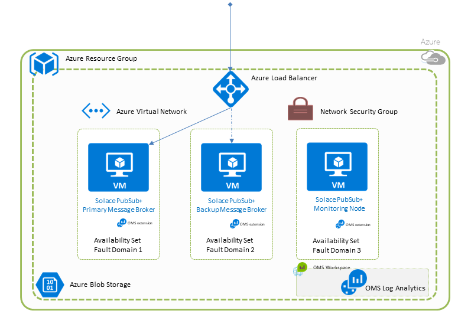
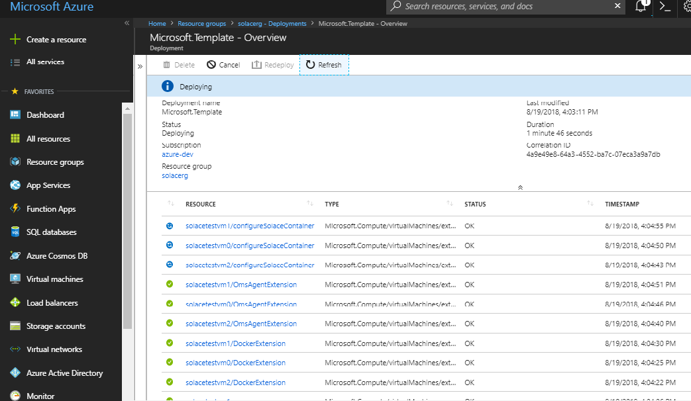
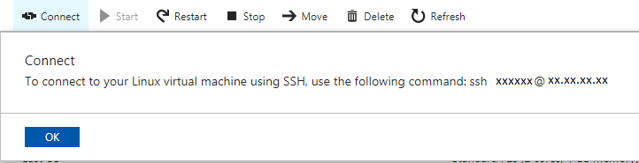
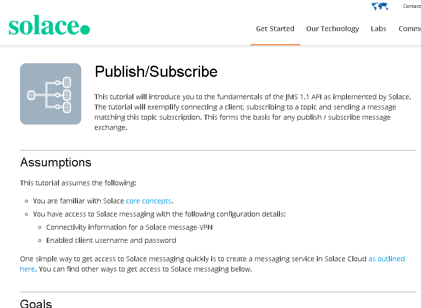

# How to Deploy Standalone or HA Clusters of Solace PubSub+ Software Event Brokers onto Azure


[](https://portal.azure.com/#create/Microsoft.Template/uri/https%3A%2F%2Fraw.githubusercontent.com%2FAzure%2Fazure-quickstart-templates%2Fmaster%2Fapplication-workloads%2Fsolace%2Fsolace-message-router%2Fazuredeploy.json)

[](http://armviz.io/#/?load=https%3A%2F%2Fraw.githubusercontent.com%2FAzure%2Fazure-quickstart-templates%2Fmaster%2Fapplication-workloads%2Fsolace%2Fsolace-message-router%2Fazuredeploy.json)    

The Solace PubSub+ software event broker meets the needs of big data, cloud migration, and Internet-of-Things initiatives, and enables microservices and event-driven architecture. Capabilities include topic-based publish/subscribe, request/reply, message queues/queueing, and data streaming for IoT devices and mobile/web apps. The event broker supports open APIs and standard protocols including AMQP, JMS, MQTT, REST, and WebSocket. As well, it can be deployed in on-premise datacenters, natively within private and public clouds, and across complex hybrid cloud environments.

How to Deploy a Solace PubSub+ Software Event Broker
-------------------

Message brokers can be deployed in three node HA clusters or as single, standalone nodes. For simple test environments that only need to validate application functionality, a single instance will suffice.



Note that in production, or any environment where message loss cannot be tolerated, an HA cluster is required.

The following diagram shows the PubSub+ broker nodes deployed in [Azure Availability Sets](//docs.microsoft.com/en-us/azure/virtual-machines/availability#availability-sets). To meet more strict service uptime requirements the broker nodes can be deployed in [Azure Availability Zones](//docs.microsoft.com/en-us/azure/virtual-machines/availability#availability-zones) instead.

Also note that for production use the type of data disks mounted from Azure Block Storage shall be adjusted from the default [Standard HDD](//docs.microsoft.com/en-us/azure/virtual-machines/disks-types)

The Load Balancer in the diagram is exposed publicly and the VMs are also publicly accessible via SSH. This is not always desirable and an "Internal" deployment option is also provided, which will only expose these internally with no public IP addresses created. In this case the Load Balancer and the VMs are only accessible from a VM within the virtual network. 




The deployment is a two step process:

### Step 1: 

Obtain a reference to the Docker image of the Solace PubSub+ event broker to be deployed

First, decide which [Solace PubSub+ event broker](//docs.solace.com/Solace-SW-Broker-Set-Up/Setting-Up-SW-Brokers.htm ) and version is suitable to your use case.

The Docker image reference can be:

*	A public or accessible private Docker registry repository name with an optional tag. This is the recommended option if using PubSub+ Standard. The default is to use the latest event broker image [available from Docker Hub](//hub.docker.com/r/solace/solace-pubsub-standard/ ) as `solace/solace-pubsub-standard:latest`, or use a specific version [tag](//hub.docker.com/r/solace/solace-pubsub-standard/tags/ ).

*	A Docker image download URL
     * If using Solace PubSub+ Enterprise Evaluation Edition, go to the Solace Downloads page. For the image reference, copy and use the download URL in the Solace PubSub+ Enterprise Evaluation Edition Docker Images section.

         | PubSub+ Enterprise Evaluation Edition<br/>Docker Image
         | :---: |
         | 90-day trial version of PubSub+ Enterprise |
         | [Get URL of Evaluation Docker Image](http://dev.solace.com/downloads#eval ) |

     * If you have purchased a Docker image of Solace PubSub+ Enterprise, Solace will give you information for how to download the compressed tar archive package from a secure Solace server. Contact Solace Support at support@solace.com if you require assistance. Then you can host this tar archive together with its MD5 on a file server and use the download URL as the image reference.

### Step 2: 

Hit the "Deploy to Azure" button, and in the deployment template add the link to the Solace PubSub+ software event broker. 

[](https://portal.azure.com/#create/Microsoft.Template/uri/https%3A%2F%2Fraw.githubusercontent.com%2Fazure%2Fazure-quickstart-templates%2Fmaster%2Fsolace-message-router%2F%2Fazuredeploy.json) 
[](http://armviz.io/#/?load=https%3A%2F%2Fraw.githubusercontent.com%2FAzure%2Fazure-quickstart-templates%2Fmaster%application-workloads%2Fsolace%2Fsolace-message-router%2Fazuredeploy.json)

You need to fill in the following fields (* marks the mandatory ones):

| Field                      | Value                                                                          |
|----------------------------|--------------------------------------------------------------------------------|
| **BASICS**                 |  |
| Subscription*              | Provide your subscription to use. |
| Resource Group*            | A new group, or an existing group that will be available from the pull-down menu once "Use existing" is selected. |
| **SETTINGS**               |  |
| Region*                  | Specify an Azure region for the deployment. Note that not every resource is available in every region. |
| VM Admin Username*         | Username for the virtual Machine(s) hosting the PubSub+ event broker instance(s). Do not use special characters. |
| VM Admin Password*         | Password for the virtual Machine(s). Azure sets rules on passwords, check the online feedback. |
| Solace Admin Password*     | Password for the PubSub+ event broker management 'admin' user. Refer to the [admin password rules]( //docs.solace.com/Configuring-and-Managing/Configuring-Internal-CLI-User-Accounts.htm#Changing-CLI-User-Passwords). |
| Security Group Name        | New or existing security group, where event broker default ports will be made publicly available. |
| Workspace Name             | New or existing OMS Log Analytics workspace, where logs and diagnostics are monitored. Leave this field empty to not deploy an OMS Workspace. |
| Workspace Region           | Select region to deploy OMS Log Analytics workspace. Not used if Workspace Name is empty. |
| VM and Loadbalancer exposure | Specify the type of access to the broker VMs for SSH and to the Load Balancer for broker services. 'Internal' will make them accessible only from the local virtual network. Default is "Public". |
| DNS Label for LB IP        | Used for the public DNS name of the Load Balancer. Name must satisfy regular expression ^[a-z][a-z0-9-]{1,61}[a-z0-9]$ |
| DNS Label for VM IP        | Used for the public DNS name of each Virtual Machine. Do not use '-'. The default offers to generate a unique name. |
| CentOS Version             | The CentOS version for deploying the Docker containers. Use CentOS 7.2, 7.3, or 7.4. |
| Max Number of Client Connections | Broker system scaling: the maximum supported number of client connections |
| Max Number of Queue Messages | Broker system scaling: the maximum number of queue messages, in millions of messages |
| Message Routing VM Size    | The size of a PubSub+ broker message routing node VM. Important: ensure adequate CPU and Memory resources are available to support the selected broker system scaling parameters. For requirements, check the [Solace documentation](//docs.solace.com/Configuring-and-Managing/SW-Broker-Specific-Config/System-Scaling-Parameters.htm). |
| Monitor VM Size            | The size of the PubSub+ monitor node VM in a High Availabity deployment. For requirements, check [https://docs.solace.com](//docs.solace.com/Configuring-and-Managing/SW-Broker-Specific-Config/System-Resource-Requirements.htm#res-req-container) |
| Data Disk Size             | The size of the data disk in GB for diagnostics and message spooling on the Solace Message Routing Nodes. For requirements check https://docs.solace.com. |
| Broker Docker Image Reference | A reference to the Solace PubSub+ event broker Docker image, from step 1. Either the image name with optional tag in an accessible Docker registry or a download URL. The download URL can be obtained from http://dev.solace.com/downloads/ or it can be a URL to a remotely hosted image version. The default value is `solace/solace-pubsub-standard:latest` |
| Deployment Model*          | High Availability or Single Node. |
| Existing Virtual Network Name | Only used if deploying into an existing virtual network and subnet. Specify the Existing Virtual Network Name together with the Existing Subnet Name, otherwise leave it at default blank. |
| Existing Subnet Name       | Only used if deploying into an existing virtual network and subnet. Specify the Existing Virtual Network Name together with the Existing Subnet Name, otherwise leave it at default blank. |
| VNnet Address Prefix       | The virtual network's address range in CIDR notation where the PubSub+ event broker will be deployed. |
| Subnet Prefix              | The subnet's address range in CIDR notation where the PubSub+ event broker will be deployed. It must be contained by the address space of the virtual network. The address range of a subnet which is in use can't be edited. |
| Location                   | The location where all the resources are stored. The default is the same location as the resource group. |
| Number Of Fault Domains    | The number of fault domains to be used for the deployment. For the maximum number fault domains available to your location refer to https://github.com/MicrosoftDocs/azure-docs/blob/master/includes/managed-disks-common-fault-domain-region-list.md |
| _artifactsLocation         | The base URI where artifacts required by this template are located. Leave it at default unless deploying from your own location. |
| _artifactsLocationSasToken | The Shared Access Signatures (SAS) token if required for the artifacts location, otherwise leave it at default blank. |

After completing the template fields and accepting the legal terms, you need to purchase the deployment. The cost will only be related to the Azure instance and storage costs.

Once the deployment has started, you can view its progress under the Resource Groups tab. Select the resource group you have deployed into, then select the correct deployment across the top. You can then scroll down and see its progress.

In this example, the resource group is `solacerg` and the `Microsoft.Template` template is in progress. You can see the VMs `solacetestvm0`, `solacetestvm1`, and `solacetestvm2` have started, the Docker Extensions have been installed on each VM, and the event broker configurations are taking place. Once the event brokers are configured, the primary event broker validates the cluster and signals the deployment as completed. At this point, you can access the event brokers.



In addition to the above resources, the deployment creates an Azure Load Balancer that gives you management and data access to the currently AD-Active event broker.

If OMS workspace name has been specified, Microsoft OMS (Operations Management Suite) Agents are also installed on each event broker using the OMS Agent Extension. They collect and send logs to a new or existing Azure Log Analytics workspace resource that aggregates logs and diagnostics from each virtual machine in the deployment.


# Gaining admin access to the event broker

To manage the currently AD-Active event broker, you can connect to the Public IP Address associated with the Load Balancer as the 'admin' user (for the rest of the document it is assumed that the publicly exposed Load Balancer option has been deployed). From the Resource Group view for your deployment on the Azure Portal, the Load Balancer is the resource named `myLB`, and its Public IP Address is the resource named `myLBPublicIPD`, which has an IP address and a DNS name that you can connect to.

Refer to the [Management Tools section](//docs.solace.com/Management-Tools.htm ) of the online documentation to learn more about the available tools. The WebUI is the recommended simplest way to administer the event broker for common tasks.

### WebUI, SolAdmin and SEMP access

Use the Load Balacer's external Public IP at port 8080 to access these services.

### PubSub+ CLI access

If you are used to working with console access to Solace PubSub+, this is available with the Azure instance. 

There are two options to connect:
* Open a CLI SSH connection on port 2222 to the active node through the Load Balancer as described above; or
* Access the individual nodes:

The [connect] button at the upper left of the `solacetestvm0`, `solacetestvm1`, or `solacetestvm2` resource view displays this information:



Use the specified "Admin Username" and "Admin Password" to log in. Once you have access to the base OS command line you can access the PubSub+ CLI with the following command:

```
sudo docker exec -it solace /usr/sw/loads/currentload/bin/cli -A
```

# Testing data access to the event broker

To test data traffic though the newly created event broker instance, visit the Solace developer portal and select your preferred programming language to [send and receive messages](http://dev.solace.com/get-started/send-receive-messages/). Under each language there is a Publish/Subscribe tutorial that will help you get started.

To connect to the currently AD-Active event broker for messaging, use the Public IP Address associated with the Load Balancer. From the Resource Group view for your deployment on the Azure Portal, the Load Balancer is the resource named `myLB`, and its Public IP Address is the resource named `myLBPublicIPD`, which has an IP address and a DNS name that you can connect to.



# Troubleshooting event broker startup

All startup logs are located on the host under this path: `/var/lib/waagent/custom-script/download/0/` and are readable by root only.

Host and Container logs and diagnostics are collected and aggregated in an Azure Log Analytics workspace that can be viewed and analyzed from the Azure Portal. The Log Analytics resource can be found under the Resource Groups tab > your Resource Group or under More services > Intelligence + Analytics. The Container Monitoring Solution and the Log Search solution are installed as part of the deployment. Message broker container logs are collected under the `Syslog` Type.

## Contributing

Please read [CONTRIBUTING.md](CONTRIBUTING.md) for details on our code of conduct, and the process for submitting pull requests to us.

## Authors

See the list of [contributors](../../graphs/contributors) who participated in this project.

## License

This project is licensed under the Apache License, Version 2.0. - See the [LICENSE](LICENSE) file for details.

## Resources

For more information about writing Azure Resource Manager(ARM) templates and Azure Quickstart templates try these resources:

- [Authoring Azure Resource Manager templates](//docs.microsoft.com/en-us/azure/azure-resource-manager/resource-group-authoring-templates)
- [Azure Quickstart Templates](//azure.microsoft.com/en-us/resources/templates/)

For more information about Solace PubSub+ technology in general please visit these resources:

- The Solace Developer Portal website at: [solace.dev](//solace.dev/)
- Understanding [Solace technology](//solace.com/products/platform/)
- Ask the [Solace community](//dev.solace.com/community/).

