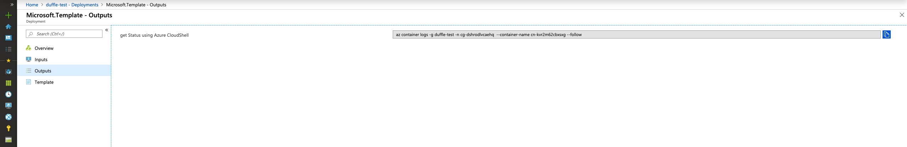

# SQL Server Always On Availability Groups on AKS

  

## Overview

This Template installs a SQL Server always on availability group on a new AKS Cluster, on install it will:

* Create a new AKS Cluster
* Deploy the SQL Server Operator
* Create Secrets for SQL Server sa password and master password
* Deploy SQL Server Containers, persistent volumes, persistent volume claims and load balancers
* Create services to connect to primary and secondary replicas

It creates an AKS Cluster with 4 nodes with agent VM Size of Standard_DS2_v2, the Cluster is created without enabling RBAC.

**This template creates an ACI instance to perform the install using CNAB by default the ACI instance will be created in the resource group that this template is deployed to, while the resources created are deployed to a different resource group which is created if needed, that resources group is defined using the parameter `aks_resource_group`.**

In order to check progress\status of the install use the command provided in the template output. You can find the command in the Azure Portal by browsing the outputs from the deployment once it is completed:

Full details of SQL Server AG on AKS can be be found [here](https://docs.microsoft.com/en-us/sql/linux/sql-server-linux-kubernetes-deploy?view=sqlallproducts-allversions)

## Parameters and Credentials

| Name| Description
---|---
aks_resource_group |   The name of the resource group to create the AKS Cluster in
aks_cluster_name |  The name to use for the AKS Cluster
azure_client_id | AAD Client ID for Azure account authentication used to authenticate to Azure using Service Principal for ACI creation to run bundle and also for AKS Cluster
azure_client_secret |  AAD Client Secret for Azure account authentication used to authenticate to Azure using Service Principal for ACI creation to run bundle and also for AKS Cluster
location | The Location to create the resources in, this needs to be a location that supports ACI as the same location is used for the ACI execution and the resource deployment
sql_masterkeypassword |  The Password for the SQL Server Master Key
sql_sapassword | The Password for the sa user in SQL Server
cnab_action | The action to perform on the installation , for a new deployment this should be install, to delete a previous installation use uninstall (this will delete the resource group specified by aks_resource_group)
cnab_installation_name | The name of the installation
cnab_state_storage_account_name| The name of the storage account to store CNAB state (claims) in
cnab_state_share_name| The name of the file share in the storage account to store CNAB state in
cnab_state_storage_account_key | The account key for the CNAB State storage account, if this is blank it wil be looked up at runtime
cnab_state_storage_account_resource_group| The resource group for CNAB state storage account, use this to provide an existing storage account in a different resource group to the ACI Container Group
containerGroupName | The name of the container group to create the container instance to run duffle in , by default a new Container Group will be created for each invocation (these can be safely deleted after deployment)
containerName| The name of a container in the con◊tainer group to run the container image to run duffle, by default a new Container Name will be generated for each invocation

