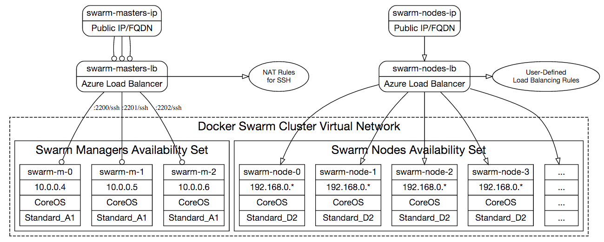
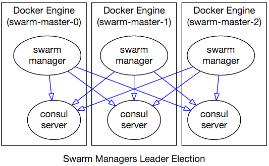
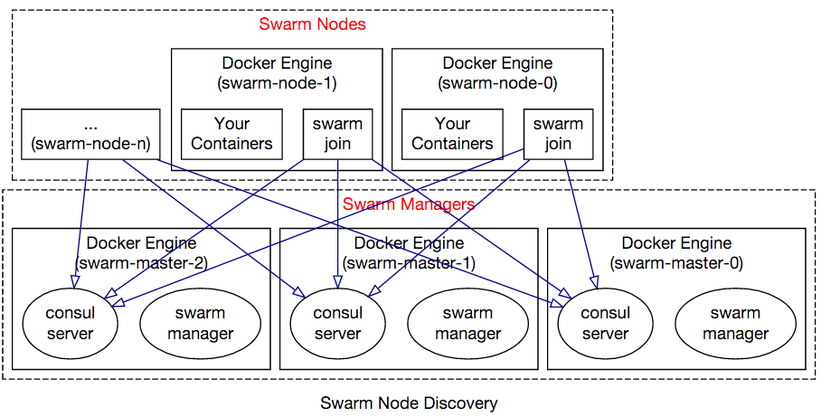
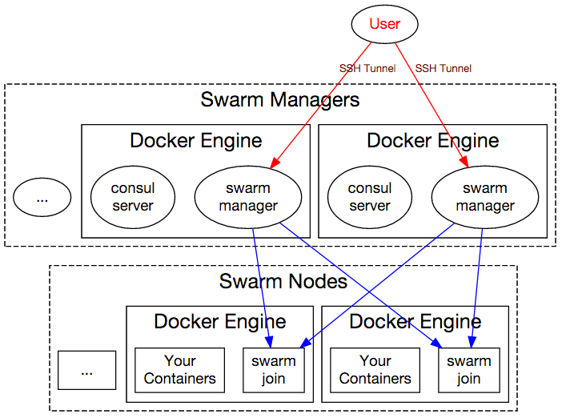

# Docker Swarm Cluster (pre-docker 1.12)


[](https://portal.azure.com/#create/Microsoft.Template/uri/https%3A%2F%2Fraw.githubusercontent.com%2FAzure%2Fazure-quickstart-templates%2Fmaster%2Fapplication-workloads%2Fswarm%2Fdocker-swarm-cluster%2Fazuredeploy.json)  [](http://armviz.io/#/?load=https%3A%2F%2Fraw.githubusercontent.com%2FAzure%2Fazure-quickstart-templates%2Fmaster%2Fapplication-workloads%2Fswarm%2Fdocker-swarm-cluster%2Fazuredeploy.json)

> :warning: :warning: **NOTE:** This template is designed for Docker versions earlier than v1.12
for which Docker Swarm was still distributed as a separate container. As of Docker v1.12,
Docker Engine has the Swarm functionalities built in. This template has not been
updated to accommodate these changes.

This template deploys a [Docker Swarm](http://docs.docker.com/swarm) cluster on
Azure with 3 Swarm managers and specified number of Swarm nodes in the location
of the resource group.

If you are not familiar with Docker Swarm, please
[read Swarm documentation](http://docs.docker.com/swarm). The template uses [CoreOS](https://coreos.com)
as the host operating system for running containers on Swarm managers and nodes.

You can use `ssh-keygen` command on Linux/Mac or Cygwin/MinGW to create public
and private key pairs. The `sshPublicKey` argument should be contents of the
`*.pub` file you have.

## Cluster Properties

This template creates the following cluster topology:

> [](img/cluster-network.png)

The cluster will be interconnected with Docker multi-host networking setup
so that you can easily create overlay networks with `docker network create`
command.

#### Swarm Managers

The template provisions 3 Swarm manager VMs that use
[Consul](https://consul.io/) for discovery and leader election. These VMs are in
an [Availability Set][av-set] to achieve the highest uptime.

Each Swarm manager VM is of size `Standard_A0` as they are not running any
workloads except the Swarm Manager and Consul containers. Manager node VMs have
static private IP addresses `10.0.0.4`, `10.0.0.5` and `10.0.0.6` and they are
in the same [Virtual Network][az-vnet] as Swarm nodes.

Swarm managers choose a leader among themselves and coordinate through
Consul agents running in server mode on each manager VM:

> [](img/cluster-leader-election.png)

#### How to SSH into Swarm Manager Nodes

Swarm manager nodes (`swarm-master-*` VMs) do not have public IP addresses.
However they are NAT'ted behind an Azure Load Balancer. You can SSH into them
using the domain name (emitted in the template deployment output) or the Public
IP address of `swarm-lb-masters` (can be found on the Azure Portal).

Port numbers of each master VM is described in the following table:

| VM   | SSH command |
|:--- |:---|
| `swarm-master-0`  | `ssh <username>@<addr> -p 2200` |
| `swarm-master-1`  | `ssh <username>@<addr> -p 2201` |
| `swarm-master-2`  | `ssh <username>@<addr> -p 2202` |

#### Swarm Worker Nodes

You can configure `nodeCount` parameter to create as many Swarm worker instances
you like. Each Swarm worker VM is of size `Standard_A2`.

Nodes in the Swarm cluster accepting Docker workloads do not have public IP
addresses, and are accessible through Swarm manager VMs over SSH. In order to
access a worker node, you need to SSH into a master VM and use worker node VMs
private IP address to SSH from there (using the same SSH key you used for
authenticating into master). Alternatively, you can establish an SSH Tunnel on
your development machine and directly connect to the worker VM using its private
IP address.

Virtual Machines of Swarm worker nodes have private IP addresses `192.168.0.*`
and are in the same [Virtual Network][az-vnet] with the manager nodes. These
nodes are in an [Availability Set][av-set] to ensure highest uptime and fault
domains.

The swarm worker VMs node VMs have are behind a load balancer
(called `swarm-lb-nodes`). Any multi-instance services deployed across worker
VMs can be served to the public internet by creating probes and load balancing
rules on this Load Balancer resource. Load balancer's public DNS address is
emitted as an output of the template deployment.

Swarm nodes join to the Swarm cluster by notifying the Consul agents running
on master nodes:

> [](img/cluster-node-discovery.png)

#### How to SSH into Swarm Worker Nodes

Since Swarm worker nodes do not have public IP addresses, you first need to SSH
into Swarm manager VMs (described above) to SSH into Swarm nodes.

You just need to use `ssh -A` to SSH into one of the masters, and from that
point on you can reach any other VM in the cluster as shown below:

```sh
$ ## <-- You are on your development machine
$
$ ssh -A <username>@<masters-IP> -p 2200
azureuser@swarm-master-0 ~ $ ## <-- You are on Swarm master
azureuser@swarm-master-0 ~ $ ssh <username>@swarm-node-3
azureuser@swarm-node-3 ~ $ ## <-- You are now on a Swarm worker node
```

The `-A` argument enables forwarding of authentication credentials so that just
by authenticating to manager VM, you can access Swarm worker VMs from there.

Swarm node hostnames are numbered starting from 0, such as: `swarm-node-0`,
`swarm-node-1`, ..., `swarm-node-19` etc. You can see the VM names on the
Azure Portal as well.

## Connecting the Cluster

Swarm manager VMs only have public address for SSH, therefore to issue Docker
commands to Swarm Manager, you need to establish an SSH tunnel to these machines:

> [](img/cluster-management.png)

If the template successfully deploys, it will have output values
`"sshTunnelCmd"` and `"dockerCmd"`.

The `sshTunnelCmd` command will help you create a SSH tunnel to Docker Swarm
Manager from your machine (this command will keep running with no output):

    $ ssh -L 2375:swarm-master-0:2375 -N core@swarm-<<DNSNAME>>-manage.westus.cloudapp.azure.com -p 2200

After this you can use `dockerCmd` command that points to localhost, just as
Swarm managers were running on your development machine:

    $ docker -H tcp://localhost:2375 info

This also can be executed in the shorthand form:

    $ export DOCKER_HOST=:2375
    $ docker info
    ...
    $ docker ps
    ...

[av-set]: https://azure.microsoft.com/en-us/documentation/articles/virtual-machines-manage-availability/
[az-lb]: https://azure.microsoft.com/en-us/documentation/articles/load-balancer-overview/
[az-vnet]: http://azure.microsoft.com/en-us/documentation/services/virtual-network/


