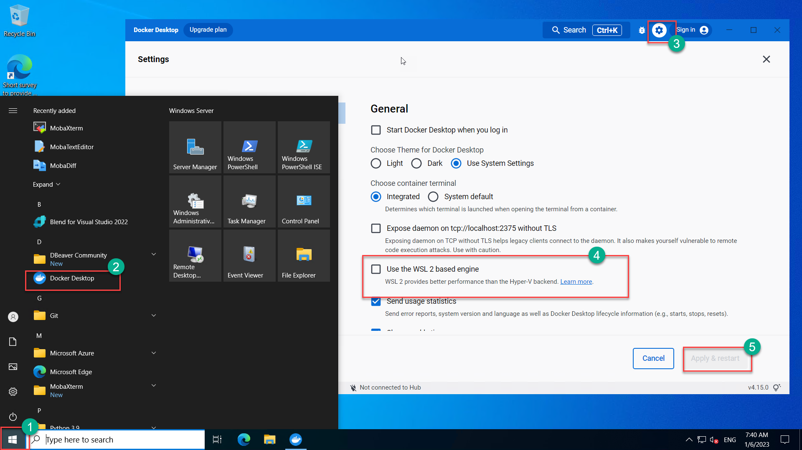

# Dev Environment for AZ-400 Labs

Template for setting up environment for AZ-400 (Azure DevOps Certification) Labs.

## Applications Installed

- Visual Studio CODE
- Visual Studio 2022 Latest Community Edition
- Git for Windows
- Docker Desktop
- Microsoft Edge Web browser
- DBeaver (Universal SQL Client ) *NEW*
- MobaXTerm (Multi-tabbed SSH Client) *NEW*

At your first login, docker-desktop will start preparing a Linux VM for docker. It might take 5 minutes. Thereafter it should start on every login within few seconds.

> Please be patient, VM Provisioning would take about 30 minutes !

## Issue with Docker desktop 

You must configure docker desktop to use `Hyper-V` instead of `WSL` for linux containers

`Tags: Microsoft.Storage/storageAccounts, Microsoft.Network/publicIPAddresses, Microsoft.Network/networkSecurityGroups, Microsoft.Network/virtualNetworks, Microsoft.Network/networkInterfaces, Microsoft.Compute/virtualMachines, Microsoft.Compute/virtualMachines/extensions, CustomScriptExtension`
