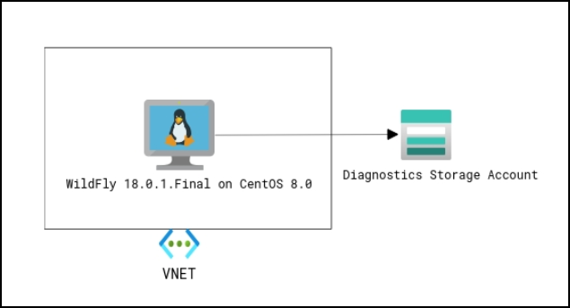
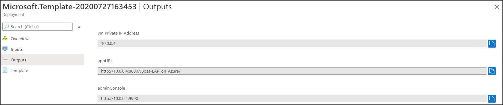
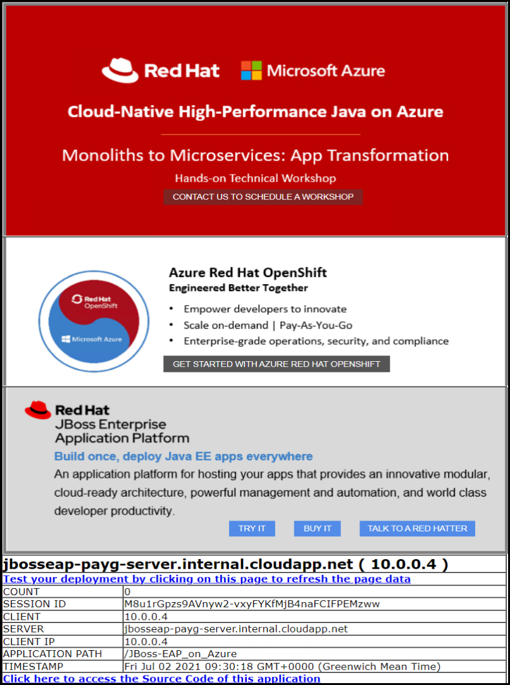
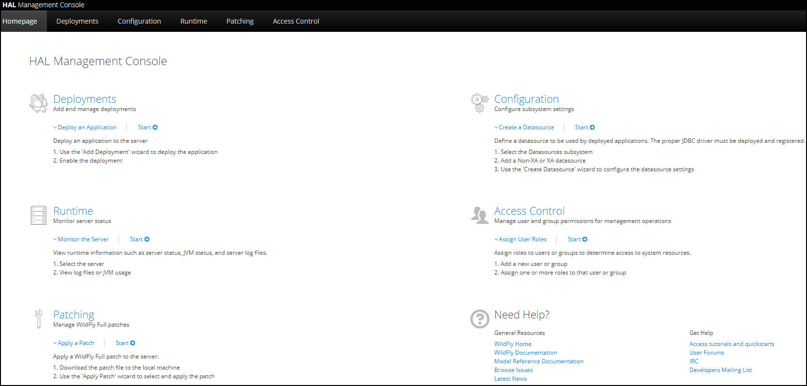

# WildFly 18 on CentOS 8 (stand-alone VM)

    

`Tags: WildFly 18.0.1.Final, Red Hat, CentOS, Java, Java EE, Jakarta EE, Azure, Azure VM`

<!-- TOC -->

1. [Solution Overview](#solution-overview)
2. [Template Solution Architecture](#template-solution-architecture)
3. [Subscriptions and Costs](#subscriptions-and-costs)
4. [Prerequisites](#prerequisites)
5. [Deployment Steps](#deployment-steps)
6. [Deployment Time](#deployment-time)
7. [Validation Steps](#validation-steps)
8. [Troubleshooting](#troubleshooting)
9. [Support](#support)

<!-- /TOC -->

## Solution Overview

This template creates a standalone node of WildFly on CentOS VM of Standard_DS2_v2 size (users can select the size of the VM from the dropdown options) in your Resource Group (RG) which includes a Private IP, Virtual Network and a diagnostics Storage Account. It is ideal for development and testing of enterprise Java applications on Azure.

WildFly is an open-source application server runtime that is exceptionally fast, flexible, lightweight and powerful. It is Jakarta EE 8 Full Platform and Web Profile compatible. The state-of-the-art architecture built on the Modular Service Container enables services on-demand when your application requires them.

The technology behind WildFly is also available in Red Hat JBoss Enterprise Application Platform (EAP), a hardened enterprise subscription including Red Hat world-class support, long multi-year maintenance cycles and exclusive content. JBoss EAP is an open-soure application server that you can download for free for development use. To obtain a Red Hat Subscription Management (RHSM) account for JBoss EAP, go to: www.redhat.com. Red Hat Subscription Management (RHSM) is a customer-driven, end-to-end solution that provides tools for subscription status and management and integrates with Red Hat's system management tools.

To learn more visit the [WildFly Documentation](https://docs.wildfly.org/18/) site.

## Template Solution Architecture 

This Azure Resource Manager (ARM) template creates all the Azure compute resources to run WildFly 18.0.1.Final setup on CentOS 8.0 VM. The following resources are created by this template:

- CentOS 8 Virtual Machine
- Virtual Network
- WildFly 18.0.1.Final
- Sample Java application named **JBoss-EAP on Azure** deployed on WildFly
- Storage Account

Following is the Architecture:

## Subscriptions and Costs 

This ARM template uses an Azure CentOS 8 image which is a Pay-As-You-Go (PAYG) VM image and does not require the user to license. The VM will be licensed automatically after the instance is launched for the first time and the user will be charged hourly in addition to Microsoft's Linux VM rates. [Linux Virtual Machine](https://azure.microsoft.com/pricing/details/virtual-machines/linux/#linux) provides pricing details. WildFly is free to download and use and does not require a Red Hat Subscription or License.

## Prerequisites 

1. Azure Subscription with specified payment method. CentOS-Based 8.0 is an Azure Marketplace product and requires a payment method to be specified in the Azure Subscription.

2. To create the VM, you will need:

    - **Admin Username** and password or SSH key data which is an SSH RSA public key for the VM.

    - **WildFly Username** and password to enable the WildFly Admin Console and Deployment method.

## Deployment Steps  

Build your environment with WildFly 18.0.1.Final on a VM by running CentOS 8.0 on Azure in a few simple steps:  
1. Launch the template by clicking on the **Deploy to Azure** button.  
2. Complete the following parameter values, accept the Terms and Conditions and click on the **Purchase** button.

    - **Subscription** - Choose the appropriate subscription for deployment.

    - **Resource Group** - Create a new Resource Group or select an existing one.

    - **Location** - Choose the appropriate location for deployment.

    - **Admin Username** - User account name for logging into the CentOS VM.

    - **Authentication Type** - Type of authentication to use on the VM (password or SSH key).

    - **Admin Password or SSH key** - User account password or SSH key data which is an SSH RSA public key for logging into the CentOS VM.

    - **WildFly Username** - Username for WildFly Admin Console Manager.

    - **WildFly Password** - User account password for WildFly Admin Console Manager.

    - **VM Size** - Select the appropriate size of the VM from the dropdown options.

    - Leave the rest of the parameter values (Artifacts and Location) as is, accept the Terms & Conditions and proceed to purchase.

## Deployment Time 

The deployment takes less than 10 minutes to complete.

## Validation Steps

Once the deployment is successful, go to the outputs section of the deployment to obtain the **Private IP of the CentOS VM**, **app URL** and the **Admin Console URL**. You can access the CentOS VM and the application by following one of the 5 options:

1. Create a Public IP to access the CentOS VM and WildFly Admin Console.
2. Create a Jump VM in a different subnet (new subnet) in the same Virtual Network and access the CentOS VM via a Jump VM. 
3. Create a Jump VM in a different Virtual Network and access the CentOS VM using Virtual Network Peering. (recommended method)
4. Using an Application Gateway.
5. Using an External Load Balancer (ELB).

   

**Option 1 of 5**. Create Public IP to access the CentOS VM and WildFly Admin Console

   - The CentOS VM you created does not have a Public IP associated with it. You can [create a Public IP](https://docs.microsoft.com/azure/virtual-network/virtual-network-public-ip-address#create-a-public-ip-address) for accessing the VM and [associate the Public IP to the VM](https://docs.microsoft.com/azure/virtual-network/associate-public-ip-address-vm). All this can be done using Azure Portal or Powershell commands or CLI commands.

   - Obtain the Public IP of a VM - go to the VM details page and copy the Public IP. You can use this Public IP to access the VM and WildFly Admin Console.

   - View the JBoss EAP on Azure web page - open a web browser and go to *http://<PUBLIC_HOSTNAME>:8080/JBoss-EAP_on_Azure/* and you should see the application running.

     

   - Log into the WildFly Admin Console - open a web browser and go to *http://<PUBLIC_HOSTNAME>:9990*. Enter the WildFly username and password to login.

     

**Option 2 of 5**. Create a Jump VM in a different subnet (new subnet) in the same Virtual Network and access the CentOS VM via Jump VM.

   - [Add a new subnet](https://docs.microsoft.com/azure/virtual-network/virtual-network-manage-subnet#add-a-subnet) in the existing Virtual Network which contains the CentOS VM.

   - [Create a Windows Virtual Machine](https://docs.microsoft.com/azure/virtual-machines/windows/quick-create-portal#create-virtual-machine) in Azure in the same Resource Group as the CentOS VM. Provide the required details and leave other configurations as default except for the Virtual Network and subnet. Make sure you select the existing Virtual Network in the Resource Group and select the subnet you just created in the step above. This will be your Jump VM.

   - Access Jump VM Public IP - once successfully deployed, go to the VM details page and copy the Public IP. Log into the Jump VM using this Public IP.

   - Log into CentOS VM - copy the Private IP of CentOS VM from the output page and use it to log into the CentOS VM from the Jump VM.

   - Access the JBoss EAP on Azure web page - in your Jump VM, open a browser and paste the app URL that you copied from the output page of the deployment.

     
     
   - Access the WildFly Admin Console - paste the Admin Console URL that you copied from the output page in a browser inside the Jump VM to access the WildFly Admin Console and enter the WildFly username and password to login.

     

**Option 3 of 5**. Create a Jump VM in a different Virtual Network and access the CentOS VM using Virtual Network Peering.

   - [Create a Windows Virtual Machine](https://docs.microsoft.com/azure/virtual-machines/windows/quick-create-portal#create-virtual-machine) - in a new Azure Resource Group, create a Windows VM. This should be in the same location as CentOS VM. Provide the required details and leave other configurations as default. This will create the Jump VM in a new Virtual Network.

   - [Peer the Virtual Networks](https://docs.microsoft.com/azure/virtual-network/tutorial-connect-virtual-networks-portal#peer-virtual-networks) - this is how you associate the CentOS VM with the Jump VM. Once the Virtual Network peering is successful, both the VMs can communicate with each other.

   - Go to the Jump VM details page and copy the Public IP. Log into the Jump VM using this Public IP.

   - Copy the Private IP of CentOS VM from the output page and use it to log into the CentOS VM from the Jump VM.

   - Paste the app URL that you copied from the output page in a browser inside the Jump VM to view the JBoss EAP on Azure web page.

     
     
   - Access the WildFly Admin Console - paste the Admin Console URL copied from the output page in a browser inside the Jump VM, enter the WilldFly username and password to login.

     

**Option 4 of 5**. Using an Application Gateway

   - [Create an Application Gateway](https://docs.microsoft.com/azure/application-gateway/quick-create-portal#create-an-application-gateway) - to access the ports of the CentOS VM, create an Application Gateway in a different subnet. This subnet must only contain the Application Gateway.

   - Set *Frontends* parameters - make sure you select Public IP or both and provide the required details. Under *Backends* section, select **Add a backend pool** option and add the CentOS VM to the backend pool of the Application Gateway.

   - Set access ports - under *Configuration* section add routing rules to access the ports 8080 and 9990 of the CentOS VM.

   - Copy Public IP of Application Gateway - once the Application Gateway is created with the required configurations, go to the  overview page and copy the Public IP of the Application Gateway.

   - To view the JBoss EAP on Azure web page - open a web browser and go to *http://<PUBLIC_IP_AppGateway>:8080/JBoss-EAP_on_Azure/* and you should see the application running.

     

   - To log into the WildFly Admin Console - open a web browser and go to *http://<PUBLIC_IP_AppGateway>:9990*. Enter the WildFly username and password to login.

     

**Option 5 of 5**. Using an External Load Balancer.

   - [Create a Load Balancer](https://docs.microsoft.com/azure/load-balancer/tutorial-load-balancer-standard-manage-portal#create-a-standard-load-balancer) to access the ports of the CentOS VM. Provide the required details to deploy the external Load Balancer and leave other configurations as default. Leave the SKU as Basic for this configuration.

   - Add Load Balancer rules - once the Load balancer has been created successfully, [create Load Balancer resources](https://docs.microsoft.com/azure/load-balancer/tutorial-load-balancer-standard-manage-portal#create-load-balancer-resources), add Load Balancer rules to access the ports 8080 and 9990 of the CentOS VM.

   - Add the CentOS VM to the backend pool of the Load Balancer - click on *Backend pools* under settings section and then select the backend pool you created in the step above. Select the Virtual Machine corresponding to the option *Associated to* and then add the CentOS VM.

   - To obtain the Public IP of the Load Balancer - go to the Load Balancer overview page and copy the Public IP of the Load Balancer.

   - To view the JBoss EAP on Azure web page - open a web browser and go to *http://<PUBLIC_IP_LoadBalancer>:8080/JBoss-EAP_on_Azure/* and you should see the application running.

     

   - To log into the WildFly Admin Console - open a web browser and go to *http://<PUBLIC_IP_LoadBalancer>:9990*. Enter the WildFly username and password to login.

     

## Troubleshooting

This section includes common errors faced during deployments and details on how you can troubleshoot these errors. 

#### Azure Platform

- If the parameter criteria are not fulfilled (ex - the admin password criteria was not met) or if any mandatory parameters are not provided in the parameters section then the deployment will not start. The *Terms & Conditions* must be accepted before clicking on *Purchase*.

- Once the deployment starts the resources being deployed will be visible on the deployment page. In the case of any deployment failure, after parameter validation process, a more detailed failure message is available.

- If your deployment fails at the **VM Custom Script Extension** resource, a more detailed failure message is available in the VM log file. Please refer to the next section for further troubleshooting.

#### Troubleshooting WildFly deployment extension

Follow the steps below to troubleshoot VM Custom Script Extension failures further:

1. Log into the provisioned VM through SSH as mentioned in the 'Validation section'.

2. Switch to root user

    `sudo su -`

3. Enter the VM admin password if prompted.

4. Change directory to logging directory

    `cd /var/lib/waagent/custom-script/download/0`

5. Review the logs in wildfly.install.log log file.

    `more wildfly.install.log`

This log file will have details that include deployment failure reason and possible solutions.

Please refer to [Using the Azure Custom Script Extension Version 2 with Linux VMs](https://docs.microsoft.com/azure/virtual-machines/extensions/custom-script-linux) for more details on troubleshooting VM custom script extensions.

## Support 

For any support related questions, issues or customization requirements with the GitHub template please contact [Spektra Systems](mailto:info@spektrasystems.com).

If you are experiencing production deployment issues please contact [Red Hat Support](https://www.redhat.com/en/services/support).
