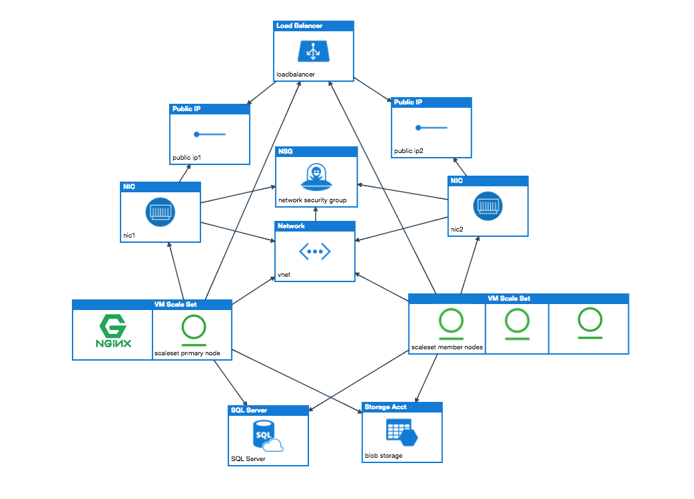

# Setup Artifactory Enterprise

&nbsp;
&nbsp;

&nbsp;
&nbsp;

&nbsp;
&nbsp;

<a href="https://portal.azure.com/#create/Microsoft.Template/uri/https%3A%2F%2Fraw.githubusercontent.com%2FAzure%2Fazure-quickstart-templates%2Fmaster%2Fartifactory-enterprise%2Fazuredeploy.json" target="_blank">

</a>
<a href="http://armviz.io/#/?load=https%3A%2F%2Fraw.githubusercontent.com%2FAzure%2Fazure-quickstart-templates%2Fmaster%2Fartifactory-enterprise%2Fazuredeploy.json" target="_blank">

</a>

This template can help you setup the [Artifactory Enterprise](https://jfrog.com/artifactory) on Azure.

## A. Deploy Artifactory Enterprise on Azure



1. Click "Deploy to Azure" button. If you haven't got an Azure subscription, it will guide you on how to signup for a free trial.

2. Enter a valid values to parameters. At least 1 license has to be provided.

3. Click on Purchase to start deploying resources. It will deploy MsSQL database, Azure Blob storage container, VM installing Nginx and Artifactory and Load balancer.

4. Once deployment is done. Copy FQDN from Output of deployment template.

5. Access artifactory using FQDN. 

6. You will see specified artifactory member nodes in 'Admin ->  High Availability' page.

### Note: 
1. This template only supports Artifactory version 5.8.x and above.
2. Turn off daily backups.  Read Documentation provided [here](https://www.jfrog.com/confluence/display/RTF/Managing+Backups)
3. Use SSL Certificate with valid wild card to use artifactory as docker registry with subdomain method.
4. Input values for 'adminUsername' and 'adminPassword' parameters needs to follow azure VM access rules.
5. One primary node is configured automatically. And, Minimum 1 member node is expected for the Artifactory HA installation.
6. This template provides support for max 5 licenses. To add more licenses, Edit the template (input fields, CustomScript sections) and install_artifactory.sh script.
7. Refer to [System Requirements](https://www.jfrog.com/confluence/display/RTF/System+Requirements) for changing 'extraJavaOptions' input parameter value. 

### Steps to setup Artifactory as secure docker registry
considering you have SSL certificate for `*.jfrog.team`
1. Pass your SSL Certificate in parameter `Certificate` as string
2. Pass your SSL Certificate Key in parameter `CertificateKey` as string
3. Set `CertificateDomain` as `jfrog.team`
4. Set `ArtifactoryServerName` as `artifactory` if you want to access artifactory with `https://artifactory.jfrog.team`
5. Create DNS record with entry `artifactory.jfrog.team` pointing to load balancer value provided as output in template deployment.
6. Create DNS record with entry `*.jfrog.team` pointing to load balancer value provided as output in template deployment.
7. If you have virtual docker registry with name `docker-virtual` in artifactory. You can access it via `docker-virtual.jfrog.team`
   e.g ```docker pull docker-virtual.jfrog.team/nginx```

### Steps to upgrade Artifactory Version

1. Login into the Primary VM instance as root. Use the admin credentials provided during the installation.  
Note: Use the load balancer's NAT entries under Azure resources, to get the allocated NAT port for accessing the VM instance.

2. Stop nginx and artifactory services.
    ```
    service nginx stop
    service artifactory stop
    ```

3. Upgrade artifactory with following apt-get install command.
    ```
    apt-get update
    apt-get -y install jfrog-artifactory-pro=${ARTIFACTORY_VERSION}
    ```
4. Start artifactory and nginx services.
    ```
    service artifactory start
    service nginx start
    ```
5. Repeat above steps for all member nodes.

------
#### Note:
Please check the Azure region support for `Standard Sku` property in load balancer for this template to work properly.  
Check for SQL server support on specified location. If SQL server is not available in the location, Use 'DB_Location' to specify the location with SQL server support.  

 

