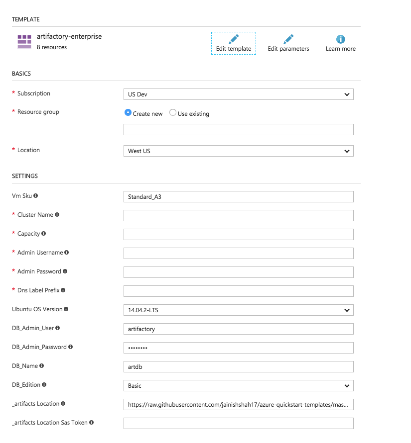
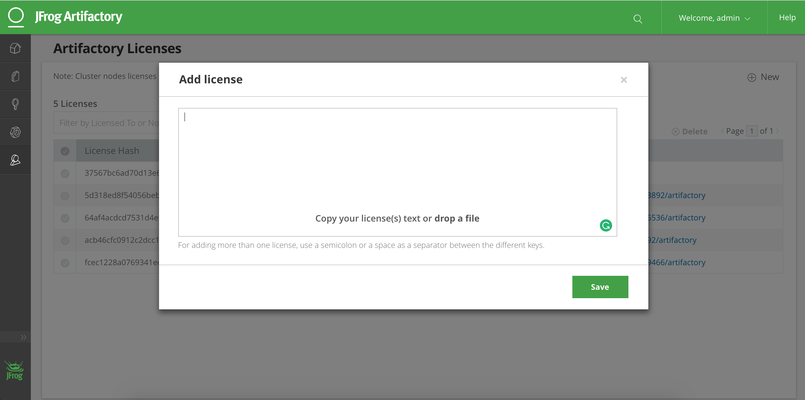

# Setup Artifactory Enterprise

<a href="https://portal.azure.com/#create/Microsoft.Template/uri/https%3A%2F%2Fraw.githubusercontent.com%2Fjainishshah17%2Fazure-quickstart-templates%2Fmaster%2Fartifactory-enterprise%2Fazuredeploy.json" target="_blank">

</a>
<a href="http://armviz.io/#/?load=https%3A%2F%2Fraw.githubusercontent.com%2Fjainishshah17%2Fazure-quickstart-templates%2Fmaster%2Fartifactory-enterprise%2Fazuredeploy.json" target="_blank">

</a>

This template can help you setup the Artifactory Enterprise environment to deploy [Artifactory](https://jfrog.com/artifactory) on Azure.

## A. Deploy Artifactory Enterprise on Azure


1. Click "Deploy to Azure" button. If you haven't got an Azure subscription, it will guide you on how to signup for a free trial.

2. Enter a valid values to parameters. 

Note: To begin with start with Capacity 1. One you have Artifactory running install artifactory licenses through UI and scale your cluster with desired capacity.


3. Click on Purchase to start deploying resources. It will deploy MsSQL database, Azure Blob storage container, VM installing Nginx and Artifactory and Load balancer.

4. Once deployment it done. Copy FQDN from Output of deployment template.

5. Access artifactory using FQDN. 

6. Go to Admin -> Artifactory Licenses and paste your artifactory licenses.



Note: To get a trial license, go to [JFrog's website](https://www.jfrog.com/artifactory/free-trial-mesosphere/).

7. Go to VMScaleSet in Azure portal and scale instance capacity to n.

8. In couple of minutes you will see n artifactory nodes in Admin ->  High Availability.

Use Artifactory as Docker Registry.
------
* This template comes with preconfigured Nginx to do Reverse Proxy to use Artifactory as docker registry on port 5001.

1. Create set of docker repository in Artifactory using Quick Setup Wizard.
   It will create four docker repo for you.
   1. docker-local: A local docker repository.
   2. bintray-docker-remote:  A remote docker repository proxying `https://docker.bintray.io`.
   3. docker-remote: A remote docker repository proxying `https://registry-1.docker.io/`.
   4. docker: A virtual docker repository aggregating all three repo mentioned above.

2. Configure insecure registry FQDN:5001 in your docker client.

3. Run command to pull nginx image from artifactory:
   ```
   docker pull soldevqaent.southcentralus.cloudapp.azure.com:5001/nginx
   ``` 

------
####Note:
Supported locations: `West US`, `East US`, `South CentralUS`, `Southeast Asia`, `Western Central US`, `West Europe` and `West US 2`.


 
