# OMS ASR Monitoring

 

This solution (currently in private preview) will allow you to capture your Azure Site Recovery operations (across subscriptions and Recovery Vaults) and visualize them in Operations Management Suite (Log Analytics). This solution currently leverages an automation runbook in Azure Automation, the Log Analytics Ingestion API, together with Log Analytics to present data about all your ASR Recovery Vaults into a single log analytics workspace.

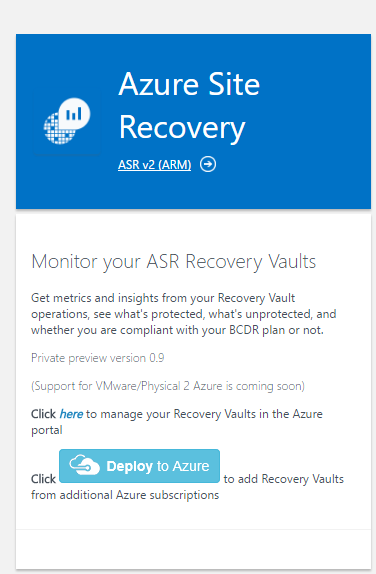

## Pre-reqs

- **Hyper-V 2 Azure**

The current OMS ASR Solution is mainly targeting the "Hyper-V 2 Azure Scenario. If you have Recovery Vaults configured with this scenario, this will automatically show up in the OMS Workspace portal after template deployment.

Support for VMware/Physical 2 will be added soon.

- **Automation Account with SPN**

Before you deploy this template, you must create an Automation Account in the Azure portal with the default settings so that the SPN account will be created. If you have an existing OMS Log Analytics Workspace you would like to use for this OMS ASR solution, it is important that the Automation account is created into the **same Resource Group where the OMS Log Analytics Workspace is located**.

If you **dont** have an existing OMS Log Analytics Workspace, the template will create and deploy this for you.

## Setup - Using an existing OMS Log Analytics Workspace

### Follow these instructions to deploy the OMS ASR Solution into an existing OMS Log Analytics Workspace

Log into Azure Portal (https://portal.azure.com) and ensure you are in the subscription containing your OMS Workspace

Locate your existing OMS Log Analytics Workspace and note the name of the workspace, the location of the workspace, and the Resource Group

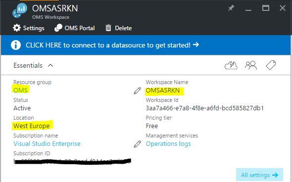 

Next, create a new Automation Account and click on *New* and search for 'Automation'

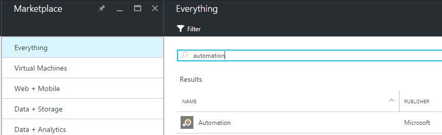
 
Select Automation and click *Create* 

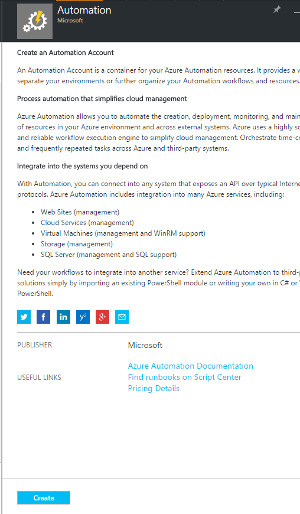

Specify the name of the Automation Account and ensure you are selecting 'Use existing' and selects the Resource Group containing the OMS Log Analytics workspace. If possible, use the same Azure Region for the Automation Account. Ensure that 'Create Azure Run As account' is set to 'Yes' and click 'Create'

 

Once the deployment has completed, you should see the Automation account and the Log Analytics workspace in the same Resource Group

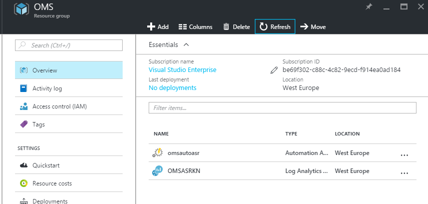

###You can now deploy the template   

This will send you to the Azure Portal with some default values for the template parameters. 
Ensure that the parameters reflects your setup so that you are deploying this into the *existing* Resource Group containing the Log Analytics Workspace and the Automation account.

*It is important that you type the exact values for your workspace name and automation account name, and points to the regions where these resources are deployed.* 

You should also change the *INGESTSCHEDULEGUID* value. You can generate your own using PowerShell with the following cmdlet:

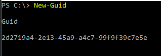

Once you have customized all the parameters, click *Create*

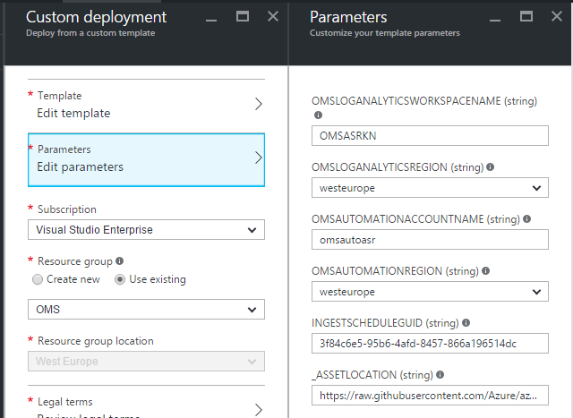

The ingestion will start 5-10 minutes post deployment.

Note: You will not see any data ingestion if you don't have any Recovery Vaults in your subscription

## Setup - Creating a new OMS Log Analytics Workspace

### Follow these instructions to deploy the OMS ASR Solution into a new OMS Log Analytics Workspace

Log into Azure Portal (https://portal.azure.com) and ensure you are in the subscription where you want to deploy the OMS ASR Solution

Create a new Automation Account and click on *New* and search for 'Automation'

 
Select Automation and click *Create* 

Specify the name of the Automation Account and create the account into a new Resource Group. Ensure that 'Create Azure Run As account' is set to 'Yes' and click 'Create'

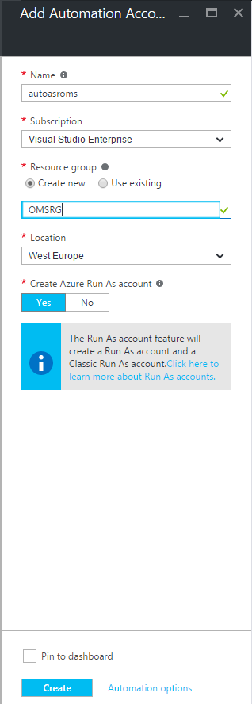 

Once the deployment has completed, you should see the new Resource Group with the Automation account

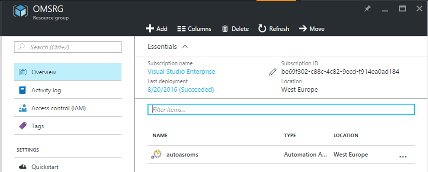

###You can now deploy the template   

This will send you to the Azure Portal with some default values for the template parameters. 
Ensure that the parameters reflects your setup so that you are deploying this into the *existing* Resource Group containing the Automation account, and also change the parameters for 'omsautomationaccountname' and 'omsautomationregion' to point to the existing account. 

This template will create a new OMS Log Analytics Workspace in the specified region.

You should also change the *INGESTSCHEDULEGUID* value. You can generate your own using PowerShell with the following cmdlet:

Once you have customized all the parameters, click *Create*

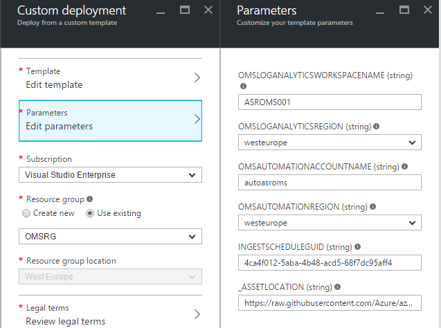

The ingestion will start 5-10 minutes post deployment.

Note: You will not see any data ingestion if you don't have any Recovery Vaults in your subscription

Once the solution has been enabled, OMS will perform an assessment and start to show data once ingested.
You should expect to see the following view for the next hour.

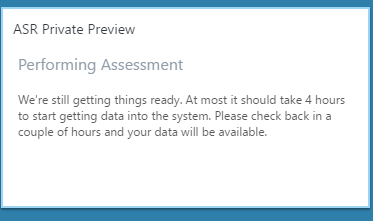

When the first data has been ingested, you can drill into the ASR Private Preview solution and explore the views

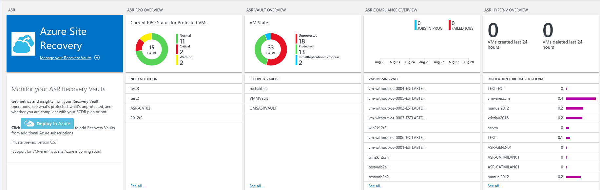           