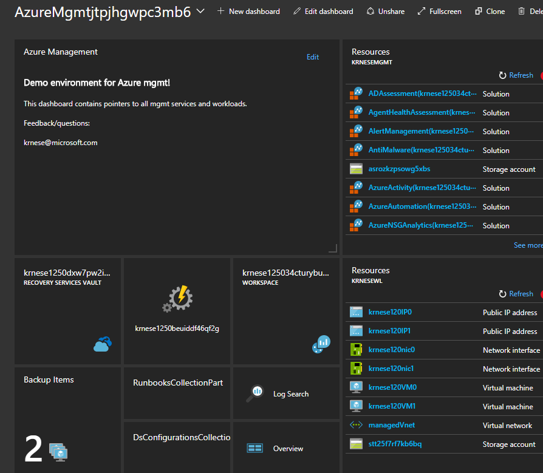

# Azure management demo

>Note: The purpose of these templates, is to give you a kick-start, instantiating all of the Azure mgmt services in Azure.
The mgmt. services will be fully integrated, and you will have VM workloads (Windows or Linux) which will be attached - and fully managed as part of the deployment.
**Please note that this sample is for demo purposes only**

<a href="http://armviz.io/#/?load=https%3A%2F%2Fraw.githubusercontent.com%2FAzure%2Fazure-quickstart-templates%2Fmaster%2Fazmgmt-demo%2Fazuredeploy.json" target="_blank">
    
</a>

## What is being deployed

### Management services and artifacts

* Azure Log Analytics

A workspace is being created, with sample datasources for both Windows and Linux, together with multiple OMS solutions.

* Azure Automation

The automation account will include several DSC configurations, centered on management scenarios, such as keeping the OMS agent healthy and running, as well as deploying the ASR mobility agent. A PowerShell runbook is also created, which can iterate through the subscription to enable backup on unprotected virtual machines.

* Recovery Services

A recovery vault - to support both Azure 2 Azure DR protection, as well as IaaS backup. The automation account also includes multiple Runbooks that can be used as part of Recovery Plans for ASR.

### IaaS workload

You can specify the amount of virtual machines you want to create (1-10), where all the machines will be connected, protected, and attached to the management services.

## How to deploy

These templates should be deployed using PowerShell, as you need to create two resource groups prior to submitting the deployment.
The guidance below shows a sample script, where you only have to provide your unique values to the variables.

```powershell

# Create 2 resource groups, for mgmt and workload
$MgmtRgName = '' # Specify a name for the resource group containing the management services
$WorkloadRgName = '' # Specify a name for the resource group containing the virtual machine(s)

$MgmtRg = New-AzureRmResourceGroup -Name $MgmtRgName -Location eastus -Verbose
$WorkloadRg = New-AzureRmResourceGroup -Name $WorkloadRgName -Location eastus -Verbose

# Define parameters for template deployment - remember to change the values!f

$azMgmtPrefix = '' # Specify the prefix for the Azure mgmt. services that will be deployed
$Platform = '' # Select either 'WinSrv' or 'Linux'. If WinSrv, DSC will be enabled.
$userName = '' # username for the VM(s)
$vmNamePrefix = '' # Specify the prefix for the virtual machine(s) that will be created
$instanceCount = '' # You can create 1-10 VMs
$deploymentName = '' # Specify the name of the main ARM template deployment job
$templateuri = 'https://raw.githubusercontent.com/Azure/azure-quickstart-templates/master/azmgmt-demo/azuredeploy.json'

# Deploy template

New-AzureRmResourceGroupDeployment -Name $deploymentName `
                                   -ResourceGroupName $MgmtRg.ResourceGroupName `
                                   -TemplateUri $templateUri `
                                   -vmResourceGroup $WorkloadRg.ResourceGroupName `
                                   -azMgmtPrefix $azMgmtPrefix `
                                   -vmNamePrefix $vmNamePrefix `
                                   -userName $userName `
                                   -platform $platform `
                                   -instanceCount $instanceCount `
                                   -Verbose
```

Navigate to [Azure Portal](https://portal.azure.com) and find the newly created dashboard, which will have the following naming convention *AzureMgmt(uniqueString(deployment().name))*:

