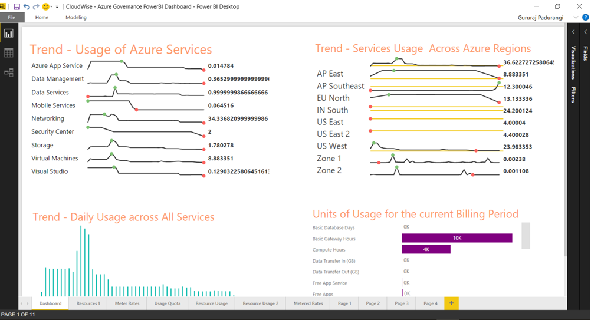

<h1> CloudWise - Enterprise Azure Governance  </h1>
<h2>Composite template version 1.0</h2>

<a href="https://portal.azure.com/#create/Microsoft.Template/uri/https%3A%2F%2Fraw.githubusercontent.com%2FAvyanConsultingCorp%2Fazure-quickstart-templates%2Fmaster%2Fazure-governance-cloudwise%2Fazuredeploy.json" target="_blank"></a>
<a href="http://armviz.io/#/?load=https%3A%2F%2Fraw.githubusercontent.com%2FAvyanConsultingCorp%2Fazure-quickstart-templates%2Fmaster%2Fazure-governance-cloudwise%2Fazuredeploy.json" target="_blank"> </a>

----------
<h2> Table of Contents </h2>

<!-- TOC -->

- [Solution Overview](#solution-overview)
- [Solution Template Overview](#solution-template-overview)
- [Target Audience](#target-audience)
- [Licenses & Costs](#licenses-costs)
- [Prerequisites](#prerequisites)
- [Reference Architecture Diagram](#reference-architecture-diagram)
- [Dashboards](#dashboards)
    - [PowerBI Dashboard (for IT Managers and Business Decision makers)](#powerbi-dashboard-for-it-managers-and-business-decision-makers)
    - [OMS Web Apps Monitoring dashboard (For Operations Teams)](#oms-web-apps-monitoring-dashboard-for-operations-teams)
    - [OMS Azure SQL Databases Monitoring dashboard (For Operations Teams)](#oms-azure-sql-databases-monitoring-dashboard-for-operations-teams)
- [Deployment and Settings](#deployment-and-settings)
- [Post Deployment Steps](#post-deployment-steps)
- [Usage](#usage)
- [Terms of Use and Privacy Policies](#terms-of-use-and-privacy-policies)
- [Support](#support)

<!-- /TOC -->


----------

## Solution Overview
Cloud adoption for an Enterprise, small or large, require responsible and efficient governance models to derive value from their cloud deployments.

Cloudwise™, a composite solution available from Azure Quick Starts, is an adoption enabler for Customers, System Integrators and Partners alike, that delivers a self-serviceable, automated governance solution, focused on 

* Optimizing Your Costs
* Improve Your Application(s) Reliability 
* Reducing Business Risk 

The solution highlights the core governance pillars of **Visibility** and **Control**.

This composite solution includes 

 - Custom Web Application [using Azure Graph, Azure Ratecard, Azure Usage and Azure Service APIs],
 - Visual Studio Application Insights 
 - Azure SQL Database, 
 - Azure Active Directory and Azure AD Application  
 - Microsoft Operationa Management Suite
    - Log Analytics,
    - OMS custom dashboards 
 - Azure Automation Runbooks [using OMSIngestion APIs]
 - Power BI Dashboards
 - Email Notifications 

## Solution Template Overview  

**Solution Templates*** provide customers with a highly automated process to launch enterprise ready first and 3rd party ISV solution stacks on Azure in a pre-production environment. The **Solution Template** effort is complimentary to the [Azure Marketplace test drive program](https://azure.microsoft.com/en-us/marketplace/test-drives/). These fully baked stacks enable customers to quickly stand up a PoC or Piloting environments and also integrate it with their systems and customization.

Customers benefit greatly from solution templates because of the ease with which they can stand up enterprise-grade, fully integrated stacks on Azure. The extensive automation and testing of these solutions will allow them to spin up pre-production environments with minimal manual steps and customization.  Most importantly, customers now have the confidence to transition the solution into a fully production-ready environment with confidence.

**Cloud Governance Pilot Solution Template 001** 
*Disclaimer*: These are intended as pilot solutions and not production ready.
Please [contact us](mailto:azuremarketplace@avyanconsulting.com) if you need further info or support on this solution.


<a name="overview"></a>
## Target Audience
The target audience for these solution templates are IT professionals who need to stand-up and/or deploy infrastructure stacks.

## Licenses & Costs
In its current state, solution templates come with licenses built-in – there may be a BYOL option included in the future. The solution template will be deployed in the Customer’s Azure subscription, and the Customer will incur Azure usage charges associated with running the solution stack.


<a name="prereqs"></a>
## Prerequisites
* Azure Subscription - if you want to test drive individual ISV products, please check out the [Azure Marketplace Test Drive Program ](https://azure.microsoft.com/en-us/marketplace/test-drives/)
* Azure user account with <span style="color:red;"> **Service Admin Role** </span>. This is required for creating an AD applicaition as well as a RunAs Service Role.
* Azure Marketplace Deployment Agreements - VM Images from Azure marketplace need a registered Azure credit card for deployments to be successful. We understand that some customers (especially EA and internal MS customers) may not have this configured leading to failed deployments.   
* Operations Management Suite Account (Free Sign Up – No credit card required. Sign up for your free OMS account [here](https://www.microsoft.com/en-us/cloud-platform/operations-management-suite))
<br/> &nbsp;&nbsp;&nbsp;&nbsp; 
* Create an Automation account with RunAs Service principal. Unfortunately ARM templates don't allow for creating AD service principals as yet, so this step is currently a manual.
    * Refer the blog https://azure.microsoft.com/en-us/documentation/articles/automation-sec-configure-azure-runas-account/ for the steps.
    * Creation of ServicePrincipal has a propensity to fail randomly. A basic verification whether it was successfully created is <span style="color:red;"> **mandatory** </span>
* Capture your OMS Workspace details 
<br/> &nbsp;&nbsp;&nbsp;&nbsp; 
 

## Reference Architecture Diagram
<br/> &nbsp;&nbsp;&nbsp;&nbsp; ](images/CloudWiseArchitecture.png)

## Dashboards

### PowerBI Dashboard (for IT Managers and Business Decision makers)
Please download the link to the PowerBI dashboard
[HOL_CloudWise_PowerBI.zip](images/HOL_CloudWise_PowerBI.zip)

<br/> &nbsp;&nbsp;&nbsp;&nbsp; 


### OMS Web Apps Monitoring dashboard (For Operations Teams)
<br/> &nbsp;&nbsp;&nbsp;&nbsp; 

### OMS Azure SQL Databases Monitoring dashboard (For Operations Teams)
<br/> &nbsp;&nbsp;&nbsp;&nbsp; 


## Deployment and Settings
You can click the "deploy to Azure" button at the beginning of this document or follow the instructions for command line deployment using the scripts in the root of this repo.

## Post Deployment Steps
* Currently, one has to manually start the scheduleIngestion Runbook. 
** Please navigate to your automation account. Click on Runbooks
** Click open the scheduleIngestion runbook and click start to run the runbook. This step will kickstart the data ingestion to the OMS workspace specified.
<br/> &nbsp;&nbsp;&nbsp;&nbsp; 


***Please refer to parameter descriptions if you need more information on what needs to be provided as an input.***


## Usage

Usage Guides

You can use the following guide to use the solution.

<guide link goes here>

## Terms of Use and Privacy Policies
As the solution contains IP owned by Avyan Consulting Corp, please refer to
This solution will be available in Azure Marketplace - tentatively around MS Ignite 2016 timeframe (End of Sept - Beginning Of Oct 2016)  
* [Terms of Service](termsofuse/CloudWise_Terms_Of_Service.pdf)
* [Privacy Policy](termsofuse/CloudWise_Privacy_Policy.pdf)

## Support
For any support-related issues or questions, please contact us for assistance.
```sh
> azuremarketplace@avyanconsulting.com 
```
