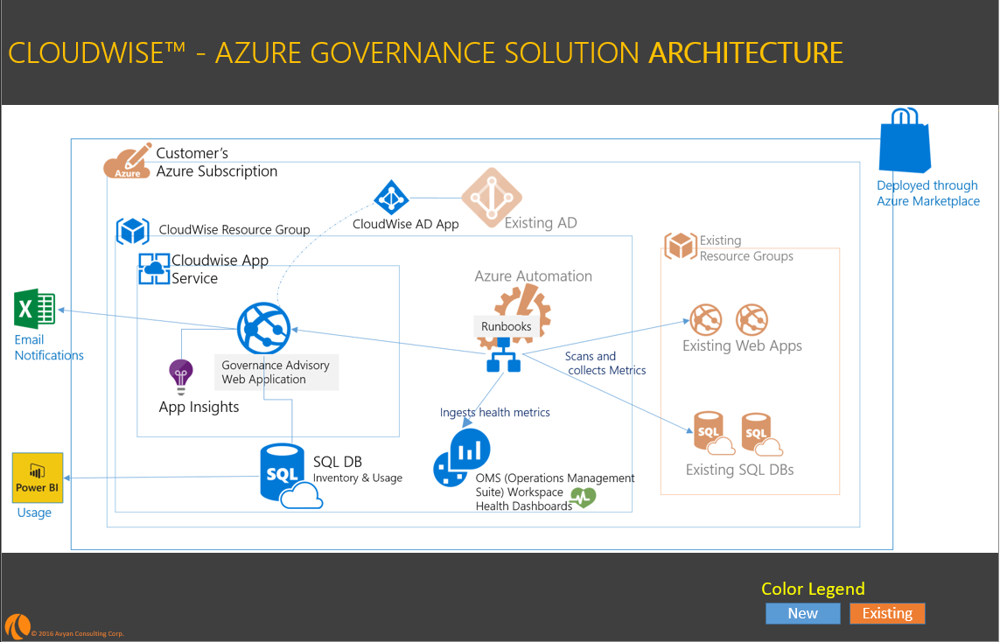
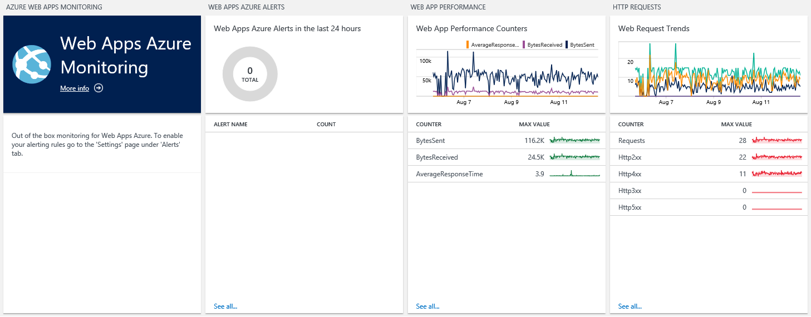

<body>

<h1 style:"color:purple;"> Azure Governance - Composite template 001 </h1>

A composite solution including 

 - Custom Web Application [using Ratecard,Usage and Service APIs], 
 - SQL DB, 
 - OMS Log Analytics, 
 - Azure Automation Runbooks [using OMSIngestion APIs] 

----------

<!-- TOC -->

- [Solution Template Overview](#solution-template-overview)
- [Target Audience](#target-audience)
- [Licenses & Costs](#licenses-costs)
- [Prerequisites](#prerequisites)
- [Solution Summary](#solution-summary)
- [Reference Architecture Diagram](#reference-architecture-diagram)
- [Dashboards](#dashboards)
    - [OMS Web Apps Monitoring dashboard (For Operations Teams)](#oms-web-apps-monitoring-dashboard-for-operations-teams)
    - [OMS Azure SQL Databases Monitoring dashboard (For Operations Teams)](#oms-azure-sql-databases-monitoring-dashboard-for-operations-teams)
- [Deployment Steps](#deployment-steps)
- [Post Deployment Steps](#post-deployment-steps)
- [Usage](#usage)
- [Support](#support)

<!-- /TOC -->

----------

## Solution Template Overview  

**Solution Templates*** provide customers with a highly automated process to launch enterprise ready first and 3rd party ISV solution stacks on Azure in a pre-production environment. The **Solution Template** effort is complimentary to the [Azure Marketplace test drive program](https://azure.microsoft.com/en-us/marketplace/test-drives/). These fully baked stacks enable customers to quickly stand up a PoC or Piloting environments and also integrate it with their systems and customization.

Customers benefit greatly from solution templates because of the ease with which they can stand up enterprise-grade, fully integrated stacks on Azure. The extensive automation and testing of these solutions will allow them to spin up pre-production environments with minimal manual steps and customization.  Most importantly, customers now have the confidence to transition the solution into a fully production-ready environment with confidence.

**Cloud Governance Pilot Solution Template 001** 
*Disclaimer*: These are intended as pilot solutions and not production ready.
Please [contact us](mailto:azuremarketplace@avyanconsulting.com) if you need further info or support on this solution.

## Target Audience
The target audience for these solution templates are IT professionals who need to stand-up and/or deploy infrastructure stacks.

## Licenses & Costs
In its current state, solution templates come with licenses built-in – there may be a BYOL option included in the future. The solution template will be deployed in the Customer’s Azure subscription, and the Customer will incur Azure usage charges associated with running the solution stack.

## Prerequisites
* Azure Subscription - if you want to test drive individual ISV products, please check out the [Azure Marketplace Test Drive Program ](https://azure.microsoft.com/en-us/marketplace/test-drives/)
* Azure user account with Service Admin Role
* Azure Marketplace Deployment Agreements - VM Images from Azure marketplace need a registered Azure credit card for deployments to be successful. We understand that some customers (especially EA and internal MS customers) may not have this configured leading to failed deployments.   
* Operations Management Suite Account (Free Sign Up – No credit card required. Sign up for your free OMS account [here](https://www.microsoft.com/en-us/cloud-platform/operations-management-suite))
      &nbsp )
* Create an Automation account with RunAs Service principal. Note down the resourceGroup and the AutomationAccount name
* Capture your OMS Workspace details   &nbsp 
 
##Solution Summary

 

## Reference Architecture Diagram
  ](images/CloudWiseArchitecture.png)

## Dashboards
<ul class="tab">
  <li><a href="#" class="tablinks" onclick="openCity(event, 'PowerBI')">PowerBI  (Usage and Inventory)</a></li>
  <li><a href="#" class="tablinks" onclick="openCity(event, 'OMSWebApp')">OMS Web Apps Monitoring </a></li>
  <li><a href="#" class="tablinks" onclick="openCity(event, 'OMSSQLDB')">OMS Azure SQL Databases Monitoring </a></li>
</ul>

  ### PowerBI Dashboard (for IT Managers and Business Decision makers)

### OMS Web Apps Monitoring dashboard (For Operations Teams)
  

### OMS Azure SQL Databases Monitoring dashboard (For Operations Teams)
  &nbsp 

## Deployment Steps
You can click the "deploy to Azure" button at the beginning of this document or follow the instructions for command line deployment using the scripts in the root of this repo.

## Post Deployment Steps
* Currently, one has to manually start the scheduleIngestion Runbook. 
** Please navigate to your automation account. Click on Runbooks
** Click open the scheduleIngestion runbook and click start to run the runbook. This step will kickstart the data ingestion to the OMS workspace specified.
      &nbsp 

***Please refer to parameter descriptions if you need more information on what needs to be provided as an input.***

## Usage

## Support
For any support-related issues or questions, please contact us for assistance.

> azuremarketplace@avyanconsulting.com [contact us](mailto:azuremarketplace@avyanconsulting.com) 

</body>

