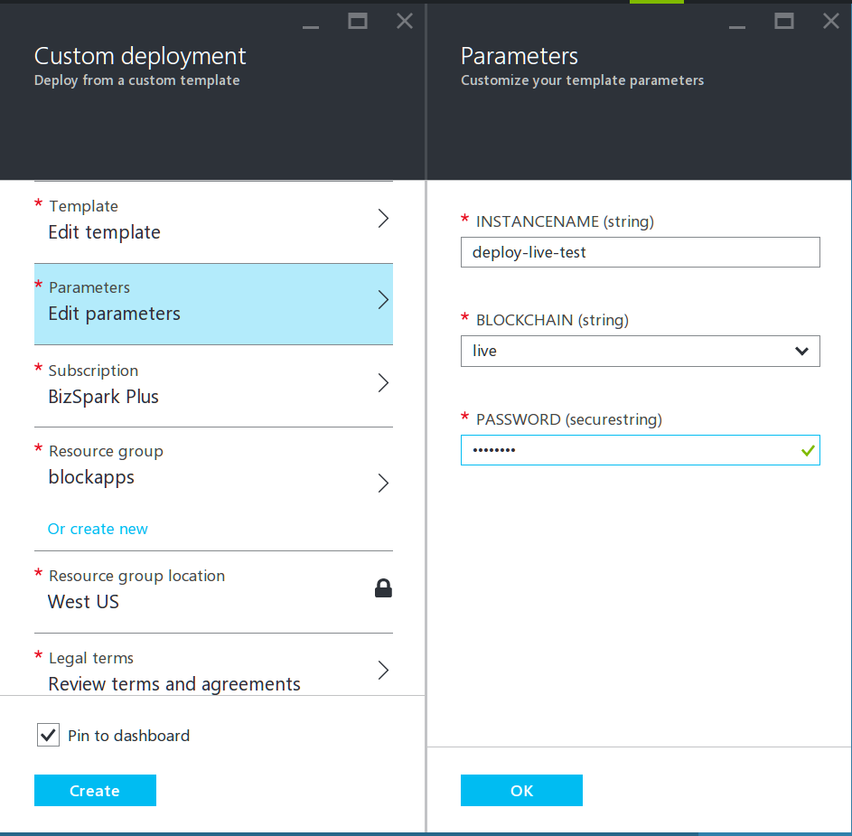
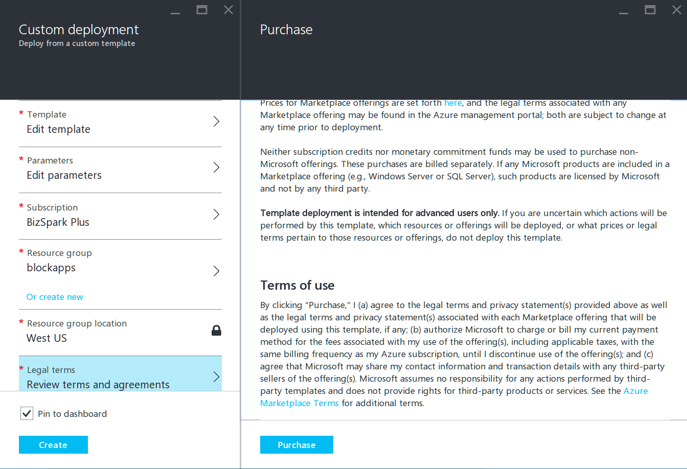
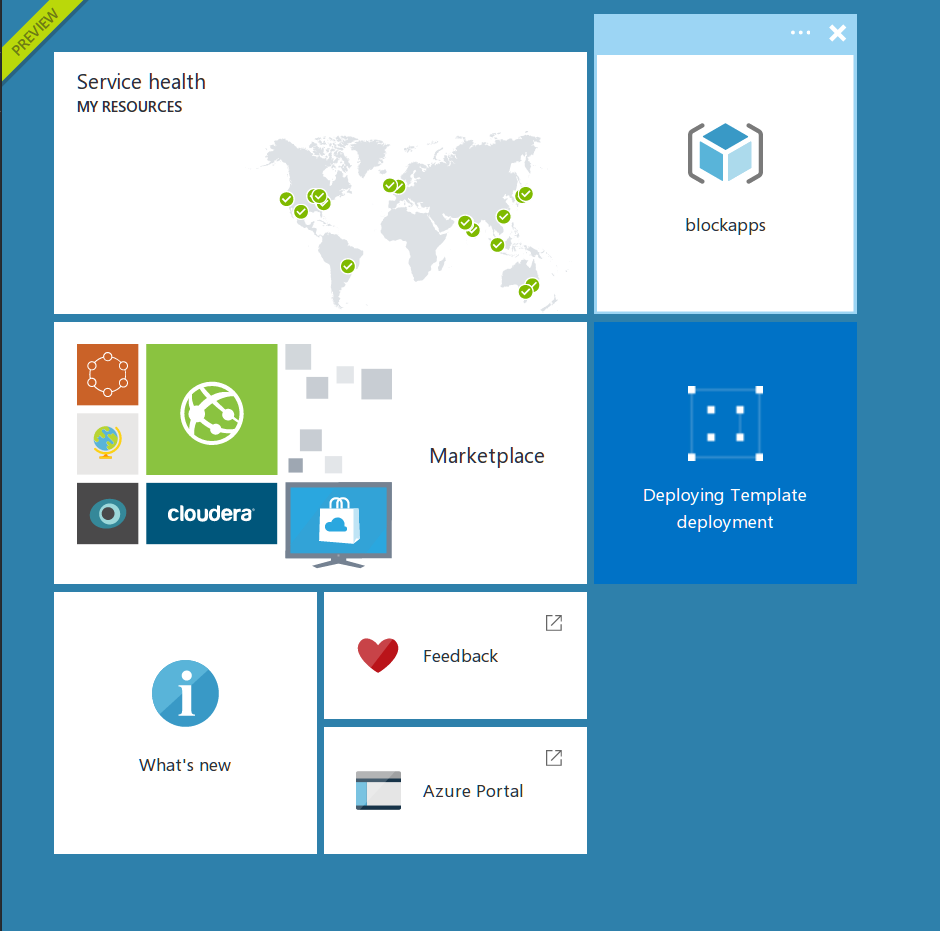
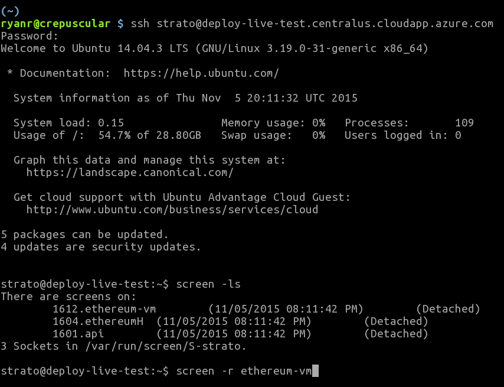
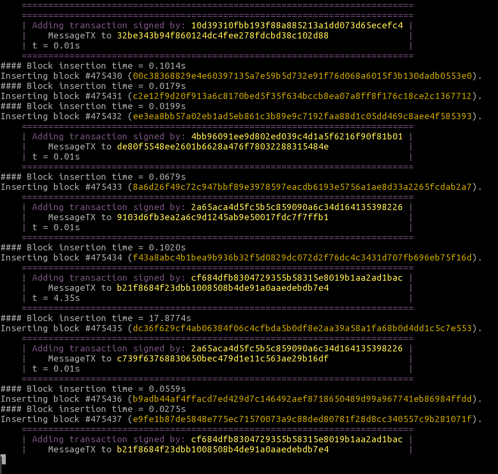
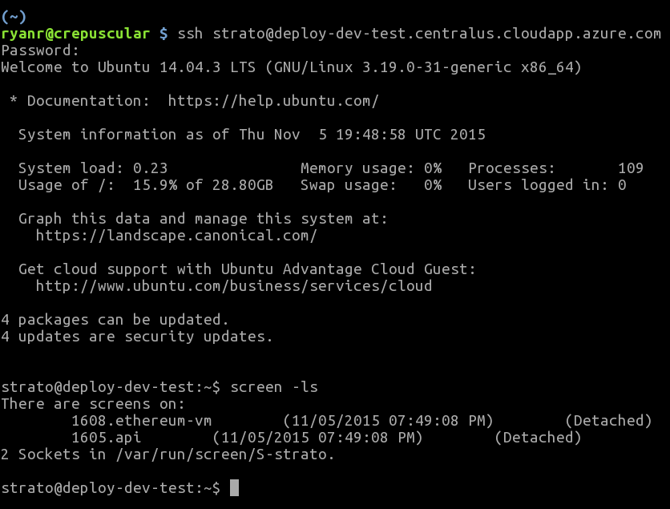

Click this button.  Once you've gone through the process, you can access the new instance via the URL

`instancename.centralus.cloudapp.azure.com`

and administrate it by logging in via SSH:

`ssh strato@<the above URL>`

with the password you chose.  You can get directly into the docker
container running STRATO by then running `docker attach strato` or,
more concisely, just logging in via

`ssh -t strato@<the above URL> docker attach strato`

(the `-t` is important, or else docker will complain about the lack of
a TTY).

# A screencap walkthrough of the process:

Set the parameters.  Please note the resource group "blockapps".

Agree to the terms and conditions

Watch it deploy

Then SSH in from your terminal.  Make sure to request user "strato"

Here is the VM at work

The "dev" image only differs a little:

