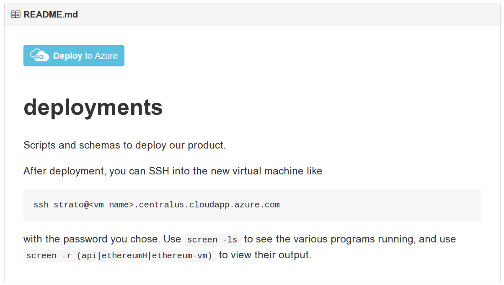
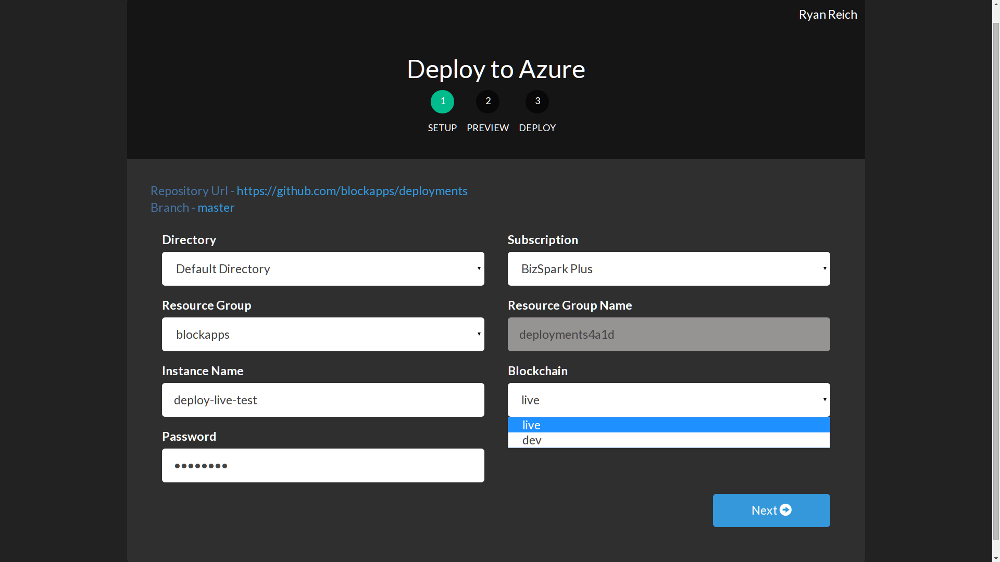
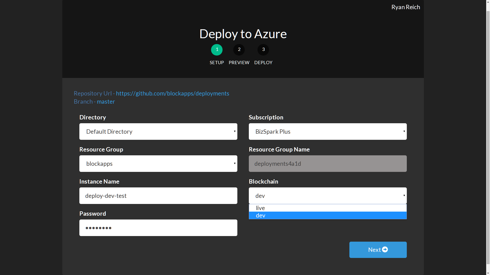
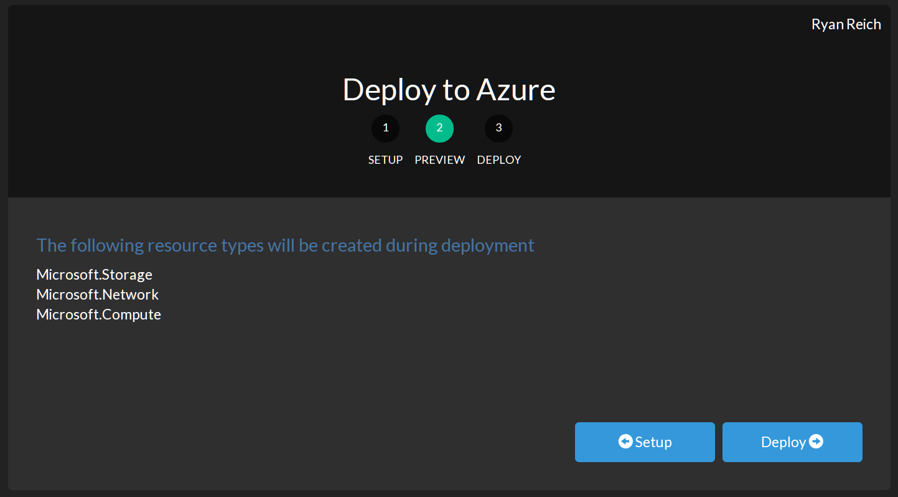
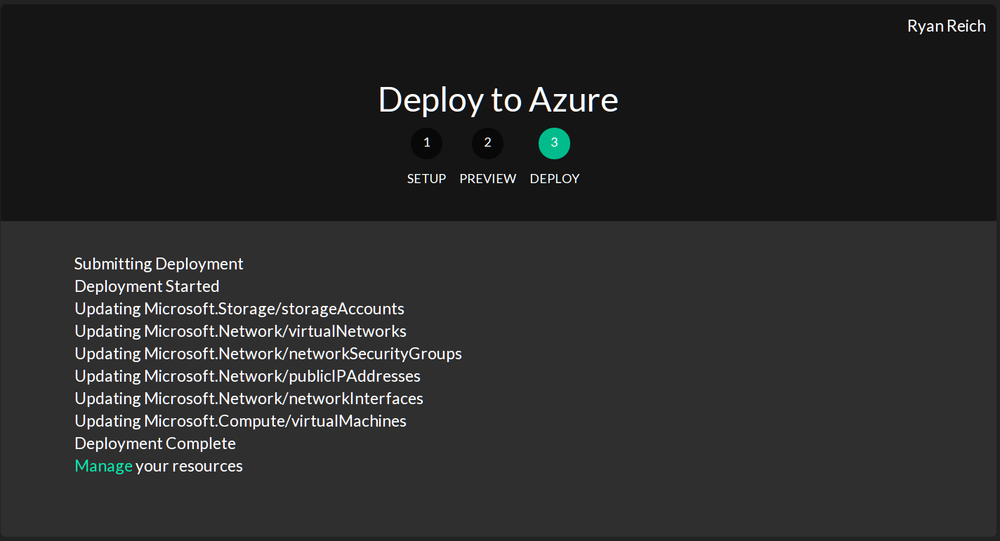

# A screencap walkthrough of the process:

Click the deploy button

Set the parameters.  Please note the resource group "blockapps"; at the moment, you must have access to our Azure subscription to make this deployment.

You can also specify the "dev" image

Confirm your deployment

Watch it deploy

Then SSH in from your terminal.  Make sure to request user "strato"

Here is the VM at work

The "dev" image only differs a little:

