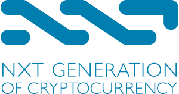
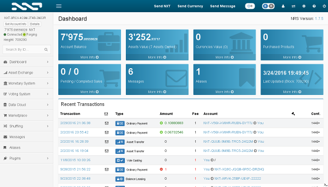

# Nxt blockchain platform

Nxt is an advanced blockchain platform which builds on and improves the basic functionality of pioneering cryptocurrencies such as Bitcoin. Cryptocurrency and financial systems are the first widely used applications of blockchain technology, but the blockchain and its associated technology can be used for much more.

Nxt revolutionises the financial technology, crowdfunding and governance industries by providing not only the groundbreaking Nxt crypto-currency, but also a powerful, modular toolset to build with in any way Nxt users can imagine. Nxt gives users complete freedom to create their own applications.

# Getting started

* Click on 'Deploy to Azure' icon for this template.
* Wait about 20 minutes for the VM to spin up.
* Navigate to `http://[vmpublicip]:7876/` to access the Nxt GUI.
* Navitage to `http://[vmpublicip]:7876/test` to access the Nxt API.

# Assistance and Troubleshooting

Please visit following links to learn more:

* [Nxt.org](https://www.nxt.org)
* [Nxt Wiki](https://nxtwiki.org/wiki/Main_Page)
* [Nxt helpdesk](https://nxt.org/helpdesk/)
* [Nxt Slack](https://nxtchat.herokuapp.com/)

