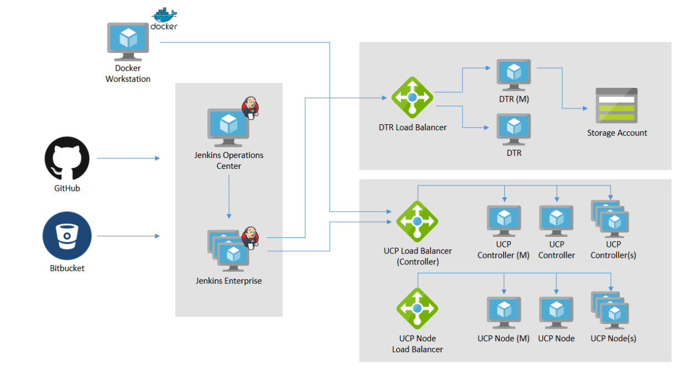
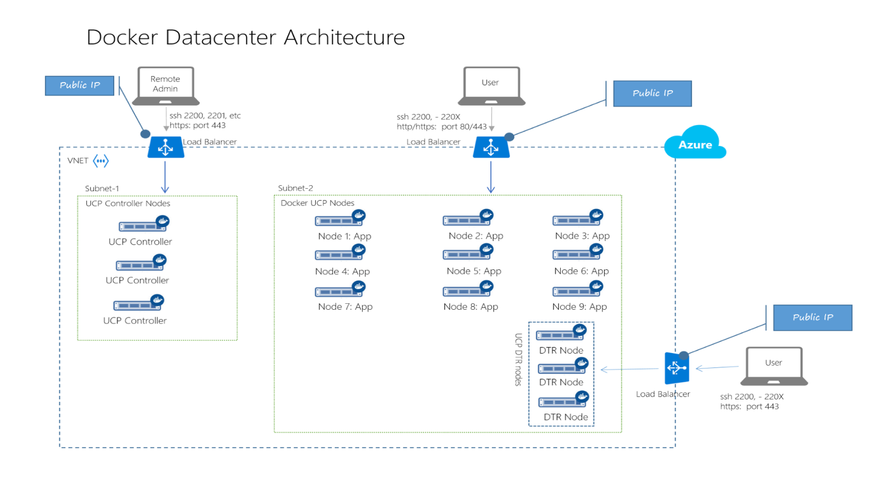

# Docker Data Center - Continuous Integration & Deployment Azure Partner Quickstart Template
<a href="https://portal.azure.com/#create/Microsoft.Template/uri/https%3A%2F%2Fraw.githubusercontent.com%2FAzure%2Fazure-quickstart-templates%2Fmaster%2Fcloudbeesjenkins-dockerdatacenter%2Fazuredeploy.json" target="_blank">

</a>
<a href="http://armviz.io/#/?load=https%3A%2F%2Fraw.githubusercontent.com%2FAzure%2Fazure-quickstart-templates%2Fmaster%2Fcloudbeesjenkins-dockerdatacenter%2Fazuredeploy.json" target="_blank">

</a>
https://raw.githubusercontent.com/Azure/azure-quickstart-templates/master/cloudbeesjenkins-dockerdatacenter
## Azure Partner Quickstarts Overview
***Azure Partner Quickstart Templates*** provide customers with a highly automated process to launch enterprise ready first and 3rd party ISV solution stacks on Azure in a pre-production environment. The **Azure Partner Quickstart** effort is complimentary to the [Azure Marketplace test drive program](https://azure.microsoft.com/en-us/marketplace/test-drives/). These fully baked stacks enable customers to quickly stand up a PoC or Piloting environments and also integrate it with their systems and customization.

Customers benefit greatly from solution templates because of the ease with which they can stand up enterprise-grade, fully integrated stacks on Azure. The extensive automation and testing of these solutions will allow them to spin up pre-production environments with minimal manual steps and customization.  Most importantly, customers now have the confidence to transition the solution into a fully production-ready environment with confidence.

**The Continuous Integration & Deployment Azure Partner Quickstart Template** launches a CI/CD solution stack that provides an automated provisioning, configuration and integration of the [Docker Datacenter](https://azure.microsoft.com/en-us/marketplace/partners/docker/dockerdatacenterdocker-datacenter/) product on Azure. Combined with [Cloudbees Jenkins platform](https://azure.microsoft.com/en-us/marketplace/partners/cloudbees/jenkins-platformjenkins-platform/) products makes this solution ready for pre-production environments. These are intended as pilot solutions and are not production-ready.
Please [contact us](azuremarketplace@sysgain.com) if you need further info or support on this solution.

##Licenses & Costs
In its current state, solution templates come with licenses built-in for Cloudbees Jenkins and Docker Datacenter needs a license (30 day trial is available). The solution template will be deployed in the Customer’s Azure subscription, and the Customer will incur Azure usage charges associated with running the solution stack.

##Target Audience
The target audience for these solution templates are IT professionals who need to stand-up and/or deploy infrastructure stacks.

## Prerequisites
* Azure Subscription - if you want to test drive individual ISV products, please check out the [Azure Marketplace Test Drive Program](https://azure.microsoft.com/en-us/marketplace/test-drives/)
* Azure user account with Contributor/Admin Role
* Sufficient Quota - At least 22 Cores (with default VM Sizes)
* Docker Data Center license.( use the url to your license instead while deploying )
 
##Solution Summary
The goal of this solution stack is to provide a continous integration experience by creating docker images of any code change and deploy the solutions as containers. This is achieved using multiple ISV products and integrating them in an automated way.


The core component of this stack is Docker Datacenter, which is an integrated solution including open source and commercial software, the integrations between them, full Docker API support, validated configurations and commercial support for your Docker Datacenter environment. A pluggable architecture allows for flexibility in compute, networking and storage providers used in your Containers-as-a-Service (CaaS) infrastructure without disrupting the application code. Enterprises can leverage existing technology investments with Docker Datacenter. The open APIs allow Docker Datacenter CaaS to easily integrate into your existing systems like LDAP/AD, monitoring, logging and more.

You can find more information here: https://www.docker.com/products/docker-datacenter

Docker Datacenter consists of 3 components:

1. **Docker Univeral Control Plane (UCP):** UCP is an enterprise-grade cluster management solution from Docker that helps you manage your cluster using a single plane of glass. It is architected on top of swarm that comes with Docker engine. The UCP cluster consists of controllers ( masters) and nodes (workers).
2. **Docker Trusted Registry (DTR):** DTR is the enterprise-grade image storage solution from Docker that helps you can securely store and manage the Docker images you use in your applications. DTR is made of DTR replicas only that are deployed on UCP nodes.
3. **Commercially Supported Engine (CS Engine):** The CS engine adds support to the existing Docker engine. This becomes very useful when patches and fixes will have to be backported to engines running in production instead of updating the entire engine.



##CI/CD Architecture Diagram
We are going to create an environment from which demos of the Docker CICD use case along with using DTR and UCP can be done. Jenkins will run as a container and handle the building of Docker images. 
](images/CI-CD.png)
 
## Deployment Steps
You can click the "deploy to Azure" button at the beginning of this document or follow the instructions for command line deployment using the scripts in the root of this repo.

The deployment takes about 30-45 mins.
## Usage
#### Connect
Login to Jenkins Operation Center with the provided output URL & Credentials, and from there run jobs that create Docker images and are pushed to Docker Trusted Registry. Login to UCP controller to pull the images and deploy the containers on UCP nodes.

You can follwo the instructions in [this downloadable guide](https://github.com/sysgain/Ignite2016-HandsOnLabs/blob/master/HOL-DDCJenkins.pdf).

##Post Deployment steps

1. Deploy the PostAzureDeploy.json onto the same resource group.
2. Since we are not using certifcates from a Third party CA, we need to establish self trusting certificates on all the nine nodes (3 upc nodes, 3 upc controller nodes, 3 dtr nodes).

   ```shell
   export DOMAIN_NAME=DOMAIN_NAME
   openssl s_client -connect $DOMAIN_NAME:443 -showcerts </dev/null 2>/dev/null | \openssl x509 -outform PEM | sudo tee /usr/local/share/ca-certificates/$DOMAIN_NAME.crt
   sudo update-ca-certificates
   sudo service docker restart
   ```
   where `DOMAIN_NAME` is the DTR domain name.
3. Set up Jenkins Job by following steps 2 through 7 from [this manual](https://github.com/sysgain/azurequickstarts/blob/master/CloudBeesJenkins-DockerDataCenter/Lab-Manual.pdf) 
4. Integrate UCP with DTR by following [this manual](https://docker.github.io/ucp/configuration/dtr-integration/) omitting  step 5. 

##Support
For any support-related issues or questions, please contact azuremarketplace@sysgain.com for assistance.
