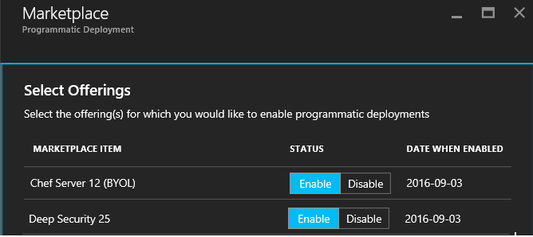
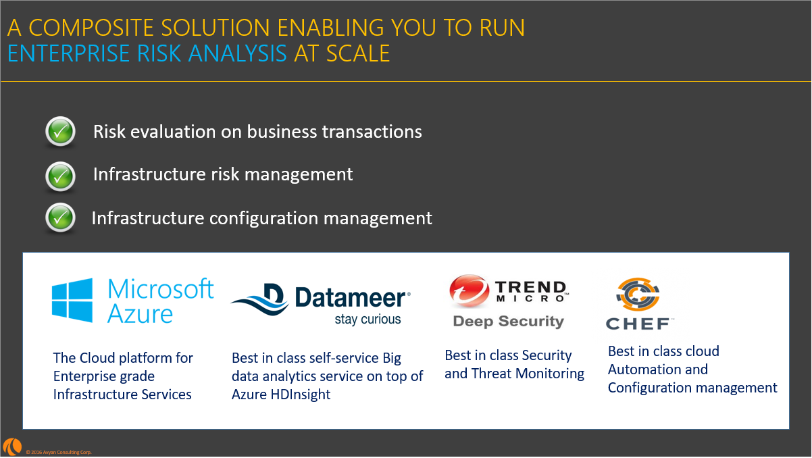

<h1> Datameer, HDInsight, TrendMicro, Chef- Business Intelligence Composite template version 1.0 </h1>
<a href="https://portal.azure.com/#create/Microsoft.Template/uri/https%3A%2F%2Fraw.githubusercontent.com%2FAvyanConsultingCorp%2Fazure-quickstart-templates%2Fmaster%2Fdatameer-trend-chef-businessintelligence%2Fazuredeploy.json" target="_blank">

</a>
<a href="http://armviz.io/#/?load=https%3A%2F%2Fraw.githubusercontent.com%2FAvyanConsultingCorp%2Fazure-quickstart-templates%2Fmaster%2Fdatameer-trend-chef-businessintelligence%2Fazuredeploy.json" target="_blank">

</a>


<h2> Table Of Contents </h2>
<!-- TOC -->

- [1. Solution Template Overview](#1-solution-template-overview)
- [2. Licenses & Costs](#2-licenses-costs)
- [3. Target Audience](#3-target-audience)
- [4. Prerequisites](#4-prerequisites)
- [5. Solution Summary](#5-solution-summary)
- [6. Reference Architecture Diagram](#6-reference-architecture-diagram)
    - [6.1 Deployed Infrastructure](#61-deployed-infrastructure)
- [7. Deployment Steps](#7-deployment-steps)
- [8. Configuration](#8-configuration)
- [9. Usage](#9-usage)
        - [7.1. Usage Guides](#71-usage-guides)
- [10. Support](#10-support)

<!-- /TOC -->

##  1. Solution Template Overview
***Solution Templates*** provide customers with a highly automated process to launch enterprise ready first and 3rd party ISV solution stacks on Azure in a pre-production environment. The **Solution Template** effort is complimentary to the [Azure Marketplace test drive program](https://azure.microsoft.com/en-us/marketplace/test-drives/). These fully baked stacks enable customers to quickly stand up a PoC or Piloting environments and also integrate it with their systems and customization.

Customers benefit greatly from solution templates because of the ease with which they can stand up enterprise-grade, fully integrated stacks on Azure. The extensive automation and testing of these solutions will allow them to spin up pre-production environments with minimal manual steps and customization.  Most importantly, customers now have the confidence to transition the solution into a fully production-ready environment with confidence.

**Business Intelligence Solution Template 001** 
*Disclaimer*: These are intended as pilot solutions and not production ready.
Please [contact us](azuremarketplace@avyanconsulting.com) if you need further info or support on this solution.

##  2. Licenses & Costs
In its current state, solution templates come with licenses built-in – there may be a BYOL option included in the future. The solution template will be deployed in the Customer’s Azure subscription, and the Customer will incur Azure usage charges associated with running the solution stack.

##  3. Target Audience
The target audience for these solution templates are 
* **Business Decision Maker, IT Data Analyst** - or anybody w/i the organization who cares for the managing risk on Business transactions
* **IT Decision Maker & Infrastructure Architects** - or any personnel w/i the organization that's responsibile for managing Infrastructure risk
* **IT Decision Maker & Infrastructure Architects** - or any personnel w/i the organization that's responsibile for DevOps/IT Configuration management
*  and lastly, but very importantly - **IT professionals** who need to stand-up and/or deploy infrastructure stacks.

##  4. Prerequisites
* Azure Subscription - if you want to test drive individual ISV products, please check out the [Azure Marketplace Test Drive Program ](https://azure.microsoft.com/en-us/marketplace/test-drives/)
* Azure user account with Contributor/Admin Role
* Sufficient Quota - At least 20 Cores(with default VM Sizes)
* Azure Marketplace Deployment Agreements - VM Images from Azure marketplace need a registered Azure credit card for deployments to be successful. We understand that some customers (especially EA and internal MS customers) may not have this configured leading to failed deployments.
* Programmatic deployments for Chef Server. (TrendMicro is optional)
](images/LicenseRequirementsPrerequisite.png)   
 
##  5. Solution Summary


An integrated ARM Template (<a href="https://azure.microsoft.com/en-us/documentation/articles/resource-group-overview/">Azure Resource Manager</a>) that stitches all the above technology into a single deployment. The following is a feature table that is pulled together for your benefit.

|Datameer and HDInsight                     |TrendMicro Deep Security                               |Chef Server and Workstation    |
|:------------------------                  |:------------------------                               |------------------------       |
| Wide variety of Data Ingestion, Visualization (Internal and External to Enterprise)| Anti-malware, Content Filtering | Cloud Infrastructure Automation
| Powered by Hadoop, but you never know it  | Intrusion prevention                                  | DevOps 
| Self Service analytics                    | Integrity monitoring              | Compliance
| MapReduce cluster                         | Log Inspection                    | Continuous Delivery |
|                                           | TrendMicro Azure Extensions       | Chef cookbooks for TrendMicro '* 

'* **TrendMicro Chef Cookbooks**: Solution deploys a Chef Server and an automated framework that allows any new VMs to bootstrap to chef Server as and when they get provisioned. Additionally, in order to integrate Chef Server with Chef Nodes in an automated way, additional microservices are deployed as a set of two Docker Containers (a Node.js app and a database).

 
## 6. Reference Architecture Diagram
![[] (images/Datameer-TrendMicro-Chef_Solution_Architecture.png)](images/Datameer-TrendMicro-Chef_Solution_Architecture.png)

The diagram above provides the overall deployment architecture for this test drive.
As a part of deployment the template launches the following:

* A storage account in the resource group.
* A Virtual Network with four subnets Trendmicro, Chef & Orchestrator, Datameer, Test Apps and Chef Workstation.
* Trend micro vm is built from the image reference in the subnet1:

### 6.1 Deployed Infrastructure

|Area	        |Role	                |Type	|Qty|
|------         |-------                |------ |---| 
|Security       |TrendMicro Server *    |	D2	|1  |
|HDInsight      |Hadoop Head Node       |	D3  |2 |
|	            |Hadoop Worker Node	    |D3	    |2 |
|	            |Datameer *	            |D3	    |1 |
|Orchestration  |	Chef Server *	    |D2	    |1 |
|	            |Docker App Orchestration|	D2	| 1|
|Test Application|	Chef Workstation    |D2|	1 |
|	            |Test App	            |D2	    |2 |
|Backend        |SQL Database	        |Standard (S3)|	1|
|	            |Azure Storage (HDInsight)|	LRS	|1  |
|VM Storage	    |Azure Storage	        |LRS	|1|

**Note**:
* Items marked with * are licenced components
* Trial licences included for TrendMicro (30days) and Chef (30days). Datameer licences (trial for 14days) need to be enabled post installation and are then subsequently available for an annual contract renewal. Please reach out to us for any of the licencing related questions and we might be able to influence *some of the ISVs, some of the times*. 


##  7. Deployment Steps
You can click the "deploy to Azure" button at the beginning of this document or follow the instructions for command line deployment using the scripts in the root of this repo.

***Please refer to parameter descriptions if you need more information on what needs to be provided as an input.***
The deployment takes about approximately 45mins. Once it is deployed there are few minor manual steps to 

## 8. Configuration

## 9. Usage
####  7.1. Usage Guides

You can use the following guide to use the solution.
```sh
<guide link goes here>
```

## 10. Support
For any support-related issues or questions, please contact us for assistance.
```sh
azuremarketplace@avyanconsulting.com
```
