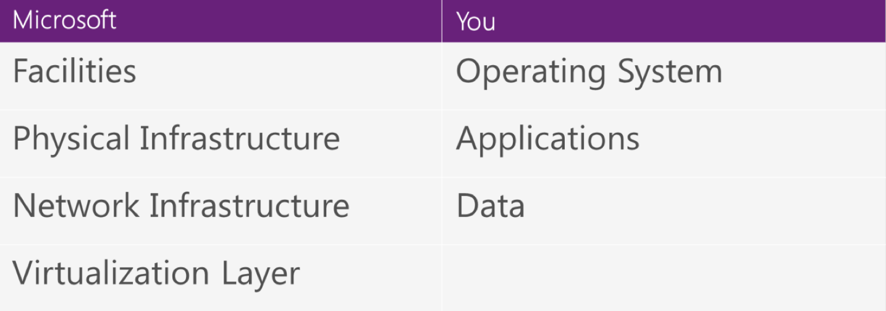
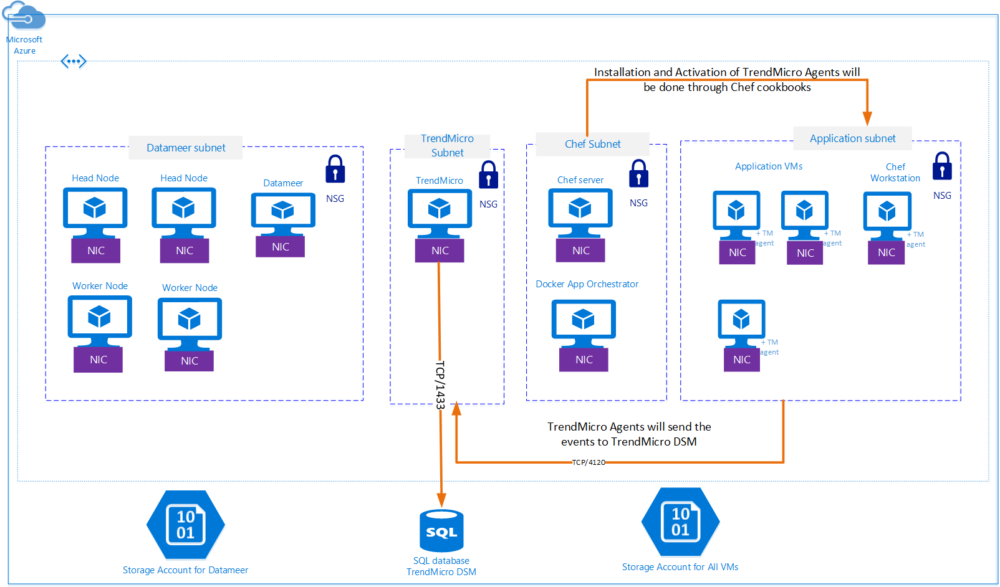

# Datameer, HDInsight, TrendMicro, Chef- Business Intelligence Composite template 001

## Solution Template Overview
***Solution Templates*** provide customers with a highly automated process to launch enterprise ready first and 3rd party ISV solution stacks on Azure in a pre-production environment. The **Solution Template** effort is complimentary to the [Azure Marketplace test drive program](https://azure.microsoft.com/en-us/marketplace/test-drives/). These fully baked stacks enable customers to quickly stand up a PoC or Piloting environments and also integrate it with their systems and customization.

Customers benefit greatly from solution templates because of the ease with which they can stand up enterprise-grade, fully integrated stacks on Azure. The extensive automation and testing of these solutions will allow them to spin up pre-production environments with minimal manual steps and customization.  Most importantly, customers now have the confidence to transition the solution into a fully production-ready environment with confidence.

**Business Intelligence Solution Template 001** 
*Disclaimer*: These are intended as pilot solutions and not production ready.
Please [contact us](azuremarketplace@avyanconsulting.com) if you need further info or support on this solution.

##Licenses & Costs
In its current state, solution templates come with licenses built-in – there may be a BYOL option included in the future. The solution template will be deployed in the Customer’s Azure subscription, and the Customer will incur Azure usage charges associated with running the solution stack.

##Target Audience
The target audience for these solution templates are IT professionals who need to stand-up and/or deploy infrastructure stacks.

## Prerequisites
* Azure Subscription - if you want to test drive individual ISV products, please check out the [Azure Marketplace Test Drive Program ](https://azure.microsoft.com/en-us/marketplace/test-drives/)
* Azure user account with Contributor/Admin Role
* Sufficient Quota - At least 18 Cores( with default VM Sizes)
* Azure Marketplace Deployment Agreements - VM Images from Azure marketplace need a registered Azure credit card for deployments to be successful. We understand that some customers (especially EA and internal MS customers) may not have this configured leading to failed deployments.   
 
##Solution Summary

The core component of this stack is Trend Micro Deep Security Manager, which is a cloud security control platform. There are two pieces to the platform: the Deep Security Manager and the Deep Security Agents. The Manager runs centrally, and the Agents are deployed on the virtual machines you want protected. The Manager allows you to set up and customize security policy, monitor events, and deliver security rule updates. The Agent does all the heavy lifting by delivering the following controls:

* anti-malware
* web reputation (also known as content filtering)
* firewall
* intrusion prevention
* integrity monitoring
* log inspection

These controls provide much-needed security to your operating systems and applications. This lines up nicely with the way security works in the Azure Cloud, which operates under the Shared Responsibility Model. This model draws a clear line where Azure responsibility for security ends and where your responsibility begins.

TrendMicro DSM is an agents based security control platform. The agents need to be deployed and configured to integrate with the Master server. As new VM's are launched in the cloud, there needs to be an automated way of bootstrapping these agents to the master. This is a typical problem in many cloud deployments. This solution stack provides two ways of deploying the agents in a dynamic manner

1. **TrendMicro Azure Extension:** Azure provides an extension to deploy and configure the agent on a VM.
2. **TrendMicro Chef Cookbooks:** Configuration Management is a key aspect in configuring servers, its applications and handling security. Chef, which is a very popular configuration management solution, can be used to install and configure TrendMicro agents. Further Chef recipes can be used to manage configuration of the application and servers to ensure they fall in line with the security policies defined in Trend Micro DSM. 

This solution stack implements the second option (with Chef). It deploys a Chef Server and an automated framework that allows any new VM's to bootstrap to chef Server as and when they get provisioned. Additionally, in order to integrate Chef Server with Chef Nodes in an automated way, additional microservices are deployed as a set of two Docker Containers (a Node.js app and a database).

 
##Reference Architecture Diagram
](images/trend-architecture-new.png)

The diagram above provides the overall deployment architecture for this test drive.
As a part of deployment the template launches the following:

* A storage account in the resource group.
* A Virtual Network with four subnets [subnet1 (Trendmicro), subnet2 (Chef & Orchestrator), Subnet3 (Splunk) & subnet4 (VM's& Workstation)].
* Trend micro vm is built from the image reference in the subnet1:
 
"publisher": "trendmicro", 

"offer": "deep-security-vm", 

"sku": "dxxn25d2v2", 

"version": "latest 

* Network security group(NSG1) is assigned to Network Interface (NIC 1) which is attached to TrendMicro VM. The NSG 1 rules are same as the security rules mentioned in TrendMicro section. A public IP is attached to Network interface.
* Deploy Azure SQL DB.

***<<to be revised>>>***
* Network security group(NSG2) is assigned to Network Interface (NIC 2) which is attached to Splunk VM. The NSG 2 rules are the same as the security rules mentioned in the Splunk section. A public IP is attached to Network interface.
* Place the Splunk VM in a availability set. 
* Deploy Chef Server in Subnet2 and integrate with orchestrator. A public IP is attached to Network interface. Deploy an orchestrator service using Docker.
* Deploy 2 VMs (Linux, Windows) with bootstrap scripts to install TrendMicro agents (through extensions).
* Deploy 1 VMs (Linux) with bootstrap scripts to install Chef Agents and connect them to the server using orchestrator.

## Deployment Steps
You can click the "deploy to Azure" button at the beginning of this document or follow the instructions for command line deployment using the scripts in the root of this repo.

***Please refer to parameter descriptions if you need more information on what needs to be provided as an input.***
The deployment takes about approximately 45mins. Once it is deployed there are few minor manual steps to 
##Usage
#### Connect

You can use the [this guide](images/*<guide goes here>*.pdf) to set policies and enable log forwarding to Splunk.

##Support
For any support-related issues or questions, please contact azuremarketplace@avyanconsulting.com for assistance.
