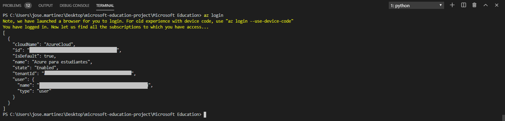
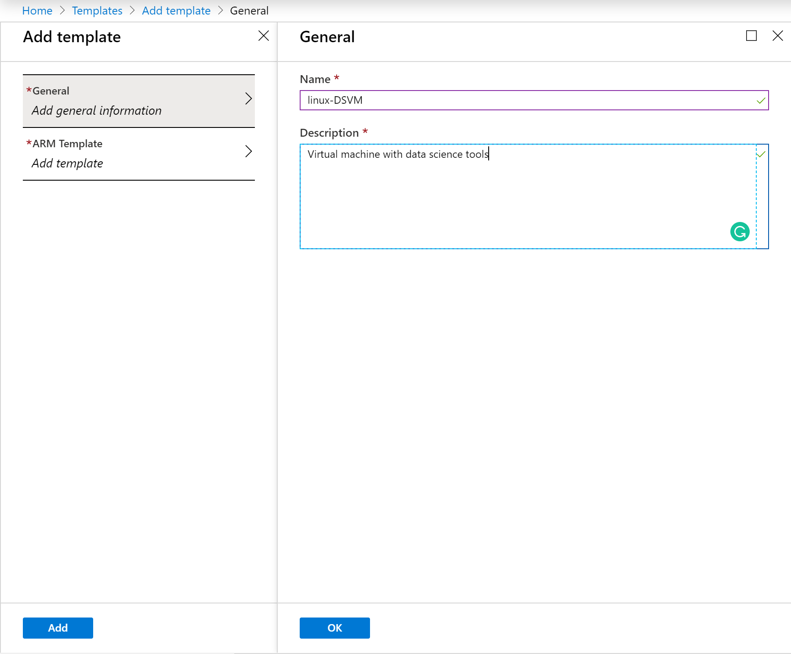
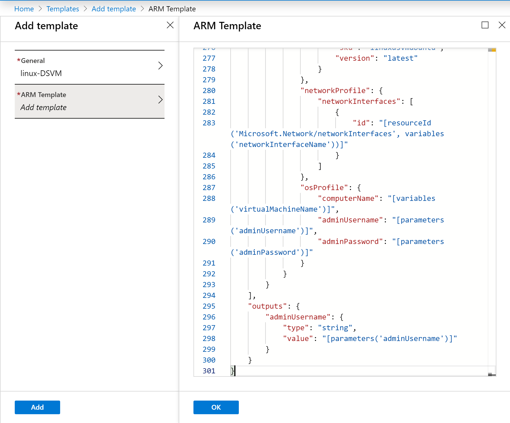
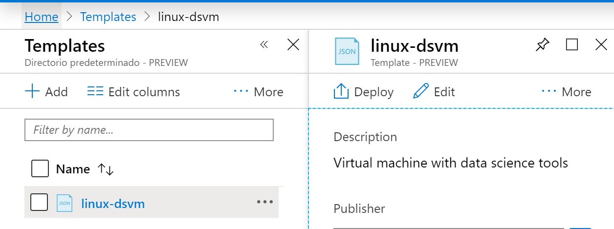
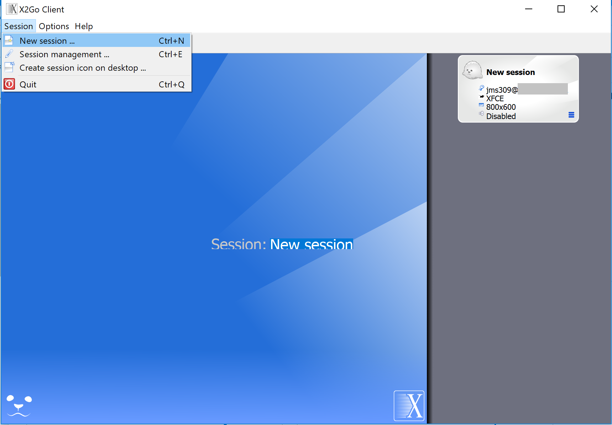
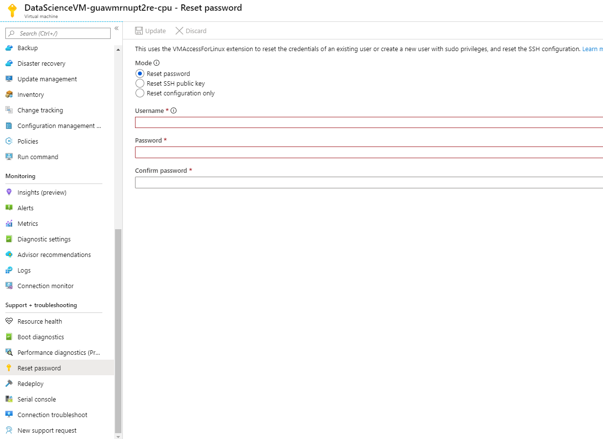
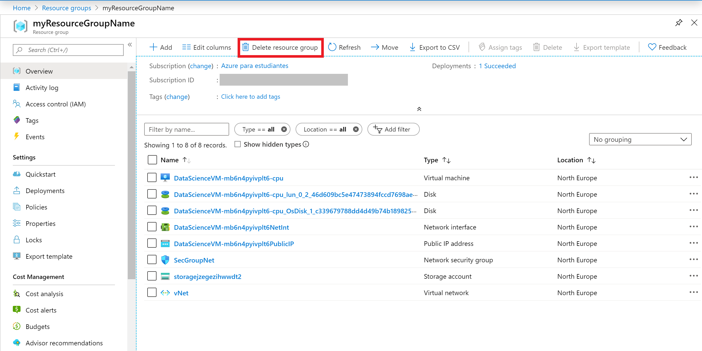
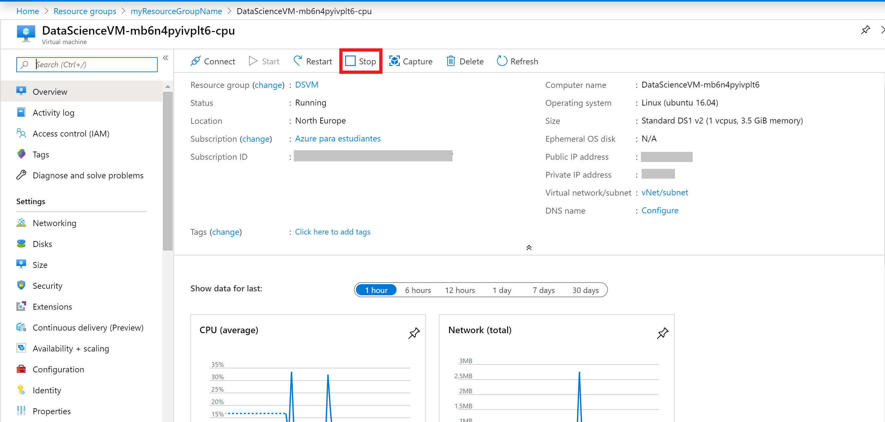

# Data Science Ubuntu Server 16.04-LTS Virtual Machine

The purpose of this ARM Template is to deploy a **Linux Virtual Machine with some Data Science tools** inserting a few parameters.

## The Template

Don't let the size of the template scares you. The structure is very intuitive and once that you get the gist of it, you will see how easier your life will be regarding deploying resources to Azure.

Those are the parameters on the template, most of them are already with the values, the ones that you need to inform are: **adminUsername**, **adminPassword** and **resourceGroup**. All the other parameters will be already informed.

Don't worry about changing anything on the file, either on the portal or using Azure CLI, you need to inform just the following parameters.

- *adminUsername:* Usernames can be a maximum of 20 characters and cannot end in a period (".").

- *adminPassword:* Password requirements between 12 to 72 characters and have lower and upper characters, a digit and a special character (Regex match [\W_])

- *resourceGroup:* The Resource Group that will have your deployment. We go in detail in the next section.

- *cpu-gpu:* Choose between CPU or GPU based virtual machine.

Let's rock with the Deployment.  

## Deployment

There are a few ways to deploy your template.
You can use [PowerShell](https://docs.microsoft.com/azure/azure-resource-manager/resource-group-template-deploy), [Azure CLI](https://docs.microsoft.com/azure/azure-resource-manager/resource-group-template-deploy-cli), [Azure Portal](https://docs.microsoft.com/azure/azure-resource-manager/resource-group-template-deploy-portal) or your favorite SDK.

For this task, we going to deploy using Visual Code and the portal and a little surprise for you at the end. :D

For Azure CLI I choose to use the Visual Code with Azure CLI extensions, if you like, you can find more information [here](https://code.visualstudio.com/docs/azure/extensions). But bare in mind that you don't need to use the Visual Code, you can stick with the old good always present **Command Line** on Windows or any **bash terminal**.

### Using Azure CLI with Visual Code

type on the terminal window: **az login**

You will be redirected to the Azure Portal where you can insert your credentials and log in.

After logged in, you will see your credentials on the terminal.

To set the right subscription, type following command:

#### az account set --subscription "your subscription id"

### Resource Group

Now you need a Resource Group for our deployment. If you haven't yet created a Resource Group, you can do it now. If you are new on Azure and wonder what is a Resource Group? Bare with me! A Resource Group is a container that holds related resources for an Azure solution. The resource group includes those resources that you want to manage as a group. Simply saying, it's like a folder that contains files. Simple as that.

To create a Resource Group, you need a name and a location for your Resource Group.

For a list of locations, type: **az account list-locations**

To create the Resource group, type the command:

#### az group create --name "resource-group" --location "your location"

Super simple, right? Now that you have your **Resource Group** created, let's deploy the Virtual Machine.

#### az group deployment create --resource-group "resource-group" --template-file "path file"

As you can see, it's running. Go grab a cup of coffee, have some fresh air and I'm sure that before you come back you will have your Virtual Machine ready.

And there we go, the deployment is succeeded:

### Using the Portal

At the Portal, in All Services look for **Templates**, you can favourite this service.

Click in **Add** to add your template. On General, type a name and a description for your template, and click on [OK].

On ARM Template, replace the contents of the template with your template, and click on [OK].

Click on the refresh button and there is your template:

Open the template and click in [Deploy]

On the screen Custom Deployment, insert the information that you must be already familiar with.

Select [I agree] and click on [Purchase].

And voilà, you have your new VM deployed.

**p.s.: Pretty easy to create resources on Azure, right? But if you are the sort of IT guy that always loves automation, here is the surprise. Just click on the button below and it will automatically deploy the VM through the  Azure Portal.**

#### Important disclaimer: Azure charges you for the resources you are using, and you don't want to finish all your credits immediately, right? So, for not running out of credit, don't forget to stop the VM at the portal or even delete the Resource Group you create to avoid any unnecessary charges

## Usage

### Connect

You have two different ways to connect to the DSVM. You can connect to the solution via SSH or using the X2Go Client.

#### Connecting via SSH

You can connect to your virtual machine using SSH.

First, go to your resource (the VM) and click on connect. After that, go to the SSH tab. Finally, copy the command to connect to the VM.

Now, open any **bash terminal** and paste the command.

It will ask you to type your password. After that, you will be connected to the VM:

#### Connecting via X2Go Client

You can connect to your virtual machine using the X2Go Client. If you don't have the program, you can download it from [here](https://wiki.x2go.org/doku.php/doc:installation:x2goclient).

Then, go to your resource, and copy the virtual machine's public IP address.

Now, it's time to open the X2Go client. If the "New Session" window does not pop up automatically, go to Session -> New Session.

On the resulting configuration window, enter the following configuration parameters on the session tab:

- Host: Enter the IP address of your VM.
- Login: Enter the username of the Linux VM.
- SSH port: Leave it at 22, the default value.
- Session Type: Change the value to XFCE.

Then, click [Ok]. You will see your VM added to the right of the X2Go window. Click on the box of your VM to bring up the log-in screen. 

Then enter the password and select [Ok]. You may have to give X2Go permission to bypass your firewall to finish connecting.

Now, you should see the graphical interface for your Ubuntu DSVM.

### How to reset your password

If you forget your password to connect to the virtual machine, you will be able to change this password in a very easy way.

Go to your resource and click on **Reset Password**:

Here, select the "Reset password" mode, and type your **username** and the **new password**. Then, update.

### How to remove your resources

#### Using the portal

On the portal, open your Resource Group, if you will not use the service or VM anymore, you can just click on the [Delete] Button.

You can also just stop the service or the Virtual Machine in case you need the resource. Open the resource and click on Stop.

Just refresh your screen and you are good to go.
