# Azure Resource Optimization(ARO) Toolkit

    

Deploy an Azure Automation account with preconfigured runbooks and schedules to your subscription and start saving money.  Azure resource optimization happens automatically on your subscription once you enable or create your own schedule including on new resources!  

***Objective:*** Provide decentralized automation capabilities for customers who want to reduce their costs.  Features include:

1. Auto Snooze ARM VMs based on low CPU

1. Schedule ARM VMs to snooze/un-snooze

1. Schedule ARM VMs to snooze/un-snooze in ascending and descending order using Azure Tags

1. Bulk delete resource groups on demand

## **How to On-board - ARO Toolkit**

## **Step 1 Deploy ARO Toolkit**

## **From Github**

Click Deploy to Azure and proceed to Step 2, "Configure Azure Automation Variables".

Important!  A bootstrap runbook can take up to 15 minutes to complete setting up your Azure Automation account.  Before you use ARO Toolkit, validate the Azure Run As account is created as show below.  If not, follow the steps in Appendix D.
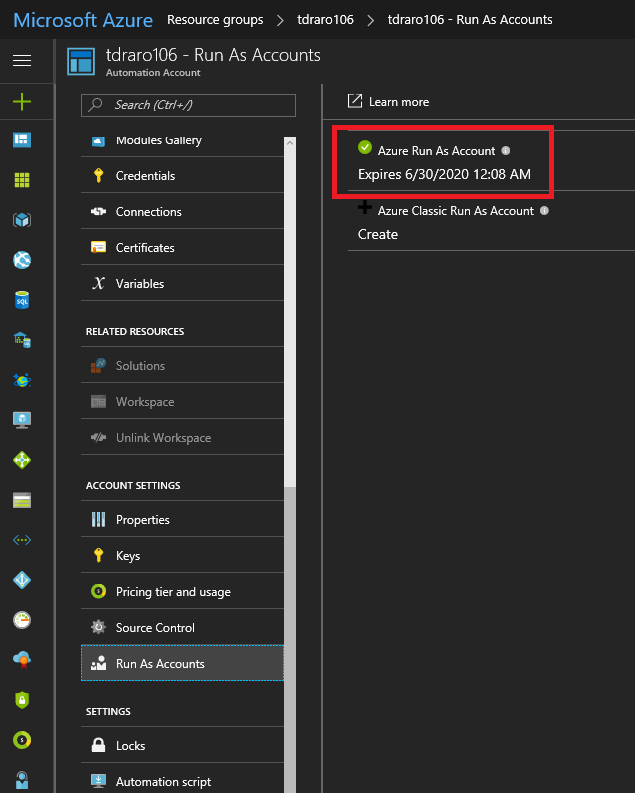

## **Step 2 Configure Azure Automation Variables**

1. Navigate to Azure portal and select your subscription (if you have
    more than one)

1. Click on “**Automation Accounts**” from the service blade

  

1. Select the Azure Automation Account which you deployed

1. Navigate to the dashboard by clicking “Overview”

1. Click “**Assets**”

    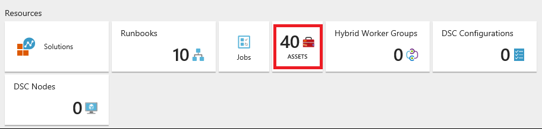

1. Click “**Variables**” tile

    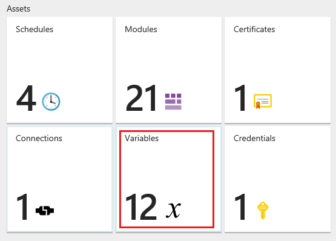

1. If needed you can maximize the variables window to get better
    visibility

1. Update the variables as per your requirements

    a.  **External\_ResourceGroupNames:** Enter the resource group names
        with comma separated values. (Example: RG1, RG2, RG3).  If you want to act on all the VMs at the subscription level, then leave this field blank.

    b.  **External\_ExcludeVMNames:** Enter the VM names with comma
        separated values to opt-in for the excluded list.

    c.  You can also modify other variables which are prefixed with
        “External” for AutoSnooze feature.

    d.  **Note:** Please make sure you don’t make any changes to the
        variables that prefixed with “Internal”

    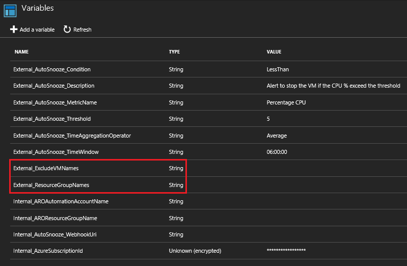

## **Step 3 Enable Azure Automation Schedules**

By Default, all default schedules deployed with the AROToolkit are disabled.  Based upon which optimization you wish to perform, you will need to enable the corresponding schedule.  To learn more about which schedule is right for you, please refer to Appendix -B. 

1. Navigate to Azure portal and select your subscription (if you have
    more than one)

1. Select the Automation Account where you have deployed (follow the
    step 2-2)

1. Click on “**Schedules**”

    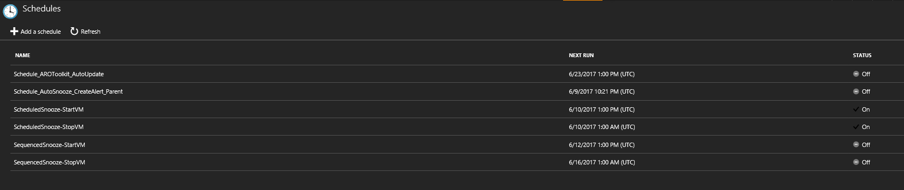

1. Select each schedule which will open the edit blade where you can
    enable them

1. Click “**Yes**” in the Enabled attribute and click “**Save**”

    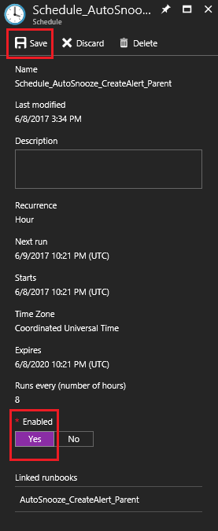

1. If you want to create the custom schedule, please refer to Appendix - A

1. If you want to learn more about the default schedules installed with the AROToolkit, please refer to Appendix -B.

## **Appendix – A : How to create a custom schedule?**

1. Follow the procedure provided in step-4 to navigate to “Schedules”

1. Click on “Add a schedule”

    

1. New Schedule blade will be open. Provide all the inputs

    a.  Name : Schedule name

    b.  Description : Description of the schedule

    c.  Select the starts Date & time

    d.  Select the time zone

    e.  Select the recurrence

1. Click on “**Create**”

    ![alt text](images/AROToolkit/image17.png "Create Schedule"

1. Click on “Runbooks” to link the runbook to the above created
    schedule.

    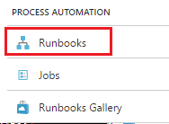

1. Select the required Runbook

    a.  For AutoSnooze: Select “**AutoSnooze\_CreateAlert\_Parent**”
        runbook

    b.  For ScheduleSnooze: Select “**ScheduledSnooze\_Parent**” runbook

    c.  For SequencedSnooze: Select “**SequencedSnooze\_Parent**”
        runbook

1. After selecting the runbook, click on “**Schedules**” tile.

     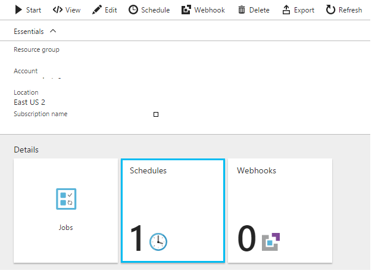

1. Click on “**Add a schedule**”

     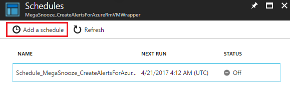
  
1. Click on “**Link a schedule to your runbook**”

     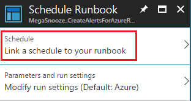

1. Select the schedule which you have created earlier. In this example,
    it is “TestSchedule1” so select that

     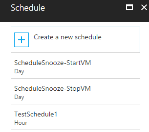

1. Click on “**Parameters and run settings**” to add the parameters

    a.  For AutoSnooze, no additional parameters needed

    b.  For ScheduleSnooze, create separate schedule for Start and Stop
        and add the below parameter

    c.  For StartVM have the parameter value as “Start”

    d.  For StopVM have the parameter value as “Stop”

1. Click “**Ok**” to finish the schedule configuration

## **Appendix – B : All about each Default Schedule**

This is a list of each of the Default Schedules which will be deployed with the AROToolkit.   It is not recommended that you modify the Default Schedules.  If a different schedule is required,  you should create a custom schedule as outlined in Appendix A.  By default each of these schedules are disabled, and is up to you to enable per your requirements.

It is not recommended to enable ALL schedules as there would an overlap on which schedule performs an action, rather it would be best to determine which optimizations you wish to perform and choose accordingly. 

**ScheduleName** | **Time and Frequency** | **What it does**
--- | --- | ---
Schedule_AROToolkit_AutoUpdate | 1:00PM (UTC), Every 2 Weeks | Runs  AROToolkit_AutoUpdate runbook every 2 weeks at the given time.  Will keep your AROToolkit deployment up-to-date whenever a new release occurs.
Schedule_AutoSnooze_CreateAlert_Parent | Time of Deployment, Every 8 Hours | Runs the AutoSnooze_CreateAlert_Parent runbook every 8 hours, which in turn will Snooze VM’s based on rules defined in the External_Autosnooze* Asset Variables.
ScheduledSnooze_StopVM | 1:00AM (UTC), Every Day | Runs the ScheduledSnooze_Parent runbook with a parameter of “Stop” every day at the given time.  Will Automatically stop all VM’s that meet the rules defined via Asset Variables outlined in Step 3.  Recommend enabling the sister Schedule, ScheduleSnooze_StartVM.
 ScheduledSnooze_StartVM | 1:00PM (UTC), Every Day | Runs the ScheduledSnooze_Parent runbook with a parameter of “Start” every day at the given time.  Will Automatically start all VM’s that meet the rules defined via Asset Variables outlined in Step 3.  Recommend enabling the sister schedule, ScheduledSnooze_StopVM.
 SequencedSnooze-StopVM | 1:00AM (UTC), Every Friday | Runs the SequencedSnooze_Parent runbook with a parameter of “Stop” every Friday at the given time.  Will sequentially (ascending) stop all VM’s with a tag of “Sequence” defined.  Refer to Appendix – C for more details on tagging.  Recommend enabling the sister schedule, SequencedSnooze-StartVM.
 SequencedSnooze-StartVM | 1:00PM (UTC), Every Monday | Runs the SequencedSnooze_Parent runbook with a parameter of “Start” Every Monday at the given time.  Will  sequentially (descending) start all VM’s with a tag of “Sequence” defined.  Refer to Appendix – C for more details on tagging.  Recommend enabling the sister schedule, SequencedSnooze-StopVM.

## **Appendix – C : All about each Runbook**

This is a list of runbooks that will be deployed with the AROToolkit.  It is not recommended that you make changes to the runbook code, as any changes made will be lost if you use the AROToolkit_AutoUpdate runbook. 

***Pro Tip:*** Don’t directly run any runbook with the name “Child”
appended to the end.

  **Runbook Name** | **Parameters** | **What it does**
  --- | --- | ---
  AROToolkit\_AutoUpdate | none | Checks Github to for any runbook, variable, or schedule update and applies the update. Gets an AROToolkit to the latest version.   **Note: Will overwrite any custom modifications to Toolkit runbooks and Default Schedules.**
  AutoSnooze\_CreateAlert\_Child | VMObject   AlertAction   WebHookURI | Called from the parent runbook only. Creates alerts on per resource basis for AutoSnooze scenario.
  AutoSnooze\_CreateAlert\_Parent | WhatIf: True or False. | Creates or updates azure alert rules on VMs in the targeted subscription or resource groups.   WhatIf: True -> Runbook output will tell you which resources will be targeted.   WhatIf: False -> Create or update the alert rules.
  AutoSnooze\_Disable | none | Disable AutoSnooze alerts and default schedule.
  AutoSnooze\_StopVM\_Child | WebHookData | Called from parent runbook only. Alert rules call this runbook and it does the work of stopping the VM.
  Bootstrap\_Main | none | Used one time to set-up bootstrap configurations such as Run As account and webhookURI which is typically not accessible from ARM. This runbook will be removed automatically if deployment has gone successfully.
  DeleteResourceGroup\_Child | RGName | Called from the parent runbook only. Deletes a single resource group.
  DeleteResourceGroups\_Parent | RGNames: Comma separated list of resource groups.  WhatIf: True or False |Deletes resource groups in bulk. Typically an ad hoc subscription clean-up method.   WhatIf: True -> Shows which resource groups will be targeted.   WhatIf: False -> Deletes those targete resource groups.  
  DisableAllOptimizations | None | Turns off all alert rules and default schedules. Use this when you want to ensure all resources are available for an event like quarter close or Black Friday.
  ScheduledSnooze\_Child | VMName:   Action: Stop or Start   ResourceGroupName: | Called from parent runbook only. Does the actual execution of stop or start for scheduled snooze.
  ScheduledSnooze\_Parent | Action: Stop or Start   WhatIF: True or False | This will take effect on all VMs in the subscription unless you edit the “External\_ResourceGroupNames” which will restrict it to only execute on these target resource groups. You can also exclude specific VMs by updating the “External\_ExcludeVMNames” variable. WhatIf behaves the same as in other runbooks.
  SequencedSnooze\_Parent | Action: Stop or Start   WhatIf:  True or False | Create a tag called “Sequence” on each VM that you want to sequence snooze\\unsnooze activity for. The value of the tag should be an integer (1,2,3) that corresponds to the order you want to snooze\\unsnooze. For snoozing VMs, the order goes ascending (1,2,3) and for unsnoozing it goes descending (3,2,1). WhatIf behaves the same as in other runbooks.   **Note: This will work exclusively off tag values and will run subscription wide.**

## **Appendix – D : How can I make this work with an account that has dual factor authentication?**

With our AAD policy, it requires that a user account has dual factor
authentication (password and smart card or phone call). It’s not
possible for our bootstrap runbook to run with a dual factor account.
However, there is a relatively easy workaround if you don’t want to go
to the trouble of provisioning a service account to deploy ARO Toolkit.

1. Deploy the ARO Toolkit with the steps listed out at the start of
    this document

1. Go into your automation account and navigate to “Run As Accounts”
    and then click Create for Azure Run As Account.

     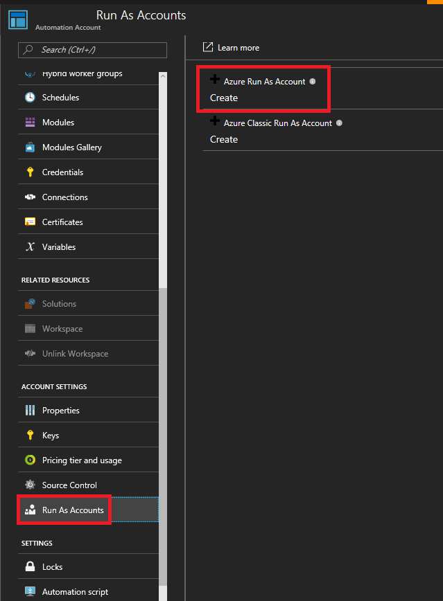

1. Once this completes, navigate to the Bootstrap\_Main runbook and
    start it.

     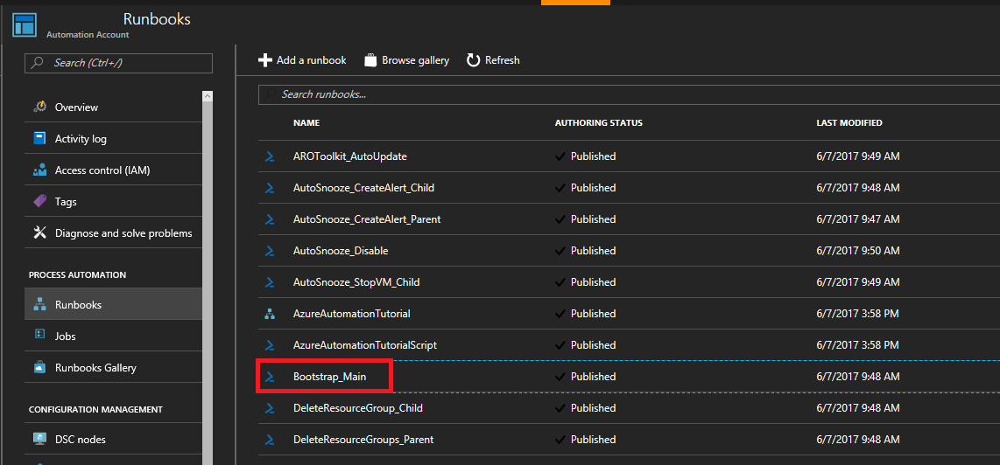

     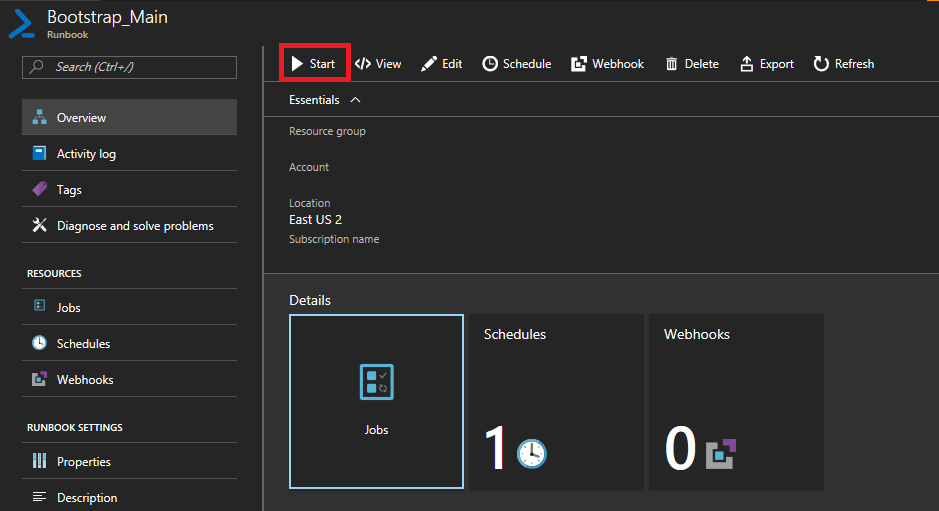

1. After this runs successfully, you should be all set up
