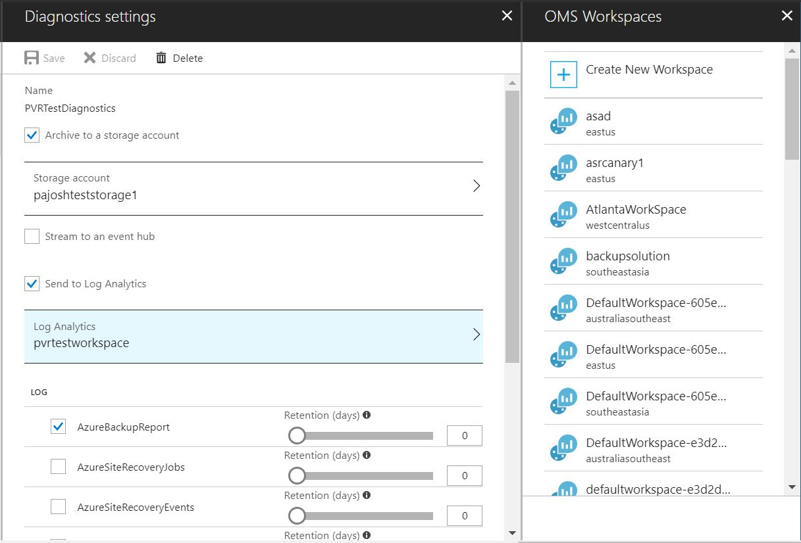
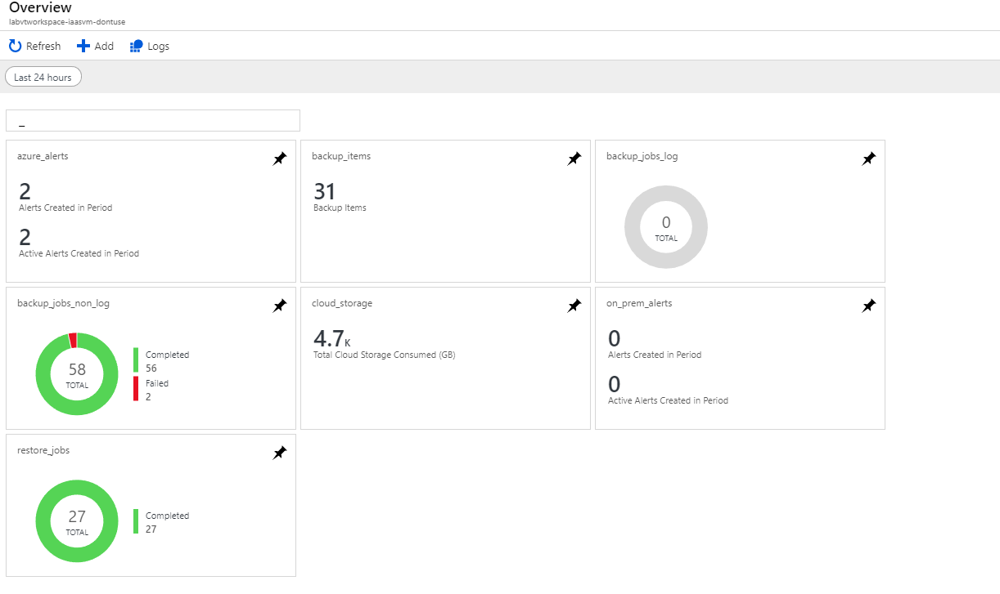
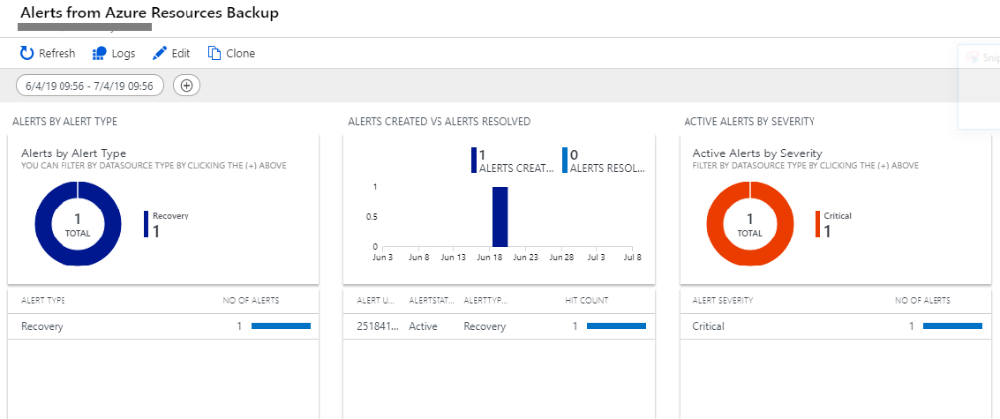
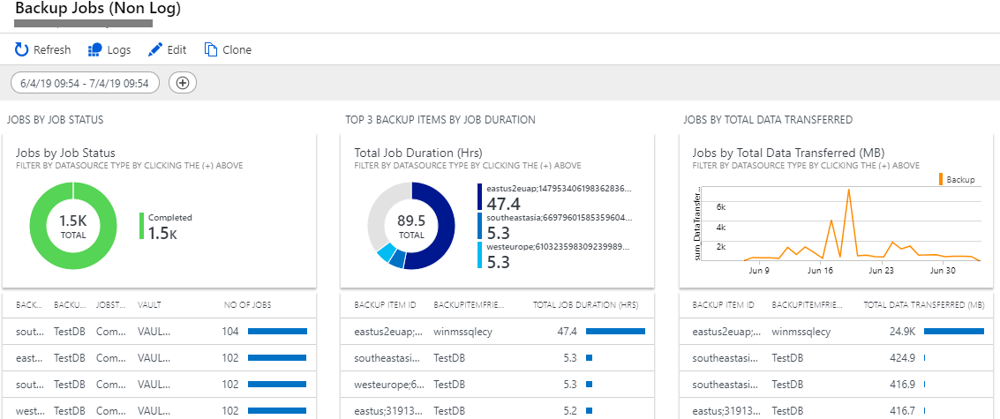

# LA Monitoring and Reporting solution for Azure Backup

This template deploys **LA Monitoring and Reporting solution for Azure backup** on a Log Analytics workspace. This allows you to monitor key backup parameters such as backup and restore jobs, backup alerts and Cloud storage usage across Recovery services vaults.

> **Important**  
> This is an updated, multi-view template for LA-based Monitoring and Reporting in Azure Backup. Users who were using our earlier solution are required to deploy the new template by clicking the 'Deploy to Azure' button above. Please note that users who were using the [earlier solution](https://github.com/Azure/azure-quickstart-templates/tree/master/101-backup-oms-monitoring) (titled 'Azure Backup Monitoring Solution') will continue to see it in their workspaces even after deploying the new solution. However, the old solution may provide inaccurate results due to some minor schema changes. Users are hence required to use this new template.

**Note**- When deploying this template, users may leave the fields "_artifactsLocation" and "_artifactsLocationSasToken" untouched.

## Prerequisites

You need to configure a Log Analytics workspace to receive backup related data from Azure Recovery Services vaults. To do so, login into Azure portal –> Click “Monitor” service –> “Diagnostic settings” in Settings section –> Specify the relevant Subscription, Resource Group and Recovery Services Vault. In the Diagnostic settings window, as shown below, in addition to specifying a storage account, you can select “Send data to log analytics” and then select the relevant workspace. You can choose any existing log analytics workspace such that all vaults pump the data to the same workspace

Please select the relevant log, “AzureBackupReport” in this case, to be sent to the log analytics workspace. Click “Save” to save the setting.

 

  

## Solution overview and deployed resources

Upon deploying the template, you would view overview tiles for Alerts, Backups, Restores, Cloud Storage and Backup Items.

Clicking on any tile would let you further explore Alerts, Backups, Restores, Cloud Storage and Active Data source details.

You can click on each tile to get more details about the queries used to create it and you can configure it as per your requirement. Clicking further on values appearing in the tiles will lead you to Log analytics screen where you can raise alerts for configurable event thresholds and automate actions to be performed when those thresholds are met/crossed.

More information about configuring alerts can be found [here](https://docs.microsoft.com/azure/log-analytics/log-analytics-tutorial-response)

`Tags: Azure Backup, OMS Log Analytics, Monitoring`

