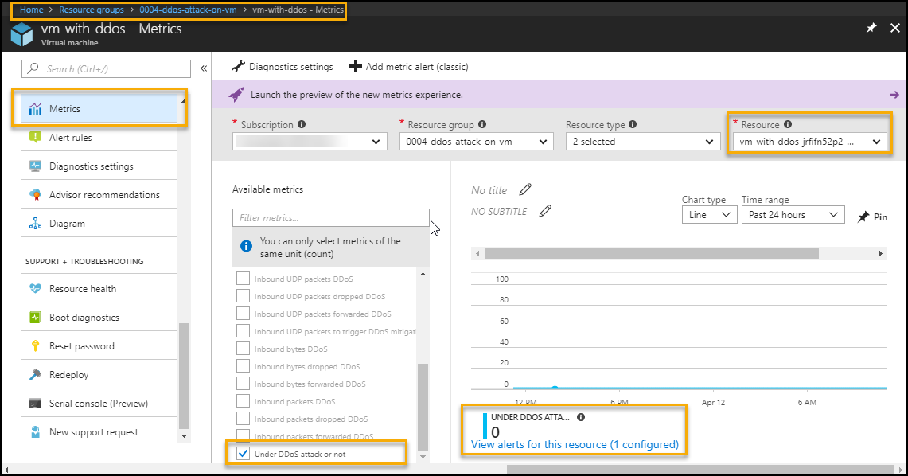
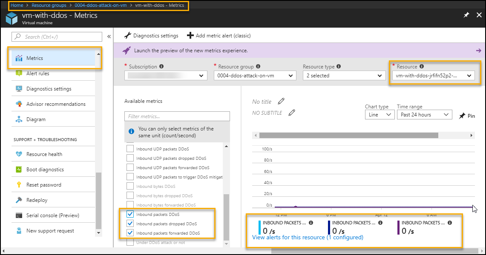
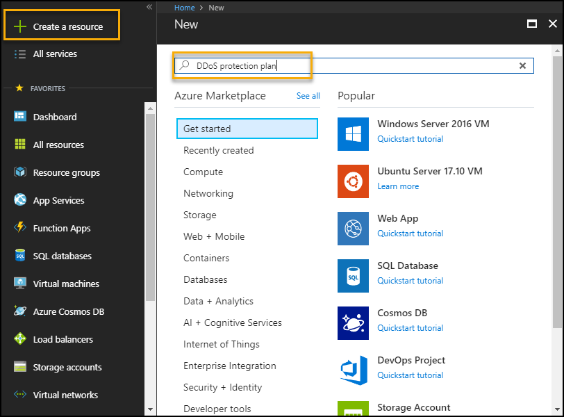
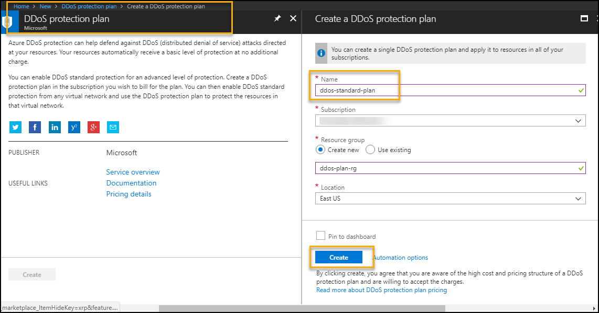
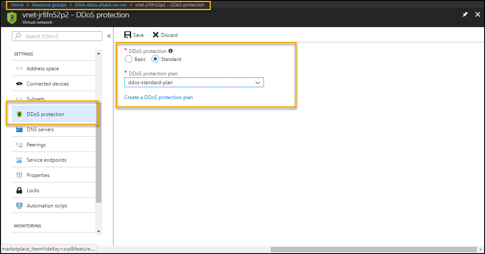
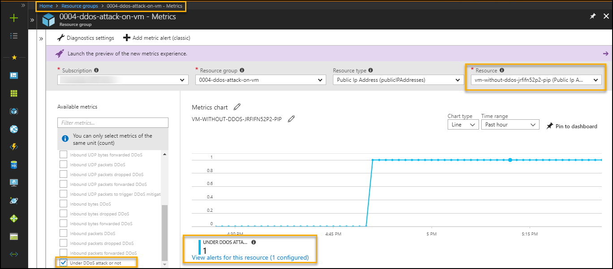
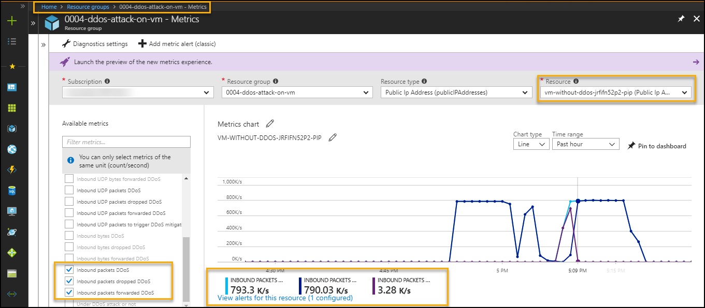
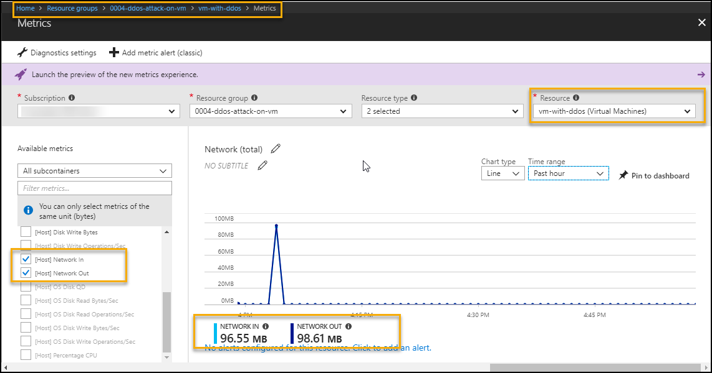
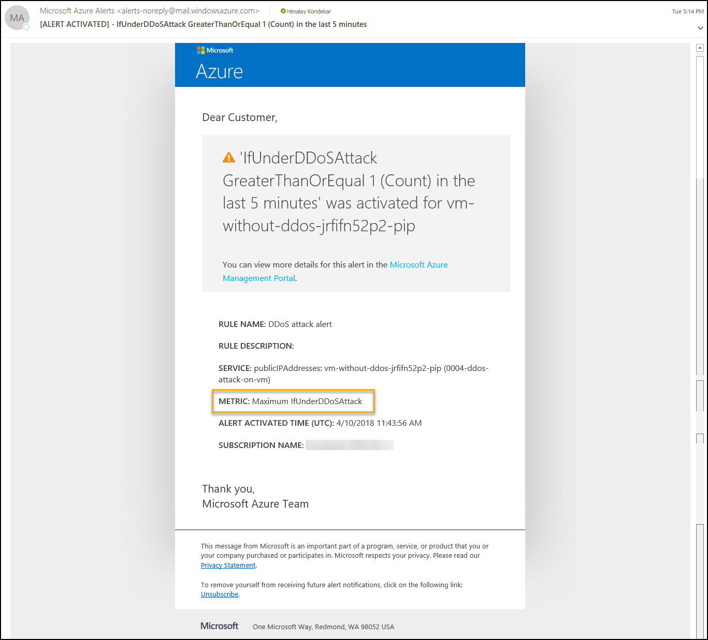

# DDoS Protection attack on a Virtual Machine Scenario 

  

 
 
# Table of Contents
1. [Objectives](#objectives)
2. [Overview](#overview)
3. [Pre-requisites](#prerequisites)
5. [Perform Attack](#attack)
6. [Detect and Mitigate Attack](#detect)
8. [Configuration validation](#config)
9. [Teardown Deployment](#teardown)

<a name="objectives">
# Objective of the POC  
This playbook illustrates a simulated Distributed Denial of Service (DDoS) attack against a virtual machine.  Work through the configuration setting to enable DDOS protections and get alerted when attacks occur. 

# Overview
Perform DDoS attack on resources in a virtual network having public IP addresses associated with virtual machines with DDoS Protection Standard to detect, mitigate and send alert on being attacked.

<a name="important-notes">

# Important Notes
DDoS Protection Standard protects resources in a virtual network including public IP addresses associated with virtual machines, load balancers, and application gateways. When coupled with the Application Gateway web application firewall, DDoS Protection Standard can provide full layer 3 to layer 7 mitigation capability.  
Refer [Azure DDoS Protection Standard](https://docs.microsoft.com/en-us/azure/virtual-network/ddos-protection-overview) for more details.

<a name="prerequisites">

# Prerequisites
Access to Azure subscription to deploy following resources

1.  Virtual Machine with Virtual Network
2.  OMS (Monitoring)

<a name="attack">

# Perform Attack 
 ### * Attack VM with Basic DDoS protection & analyze  
Microsoft have partnered with [BreakingPoint Cloud](https://www.ixiacom.com/products/breakingpoint-cloud) to offer tooling for Azure customers to generate traffic load against DDoS Protection enabled public endpoints to simulate TCP SYN flood and DNS flood attack on the VM without DDoS Protection Standard. Create a  support request with [BreakingPoint Cloud](https://www.ixiacom.com/products/breakingpoint-cloud) for simulation of a DDoS attack on infrastructure. The team executed TCP SYN flood and DNS flood attack on the VM without DDoS Protection Standard   

In this case DDoS attack cannot be detected as shown in below images.  
To monitor from metrics to find public IP is under DDoS attack (Does not detect DDoS attack)   
    Azure Portal-->Resource Group --> VM --> Metrics --> Select below options   
    - Select specific Public IP in resource option    
    - "Under DDoS attack or not" in metrics filter   
    

   

To monitor from metrics to find public IP inbound packets status (Does not detect DDoS attack)  
    Azure Portal-->Resource Group --> VM --> Metrics --> Select below options from metrics filter   
    - inbound packets DDoS   
    - inbound packets dropped DDoS   
    - inbound packets forwarded DDoS   

  

 ### * Attack on VM with DDoS Protection Standard  
 
Microsoft have partnered with [BreakingPoint Cloud](https://www.ixiacom.com/products/breakingpoint-cloud) to offer tooling for Azure customers to generate traffic load against DDoS Protection enabled public endpoints to simulate TCP SYN flood and DNS flood attack on the VM without DDoS Protection Standard. Create a  support request with [BreakingPoint Cloud](https://www.ixiacom.com/products/breakingpoint-cloud) for simulation of a DDoS attack on infrastructure. The team executed TCP SYN flood and DNS flood attack on the VM with DDoS Protection Standard  

*  To create standard DDoS plan and configure with virtual network  

    a. Go to Azure Portal --> Click on "Create a resource" --> Search "DDoS Protection  plan"

      
    
    b. Enter details and click Create

      

    c. Configure standard DDoS protection plan on VNet

      

<a name="detect">

# Detect and mitigate attack
The DDoS attack on VM with DDoS Protection Standard is detected and mitigated as shown in below images.  
To monitor from metrics to find public IP is under DDoS attack (Detect DDoS attack)   
    Azure Portal-->Resource Group --> VM --> Metrics --> Select below options   
    - Select specific Public IP in resource option    
    - "Under DDoS attack or not" in metrics filter   
 

   

To monitor from metrics to find public IP inbound packets status (Detect DDoS attack)  
    Azure Portal-->Resource Group --> VM --> Metrics --> Select below options from metrics filter   
    - inbound packets DDoS   
    - inbound packets dropped DDoS   
    - inbound packets forwarded DDoS   

  
   

The DDoS Protection Standard detects and mitigates the attack on VM. The below image of network metrics of VM while network in attack.  
To monitor network in and network out follow below steps  
    Azure Portal-->Resource Group --> VM --> Metrics --> Select VM name in resource --> select network in / out in metrics filter

   
    

The email alert configured at metrics level, this will send the alert mail if VNet is under DDoS attack over last the 5 minutes  
  ( Note: Deployment username is used to get the email alert for DDoS attack)
  
    
   

<a name="config">
## Configuration Validation
* Distributed denial of service (DDoS) attacks are some of the largest availability and security concerns facing customers that are moving their applications to the cloud. A DDoS attack attempts to exhaust an application’s resources, making the application unavailable to legitimate users. Azure DDoS protection, combined with application design best practices, provide defense against DDoS attacks. Automatic detection and remediation procedure of such vulnerabilities can be easily done using the controls available in Cloudneeti.

* Cloudneeti is available on the Azure marketplace. Try out the free test drive here https://aka.ms/Cloudneeti

<a name="teardown">
## Teardown Deployment 

Run following powershell command after login to subscription to clear all the resources deployed during the demo. Specify resource group name given during deployment
 
 `Remove-AzureRmResourceGroup -Name <ResourceGroupName>  -Force `
 
    
Verification steps -
1. Login to Azure Portal / Subscription
2. Check if resource group name given during deployment is cleared.

**References** 

1.	DDoS Blog: http://aka.ms/ddosblog
2.	DDoS Protection overview: http://aka.ms/ddosprotectiondocs
3.	DDoS Standard best practices & reference architecture: http://aka.ms/ddosbest 

## Disclaimer & Acknowledgements

Avyan Consulting Corp conceptualized and developed the software in guidance and consultations with Microsoft Azure Security Engineering teams.

AVYAN MAKES NO WARRANTIES, EXPRESS, IMPLIED, OR STATUTORY, AS TO THE INFORMATION IN THIS DOCUMENT. This document is provided “as-is.” Information and views expressed in this document, including URL and other Internet website references, may change without notice. Customers reading this document bear the risk of using it. This document does not provide customers with any legal rights to any intellectual property in any AVYAN or MICROSOFT product or solutions. Customers may copy and use this document for internal reference purposes.

### Note:

*	Certain recommendations in this solution may result in increased data, network, or compute resource usage in Azure. The solution may increase a customer’s Azure license or subscription costs.
*	The solution in this document is intended as reference samples and must not be used as-is for production purposes. Recommending that the customer’s consult with their internal SOC / Operations teams for using specific or all parts of the solutions.
*	All customer names, transaction records, and any related data on this page are fictitious, created for the purpose of this architecture, and provided for illustration only. No real association or connection is intended, and none should be inferred. 

