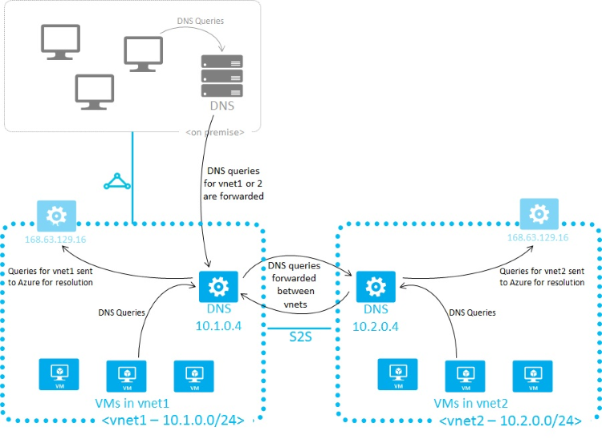

# DNS Forwarder VM

  

This template shows how to create a DNS server that forwards queries to Azure's internal DNS servers so that hostnames for VMs in the virtual network can be resolved from outside the network.  As illustrated below, this is useful for doing hostname resolution between virtual networks or from on-premise machines to Azure. See [Name resolution using your own DNS server](https://azure.microsoft.com/documentation/articles/virtual-networks-name-resolution-for-vms-and-role-instances/#name-resolution-using-your-own-dns-server) for more details of how DNS resolution work in Azure.

