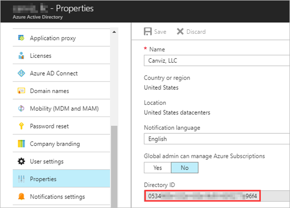
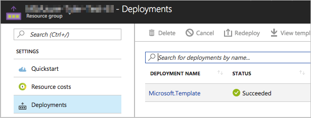

# eShop Website with ILB ASE

    

**Table of Contents**

[Architecture](#architecture)

[Prerequisites](#prerequisites)

[Deploy Azure Resources with ARM Templates](#deploy-azure-resources-with-arm-templates)

* [Create a new App Service Environment](#create-a-new-app-service-environment)
* [Create App Registration in Azure Active Directory (AAD)](#create-app-registration-in-azure-active-directory-aad)
* [Deploy the Other Azure Resources](#deploy-the-other-azure-resources)

[Follow-up Steps](#follow-up-steps)

* [Check Deployment Outputs](#check-deployment-outputs)
* [Get ASE ILB IP address](#get-ase-ilb-ip-address)

* [Add DNS Records](#add-dns-records)

* [Add Reply URL to the Admin Web App](#add-reply-url-to-the-admin-web-app)

[Access Deployed Resources](#access-deployed-resources)

* [Web App](#web-app)
* [Admin App](#admin-app)

## Architecture

Download the Visio diagram [here](/demos/e-shop-website-with-ilb-ase/architecture.vsdx).

#### Architecture overview

The eShop website is deployed on internal-load-balanced App Service Environment (ILB ASE) within a virtual network. The public website is further secured by application gateway. Its content and product images are served by Azure CDN for better performance.

​	A. Customer accesses the public website in browser.

​	B. Browser pulls static resources and product images from Azure CDN.

​	C. Azure CDN pulls static content from content website.

​	D. Azure CDN pulls product images from blob storage.

​	E. Customer searches for products.

​	F. Public website pulls product catalog from product database.

​	G. Page output is cached in the Redis Cache.

​	H. Customer creates new orders.

​	I. Public website invokes orders web service.

​	J. Orders web service saves/loads orders from Azure SQL Database.

​	K. Employee accesses the admin website in browser.

​	L. Employee authenticates against AAD.

​	M. Employee searches orders.

​	N. Admin website invokes orders web service.

Download the PowerPoint slides [here](/demos/e-shop-website-with-ilb-ase/architecture-overview.pptx).

## Prerequisites

To experience this sample, you should prepare two domain names:

1. Internal domain name: used by the App Service Environment. For example `contoso-internal.com`.
2. External domain name: used for internet access to the Web Apps. For example `contoso.com`.

And you should have the permissions to configure them. We will add several A records and CNAME records later.

> Note: You may get free domain names on [freenom](https://www.freenom.com).

## Deploy Azure Resources with ARM Templates

### Create a new App Service Environment

It takes about 70 minutes to create a new App Service Environment in Azure. 

1. Click the **Deploy to Azure** Button:

   <a href="https://portal.azure.com/#create/Microsoft.Template/uri/https%3A%2F%2Fraw.githubusercontent.com%2FAzure%2Fazure-quickstart-templates%2Fmaster%2Fdemos%2Fe-shop-website-with-ilb-ase%2Fprereqs%2Fprereq.azuredeploy.json" target="_blank">
     
   

2. Fill in the values on the custom deployment page:

   **Basics**:

   - **Subscription**: choose one of your subscriptions
   - **Resource group**: create a new resource group
   - **Location**:  select a location

   **Settings**:

   - **Name**: the name of the App Service Environment. 

     > **Note:** 
     >
     > * This value is also used to name other Azure resources created by the ARM template. To avoid naming conflicts, please choose a unique name, for example **tyler-eshop-180308**.
     > * This value is also used as the subdomain name. Please only use lowercase characters, numbers, and dash(-).

   - **Location**: choose the same location as the location of the resource group.

     > **Note:** This parameter was added because of this [issue](https://github.com/Azure/azure-quickstart-templates/issues/2828).

   - **DNS Suffix**:  input the internal domain name, for example `contoso-internal.com` 

   **Terms and conditions**:

   - Check **I agree to the terms and conditions stated above**.

   > **Note**: keeps these values. They will be used to deploy the other resources later.

3. Click **Purchase**.

   > **Note**: During the deployment, you may work on next section.

### Create App Registration in Azure Active Directory (AAD) 

#### Get Tenant Id

Open the AAD in the Azure portal, and copy get the **Directory ID**.

The **Directory ID** is used to set the value of the **Azure Ad Tenant Id** parameter in the ARM Template.

#### Create App Registration for the Admin Web App

Create a new App Registration in AAD:

* Name: LoB with ASE - Admin

* Application Type: Web app/API

* Sign-on URL: https://lob-with-ase/admin

* Permissions:

   | API                            | Permission Type | Permissions                   |
   | ------------------------------ | --------------- | ----------------------------- |
   | Windows Azure Active Directory | Delegated       | Sign in and read user profile |

Copy the **Application Id** and save it in a text file. You will need it later to specify the value for the **Azure Ad Client Id** parameter in the ARM Template.

### Deploy the Other Azure Resources

After the App Service Environment is deployed, follow the steps below to deploy the other Azure resources.

2. Click the **Deploy to Azure** Button:

     
     
   

   
     
   

3. Fill in the values on the deployment page:

   **Basics**:

   * **Subscription**: choose the same subscription.
   * **Resource group**: choose the same resource group.

   **Settings**:

   * **Existing ASE Name**: the name of the App Service Environment.

   * **Existing ASE Location**: the location of the App Service Environment.

   * **Existing ASE DNS Suffix**: the DNS Suffix (the internal domain name) of the App Service Environment. 

   * **DNS Suffix**: the external domain name. For example `contoso.com`

   * **SQL Server Administrator Login**:  administrator login name of the Azure SQL Server.

     >**Note:** It should meet the following requirements - It's a SQL Identifier, and not a typical system name (like admin, administrator, sa, root, dbmanager, loginmanager, etc.), or a built-in database user or role (like dbo, guest, public, etc.). Make sure your name doesn't contain whitespaces, unicode characters, or nonalphabetic characters, and that it doesn't begin with numbers or symbols.

   * **SQL Server Administrator Login Password**: please do use a strong password.

     >**Note:**
     >
     > - Your password must be at least 8 characters in length.
     > - Your password must contain characters from three of the following categories – English uppercase letters, English lowercase letters, numbers (0-9), and non-alphanumeric characters (!, $, #, %, etc.)

   * **Azure AD Tenant Id**/**Client Id**: use the values you got from the previous chapter.

     > Note: These values are used to authenticate the Admin Web App.

   **Terms and conditions**:

   * Check **I agree to the terms and conditions stated above**.

4. Click **Purchase**.

   > **Note**: The deployment takes about 30minutes to complete.

## Follow-up Steps

### Check Deployment Outputs

After the deployment finishes, you will see the URLs of the Web App and Admin App in the outputs tab.

* **Web App URL**: URL used to access the Web App
* **Admin App URL**: URL used to access the Admin App
* **Admin App Redirect URL**: Admin App OAuth redirect URL which will be added to Reply URLs of the App Registration later.
* **App Gateway Public IP FQDN**: Fully qualified domain name of the Application Gateway Public IP Address which will be used as the value of external domain CNAME records.

> **Note**: the deployment window shown above can be re-opened by clicking the **Deployments** tab in the resource group.
>
> 

### Get ASE ILB IP address

Open the App Service Environment, then click **IP addresses**.

Copy the value of **Internal Local Balancer IP address** and save it in a text file. It will be used as the value of internal domain A records.

### Add DNS Records

1. Add the two A records below in the record management of the internal domain:

   | Host  | Type | Value                                        | TTL  |
   | ----- | ---- | -------------------------------------------- | ---- |
   | *     | A    | *\<ASE Internal Local Balancer IP address\>* | 600  |
   | *.scm | A    | *\<ASE Internal Local Balancer IP address\>* | 600  |

2. Add the three CNAME records below in the record management of the external domain:

   | Host                   | Type  | Value                            | TTL  |
   | ---------------------- | ----- | -------------------------------- | ---- |
   | *\<ASE Name\>*-web     | CNAME | *\<App Gateway Public IP FQDN\>* | 600  |
   | *\<ASE Name\>*-content | CNAME | *\<App Gateway Public IP FQDN\>* | 600  |
   | *\<ASE Name\>*-admin   | CNAME | *\<App Gateway Public IP FQDN\>* | 600  |

### Add Reply URL to the Admin Web App

Add the **Admin App Redirect URL** you got from the outputs of the deployment to the App Registration and save it.

## Access Deployed Resources

### Web App

Open the **Web App URL** you got from the outputs section in a browser.

> **Note**:  The sample uses **Azure CDN from Verizon** profile and its propagation usually completes within 90 minutes. You may need to wait for a while then the page will look exactly like below.

### Admin App

Open the **Admin App URL** you got from the outputs section in a browser. Then sign in with a work account in the AAD where you registered the AAD application. 

**Copyright (c) 2018 Microsoft. All rights reserved.**

