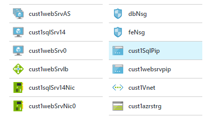
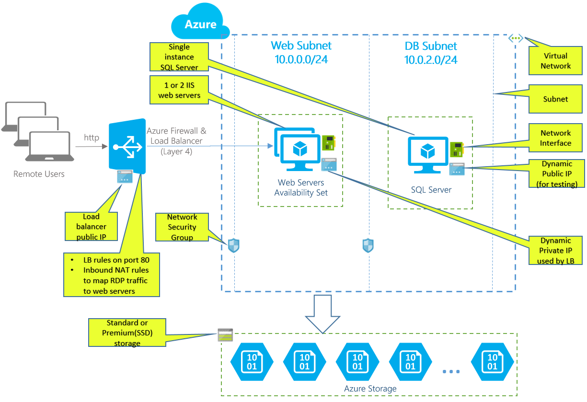

# IIS VMs and SQL VM

    

This template creates one or two Windows Server 2012R2 VM(s) with IIS configured using DSC. It also installs one SQL Server 2014 standard edition VM, a VNET with two subnets, NSG, load balancer, NATing and probing rules.

## Resources

The following resources are created by this template:

- 1 or 2 Windows 2012R2 IIS Web Servers.
- 1 SQL Server 2014 running on premium or standard storage.
- 1 virtual network with 2 subnets with NSG rules.
- 1 Availability Set for IIS servers.
- 1 Load balancer with NATing rules.

## Architecture Diagram

