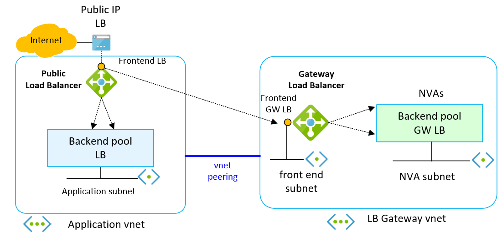
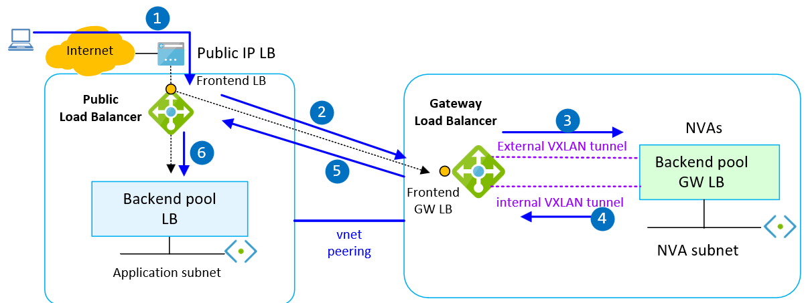
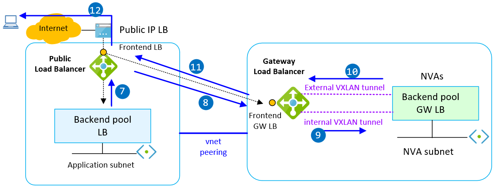
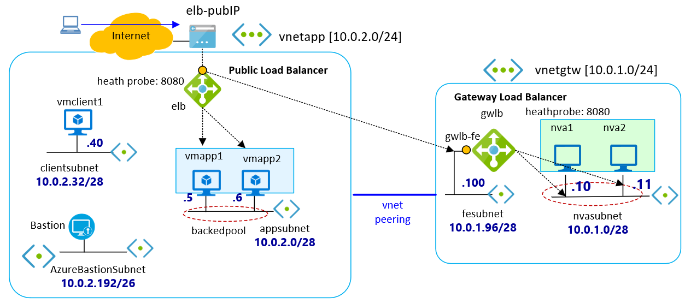
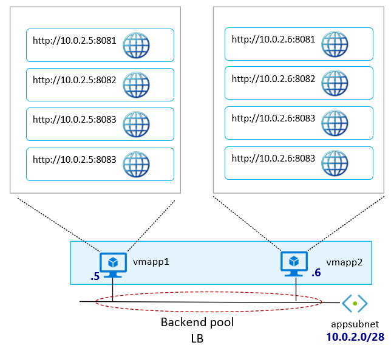

# Public Load Balancer chained to a Gateway Load Balancer


[](https://portal.azure.com/#create/Microsoft.Template/uri/https%3A%2F%2Fraw.githubusercontent.com%2FAzure%2Fazure-quickstart-templates%2Fmaster%2Fdemos%2Fload-balancer-gateway%2Fazuredeploy.json)

[](http://armviz.io/#/?load=https%3A%2F%2Fraw.githubusercontent.com%2FAzure%2Fazure-quickstart-templates%2Fmaster%2Fdemos%2Fload-balancer-gateway%2Fazuredeploy.json)

This template creates a Public Load Balancer chained to a Gateway Load Balancer.

## Network diagram ##

A hight level network diagram of the deployment is shown below:



Traffic between a client from the internet and the application VMs is pictured below:





1.  The client from the internet sends an HTTP request to the frontend IP of the Public Load Balancer
2.	The frontend IP of the Public Load Balancer forwards the traffic to the Gateway Load Balancer configured via chain
3.	Through the VXLAN tunnel, the IP packet is sent to the NVAs configured as the backend pool of the Gateway LB. The VXLAN tunnel used for traffic coming from the internet  is named in the ARM template as external
4.	The IP packet reaches one of the NVAs. The NVAs are configured with IP forwarding, and the packet is sent back to the Gateway Load Balancer through a different VXLAN tunnel, named in the ARM template as internal
5.	The IP packet is sent from the Gateway load Balancer back to the Public Load Balancer
6.	Based on the load balancing rules, the Public Load Balancer distributes the packet to the application VMs configured in the backend pool
7.	The application VM that receives the packet serves the HTTP request and sends a response to the Public Load Balancer
8.	The Public Load Balancer forwards the packet to the Gateway Load Balancer
9.	The Gateway Load Balancer sends the traffic to same NVA through the internal VXLAN tunnel
10.	The NVA sends the packet back to the Public Load Balancer through the external VXLAN tunnel
11.	The Public Load Balancer receives the packet and applies a translation of the source IP of the application VM to the public frontend IP of the load balancer. The translation is required to route the IP packet over the internet
12.	The Public Load Balancer sends the IP packet (HTTP response) to the client over the internet

<br>

The full network diagram inclusive of IP addresses and network IPs is shown below:



## Notes ##

- Gateway LB maintains flow stickiness to a specific instance in the backend pool along with flow symmetry. As a result, packets traverse the same network path in both directions: from Stadard Public LB to the Gateway LB and from the Gateway LB to the Standard Public LB.
- **Gateway LB is transparent**. Source and Destination IP addresses are unchanged when traffic traverses the Gateway LB, via VXLAN tunnels to backend pool members.
- The Gateway LB routes traffic to the backend instances using the HA ports rule
- Configurations of NVAs and application VMs are executed by two different bash scripts: **nva.sh** is used for the setting up the NVAs, **nginx-serverblocks.sh** install and customize the NGINX with different server blocks on the application VMs
- Standard Load Balancer and Gateway Load Balancer have both health probe set with HTTP traffic on port 8080; the bash scripts **nva.sh**, **nginx-serverblocks.sh** configure NGINX in NVAs and application VMs to answer with basic homepage to the HTTP port 8080
- To keep the deployment simple, the NVAs are configured with IP forwarding and do not apply any security check and filtering. In production environment is recommended to use in NVAs firewall/intrusion detection to protect the integrity of the applications exposed to internet. The NVAs should provide a secure network boundary by checking all inbound and outbound network traffic and passing only the traffic that meets network security rules.
- The application VMs are configured to serve HTTP requests; this is not a best practice for web server exposed to internet. In production environments is high recommended to modify the script **nginx-serverblocks.sh** to configure HTTPS

The diagram reported below shows the NGINX server blocks configurated in application VMs:



- The bash scripts: **nva.sh** sets the VXLAN tunnels in the NVAs. A simplified version of bash script to create the VXLAN tunnels in the NVAs is shown below:

```bash
# the VXLAN Network Idenfier (VNI) is specified with id
tunnel_internal_port=10800
tunnel_internal_vni=800
tunnel_external_port=10801
tunnel_external_vni=801
nva_lb_ip=10.0.1.100

# internal tunnel
ip link add name vxlan${tunnel_internal_vni} type vxlan id ${tunnel_internal_vni} remote ${nva_lb_ip} dstport ${tunnel_internal_port}
ip link set vxlan${tunnel_internal_vni} up

# external tunnel
ip link add name vxlan${tunnel_external_vni} type vxlan id ${tunnel_external_vni} remote ${nva_lb_ip} dstport ${tunnel_external_port}
ip link set vxlan${tunnel_external_vni} up

# bridge both VXLAN interfaces together (it works arounding routing between them)
ip link add br-tunnel type bridge
ip link set vxlan${tunnel_internal_vni} master br-tunnel
ip link set vxlan${tunnel_external_vni} master br-tunnel
ip link set br-tunnel up
```

## Deployment check out ##

Custom script extension logs are stored in:

```bash
root@nva1:~# ll /var/lib/waagent/custom-script/download/0/
root@nva1:~# cat /var/lib/waagent/custom-script/download/0/stderr
root@nva1:~# cat /var/lib/waagent/custom-script/download/0/stdout
root@nva1:~# cat /var/lib/waagent/custom-script/download/0/nva.sh
```

To check the setup of VXLAN tunnels in NVAs:

```bash
root@nva1:~# systemctl status nvavxlan.service
root@nva1:~# ip a
root@nva1:~# ip -d link show vxlan800
root@nva1:~# ip -d link show vxlan801
```

By installation of **net-tools** in NVA is possibile to use the utility ifconfig to see the packets received/transmit in the VXLAN tunnels:

```bash
root@nva1:~# apt -y install net-tools
root@nva1:~# ifconfig vxlan800
root@nva1:~# ifconfig vxlan801
```

Check the IP fowarding in NVAs using **sysctl** (used to set/modify/view kernel parameters at runtime):

```bash
root@nva1:~# /sbin/sysctl net.ipv4.ip_forward
```

or just check out the value in the **/proc** system:

```bash
root@nva1:~# cat /proc/sys/net/ipv4/ip_forward
```

the last command should return the value: **1**.

Check the status of VXLAN service in NVAs:

```bash
root@nva1:~# systemctl status nvavxlan.service
```

you should see the  vni service as _started_ and "nvavxlan.service: Succeeded".

A check on traffic in NVAs can be done through tcpdump by the following command:

```bash
root@nva1:~# tcpdump -i any -n host <public_IP_client_in_internet>
root@nva1:~# tcpdump -i vxlan800 -n host <public_IP_client_in_internet>
root@nva1:~# tcpdump -i vxlan801 -n host <public_IP_client_in_internet>
```

In application VMs:

```bash
root@vamapp1~# tcpdump -i eth0 -n host <public_IP_client_in_internet>
```

`Tags: Microsoft.Network/loadbalancer, Public Load Balancer, Gateway Load Balancer`