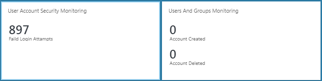
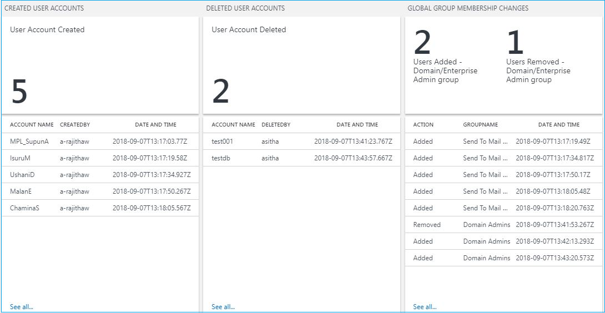
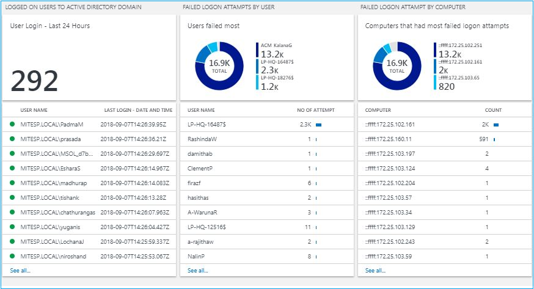
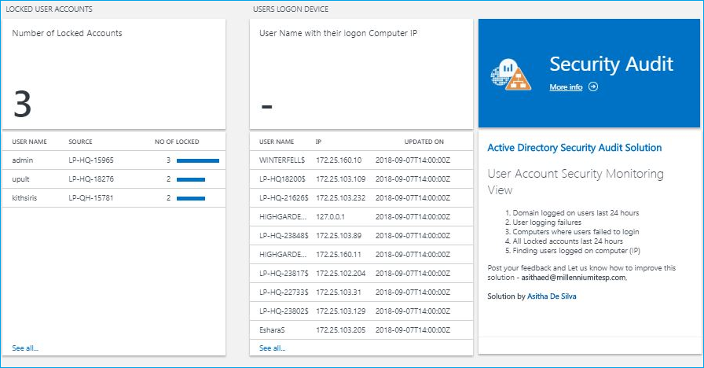
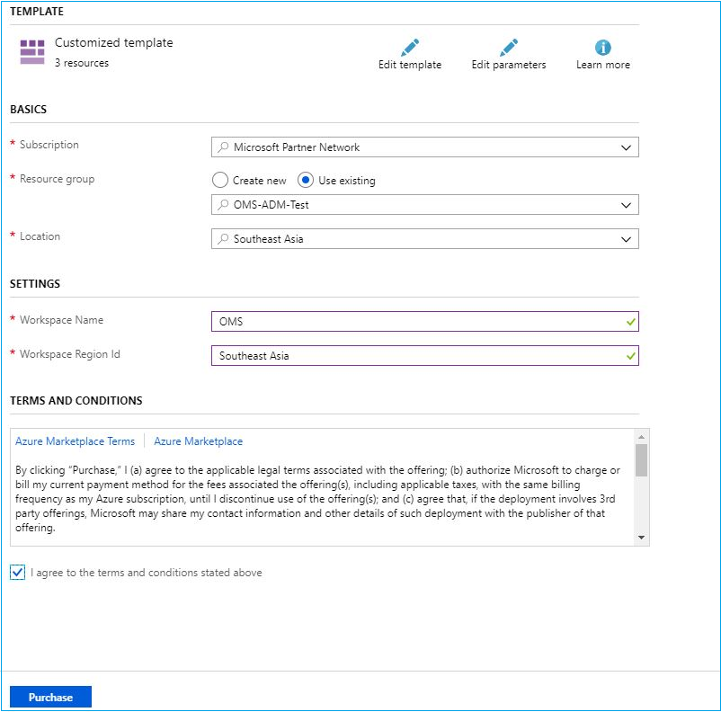

# Active Directory Security Audit Solution

AD Security Audit Solution collects security events from domain controllers and filter them with Azure log analytics queries to visualize in OMS Dashboards. It have two attractive dashboard to display following information. 

*	Created and deleted domain users with time and by whom
*	Created and deleted domain groups with time and by whom
*	Group membership changes with the group, added or removed user and time. (ex – Domain admin or Enterprise admin group membership changes)
*	Number of Users logged in to the domain by last 24 hours
*	Domain users logged in to the domain with time and user name
*	Failure logon attempts by user
*	Failure logon attempts by computer
*	Locked user accounts with the source where account locked
*	Domain user logged on Computer by its IP address and the updated time and date.

#### Overview of the two views

#### Users And Groups Monitoring View

#### User Account Security Monitoring view

## Prerequisites 

* #### OMS Log Analytics Workspace
Log analytics workplace is required to host this solution. You can either select the free version or the paid version. Free version supports 500mb of daily upload and 7 days of retention. 
* #### Azure Security Center license 
Azure Security Center licensing is required to collect Security event and search from Domain controllers. This is also known as OMS Security and Compliance license. Azure Security Center is offered in two tiers: Free and Standard. The Standard tier is free for the first 60 days. You can either use the free tier or use the standard node license to all domain controllers. 
* #### OMS Agent installed in Domain controllers. 
OMS agent should be installed in every domain controller.
* #### OMS workplace name and Resource group name
To deploy the solution you should know the OMS workspace name and the its related resource group name, for the current version you have to deploy it to the same resource group with the workspace

## Deploying the Active Directory Security Audit Solution
### Follow these instructions to deploy the solution into an existing or new OMS workspace

This will send you to the Azure Portal with some default values for the template parameters. Ensure that the parameters reflect your setup so that you are deploying this into the existing Resource Group containing the Log Analytics Workspace and the Automation account.
It is important that you type the exact values for your workspace name and resource group name, and points to the regions where these resources are deployed.

The ingestion will start 5-10 minutes post deployment.

## Summary
If you enabled auditing on domain controllers, it will generate a fair amount of security data which you can use to search for events such as failed login or locked users. But searching this using the native event viewer is not easy. OMS log analytics can be used to search these events and it will provide the information in a rich, presentable manner. 
AD Security Audit solution is designed with number of these important use cases most customers face day in today's business. It will help you to identify 
*	Users login to the domain with a time range
*	Users failed to login to the domain, incorrect password attempts, number of attempts, time when the failed attempts are made.
*	Find the locked accounts. And from where the account was locked. Mainly accounts are locked by domain security policy after regularly failed attempts. But its hard to find where these attempts are made. You can use log analytics to track failed login attempts and generated IP address of those failed attempts.
*	User accounts and groups created and by whom
*	Any group membership changes, added to the group, removed from the group and who did this change. This is very important when domain admin group membership changes.

