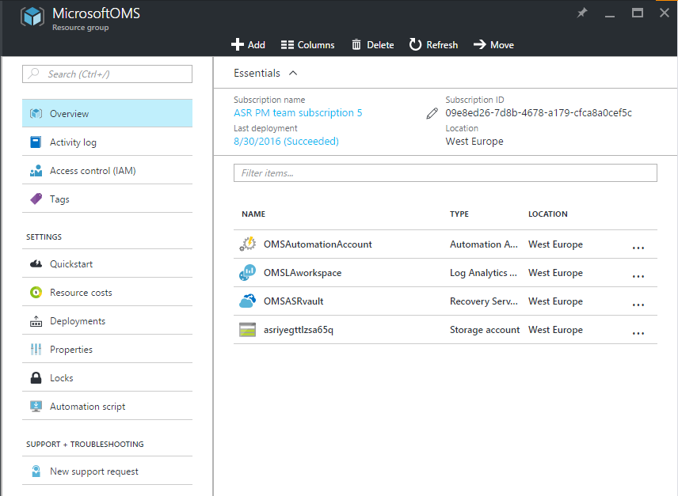
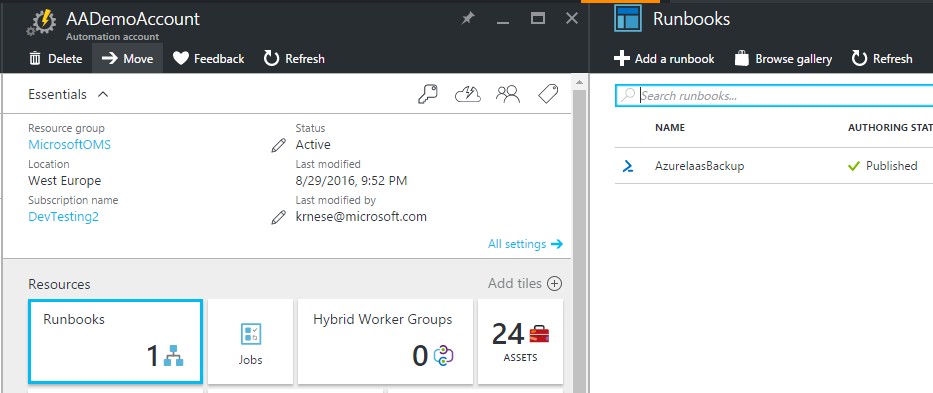
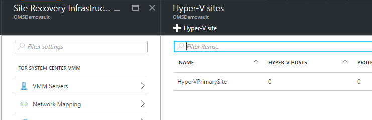
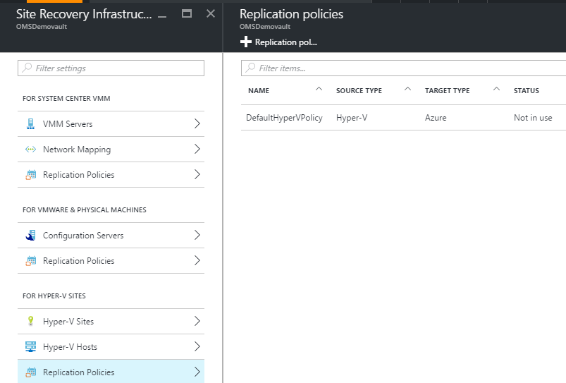
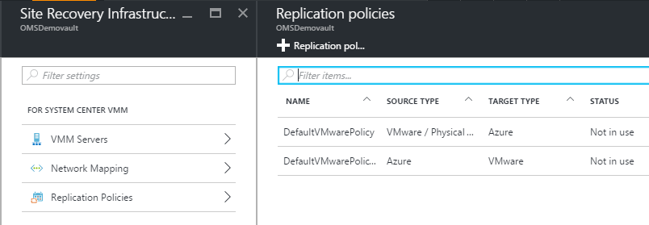
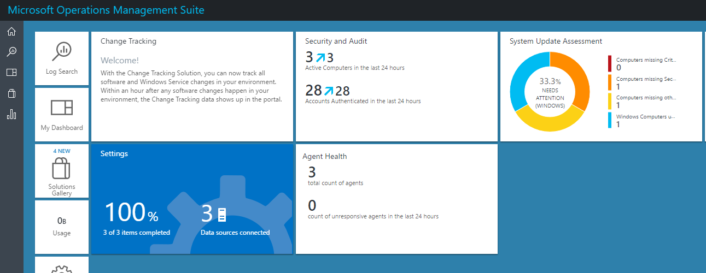
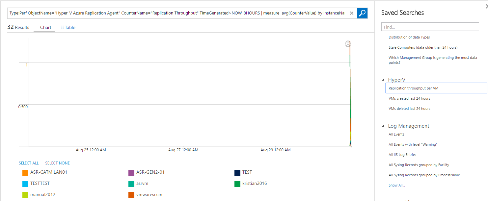
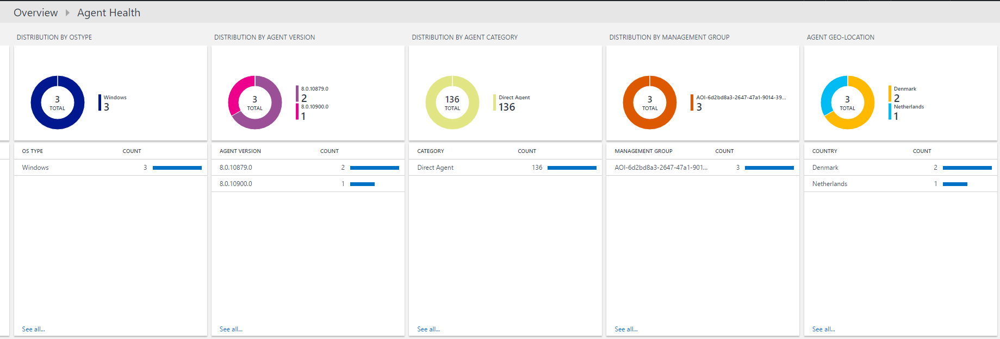
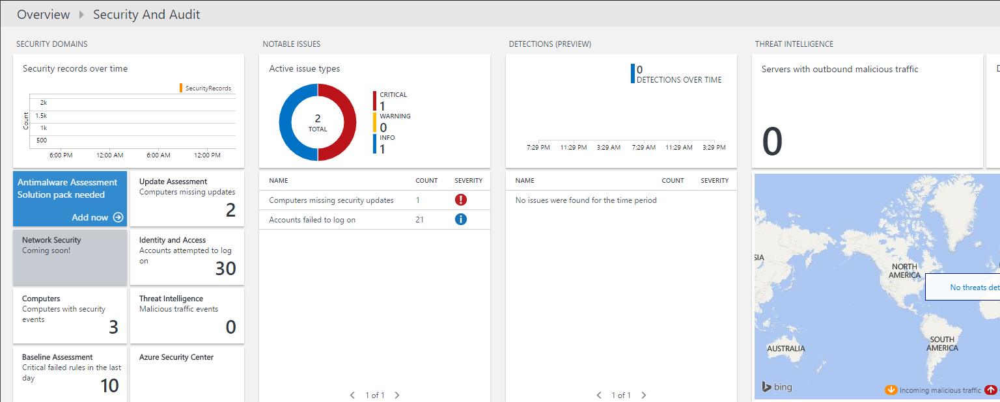

# Microsoft Operations Management Suite

  

Your time is precious, why spend it on trying to integrate multiple tools. Lose the product palooza and unify on a single solution, providing management at your fingertips. Get up and running in seconds and have real insights in just hours, giving you faster time to value.

## Microsoft OMS Azure Resource Manager Template

This template will deploy *all* the OMS services into a Resource Group

* Azure Log Analytics

Instead of spending time adding data sources to your workspace and constructing the search queries for common scenarios, you will have multiple solutions enabled by default, common Windows and Linux logs present, as well as some of the most used performance counters regardless of platform. With saved searches categorized in the workspace, it is easy to get started immediately after you have added your machines to the workspace

* Azure Automation

The template will create several assets for you to use, such as credentials and variables that can be used out-of-the-box with the runbooks provided. All the dependencies are there.

* Azure Backup

Get started immediately post deployment by running the provided runbook in Azure Automation that will enable Azure IaaS backup on your VMs present within the region where you deployed your Recovery Vault

* Azure Site Recovery

After deployment, you just have to add your Hyper-V hosts or/and Management/Configuration Servers to the Recovery Vault and leverage the pre-created Hyper-V site and policies for your replication provider
You can leverage the pre-created storage account as target for your replication scenarios.

### Post Deployment

* Enable Azure IaaS Backup using a runbook

* Add Hyper-V hosts to your primary Hyper-V site and associate them with the default replication policy

* Associate your Management/Configuration Servers with the default replication policy

* Explore the solutions within Log Analytics after adding VMs/servers and storage accounts

The template will enable the following solutions:
	
	* Change Tracking
	* Security and Audit
	* System Update Assessment
	* Agent Health

Explore a rich list of saved searches within Log Search

Explore the Agent Health solution

Explore the Updates solution

Explore the Security solution

*This template will be updated to add more capabilities*

       

