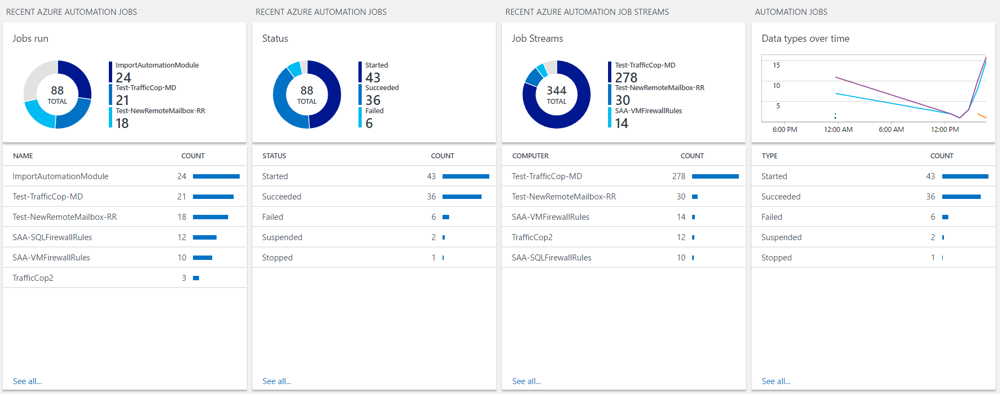
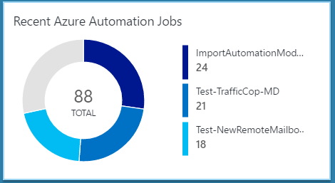

# OMS Azure Automation Job Monitoring

 
 

This solution (currently in private preview) will allow you to visualize your Azure Automation jobs in Operations Management Suite (Log Analytics). This solution use the job status and job stream information provided by Microsoft (https://docs.microsoft.com/en-us/azure/automation/automation-manage-send-joblogs-log-analytics) to present data about your Azure Automation jobs in Log Analytics. 

**Prerequisites**  

- **OMS Workspace**

To add this solution you need to have an existing OMS workspace. To create one, go to www.microsoft.com/oms and sign up. For details on this process see: https://docs.microsoft.com/en-us/azure/log-analytics/log-analytics-get-started 

- **Automation Account with runbooks**

Before you deploy this template, you will need an Automation Account in the Azure portal. This Automation Account will also need jobs which have been created and which have run. 

- **Automation job information sent to OMS**

Automation job information needs to be sent from Azure Automation to Microsoft OMS. To acccomplish this, perform the steps documented by Microsoft at: https://docs.microsoft.com/en-us/azure/automation/automation-manage-send-joblogs-log-analytics

**How to use the application** 

Once the prerequisites are complete, you can deploy the template.

 

Once the template is successfully deployed the following solution should now be visible in your OMS workspace.

**Notes** 

To see data in this solution jobs will have to have run after the automation job information was sent to OMS. Any job data from before the prerequisite step "Automation job information sent to OMS" will not be displayed in this solution. 

