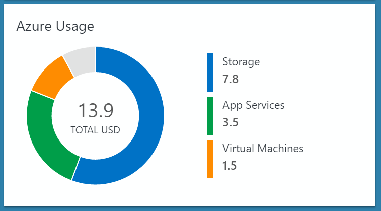
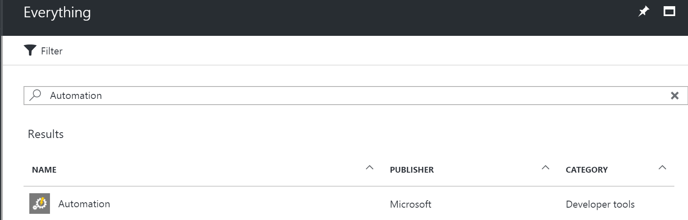
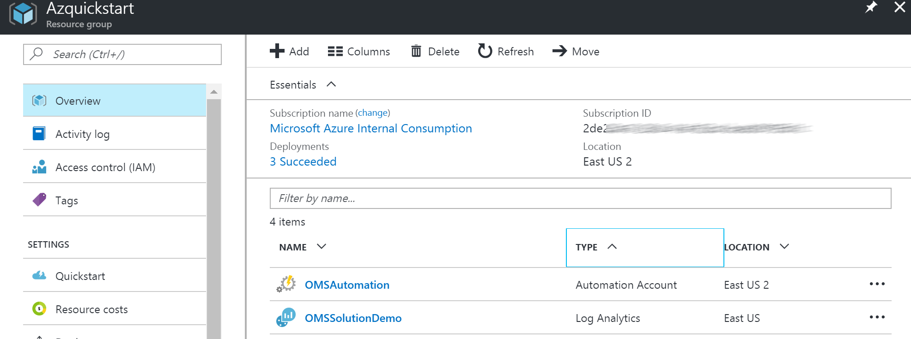
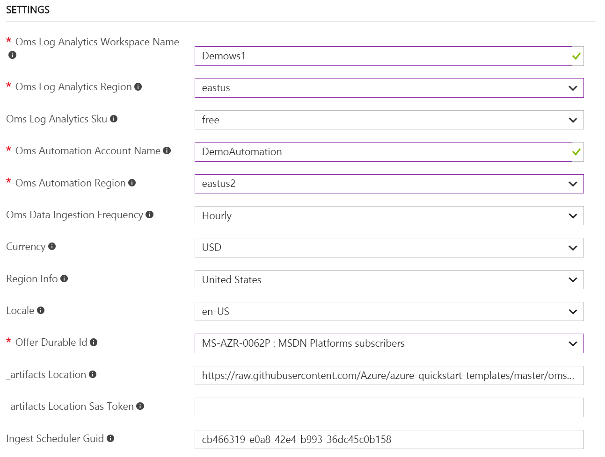
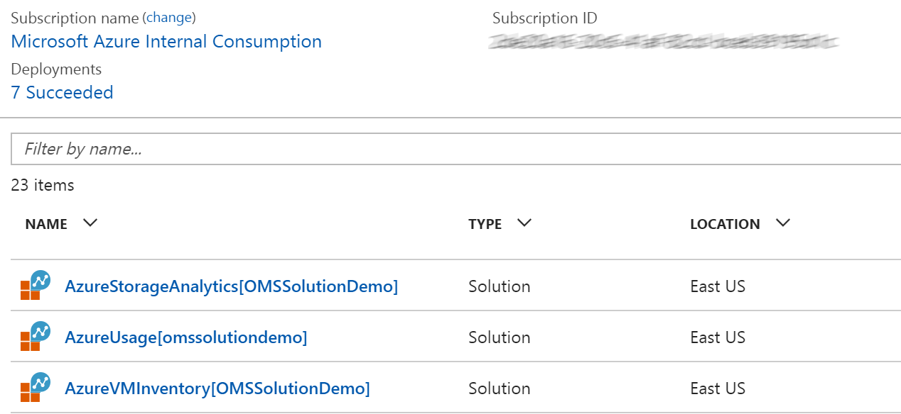
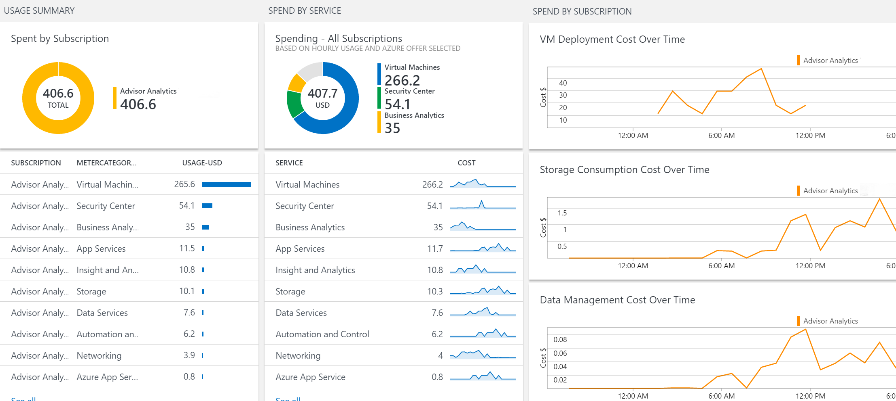
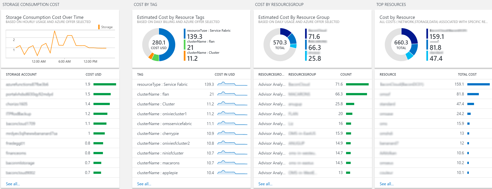
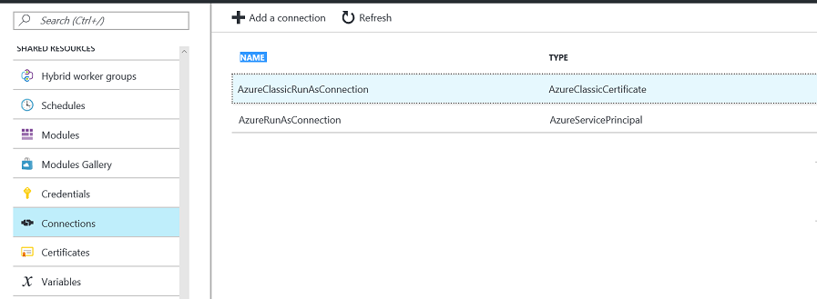

# Azure Resource Usage Solution

>[AZURE.NOTE]This is preliminary documentation for Azure Resource Usage Solution, a management solution you can deploy into OMS that will provide insights of virtual machines across subscriptions. 

Azure Resource Usage   Solution collects and visualizes Azure Usage from Azure Billing  APIs to bring in the cost metric of Azure resources. Solution provides  usage deatils for;

* Category  (Storage)
* SubCategory (Locally Redundant)
* MeterType (Standard IO - Page Blob/Disk (GB))
* Resouce ( VM, Storage Account , Website)
* Reosuce Group 
* Resource Tags 

## Pre-reqs

- **Automation Account with SPN**

Before you deploy this template, you must create an Automation Account in the Azure portal with the default settings so that the SPN account will be created. If you have an existing OMS Log Analytics Workspace you would like to use for this solution, it is important that the Automation account is created into the **same Resource Group where the OMS Log Analytics Workspace is located**.

If you **dont** have an existing OMS Log Analytics Workspace, the template will create and deploy this for you.

## Deploying the Azure Resource Usage Solution

### Follow these instructions to deploy the solution into an existing - or new Log Analytics Workspace

Log into Azure Portal (https://portal.azure.com) and ensure you are in the subscription containing the recovery vault you want to monitor

Locate your existing OMS Log Analytics Workspace and note the name of the workspace, the location of the workspace, and the Resource Group

 

Next, create a new Automation Account and click on *New* and search for 'Automation'

 
Select Automation and click *Create* 

Specify the name of the Automation Account and ensure you are selecting 'Use existing' and selects the Resource Group containing the OMS Log Analytics workspace. If possible, use the same Azure Region for the Automation Account. Ensure that 'Create Azure Run As account' is set to 'Yes' and click 'Create'

Once the deployment has completed, you should see the Automation account and the Log Analytics workspace in the same Resource Group

###You can now deploy the template   
 

This will send you to the Azure Portal with some default values for the template parameters. 
Ensure that the parameters reflects your setup so that you are deploying this into the *existing* Resource Group containing the Log Analytics Workspace and the Automation account.

#### Please take caution on  OMS workspace SKU and Automation Account SKU as selections might effect the existing deployment.
#### Solution requires a new guid to be created every time  ARM template deployed. Using same guid will cause deployment to fail!

#### Parameters

* OMS Log Analytics Workspace Name

Specify the name of the workspace you want to deploy this solution to

* OMS Log Analytics Region

Select the Azure Region where your existing workspace is located

* OMS Automation Account Name

Specify the name of the automation account you created earlier

* OMS Automation Region

Select the Azure Region where your automation account is located

You should also change the values for the *Ingest Scheduler Guid* and *Ingest Cleanup Guid*. You can generate your own using PowerShell with the following cmdlet:

Once you have customized all the parameters, click *Create*

The ingestion will start 5-10 minutes post deployment.

## Exploring the views

Once the template has successfully been deployed, Azure usage  data ingestion should occur within 1 hour  post deployment.  If you are deploying the solution to a new workspace, it can take approximately 30 minutes before the indexing has completed for the workspace in general. IF you have selected  Daily data ingestion , usage data will be ingested  at 02.00 AM (UTC) every day and while viewing the views time range should be set at least to 1 day . 

In the Resource Group where you deployed the template, you should see the solution resource.

* AzureUsage[workspaceName]

### Azure Resouce Usage 

The views for Azure Resource   will give you an overview of usage and cost of resources in an Azure Subscription.  Multiple subscriptions can be added to provide overview for all.

### Troubleshooting 

Solution relies on Automation Account with Runas Accounts  configured. Both SPN and Classic Certificate is used by the Storage REST API calls.  

General Troubleshooting steps ;
* Make sure you specify a new Guid each time template is deployed
* Check if automation account can start  the runbooks
* Check if Runas Accounts configured properly and has permission to query subscription details and can access storage keys  
* Check if AzureStorageIngestion.......  Automation Schedules are enabled
* Navigate to Resource group , delete AzureUsage[workspaceName] solution and redeploy template with a new Guid

## Adding Additional Subscriptions | Partial Deployment 

Deploying all resources in a single resource group is the prefferred way for deploying the solution. But if you have your OMS workspace and Automation account in different resource groups  you can use the partial templates to deploy the solution. 

First deploy the OMS Solution Views by following the link below 

 

Second use the link below to deploy the automation components to an existing automation account.

This second template also used to onboard additional subscriptions to the solution !

 

Template requires OMS Log Analytics workspace ID and Key  from the  workspace where solution is already deployed. Navigate to Log Analytics Portal / Settings / Connected Sources  to get worspace Id and Key.
This solution will deploy only the automation components used in data collection and push data to existing log analytics workspace. 

